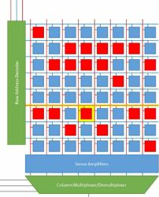

* **OMOGENEE**
  1. [VETTORI](./views/Vettori.html)
  2. [MATRICI](./views/Matrici.html)
* **ETEROGENEE**
  1. [LISTE](./views/Liste.html)
  2. [DATAFRAME](./views/Dataframe.html)
* **UNIDIMENSIONALI**
  1. [VETTORI](./views/Vettori.html)
  2. [LISTE](./views/Liste.html)
* **BIDIMENSIONALI**
  1. [MATRICI](./views/Matrici.html)
  2. [DATAFRAME](./views/Dataframe.html)


# GERARCHIA TIPI DI DATO


In ordine **crescente** per **priorità**


* **LOGICAL**
* **INTEGER**
* **DOUBLE**
* **CHARACTER**


**Character prevale** su tutti gli altri


[LINK A GOOGLE](https://www.google.it)



```{r}
#library(datasets)
#data(airquality)
#summary(airquality)
```