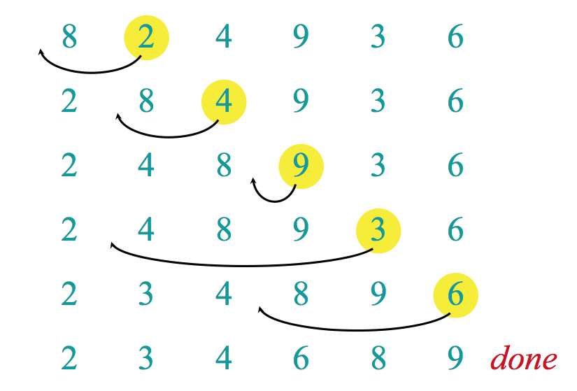
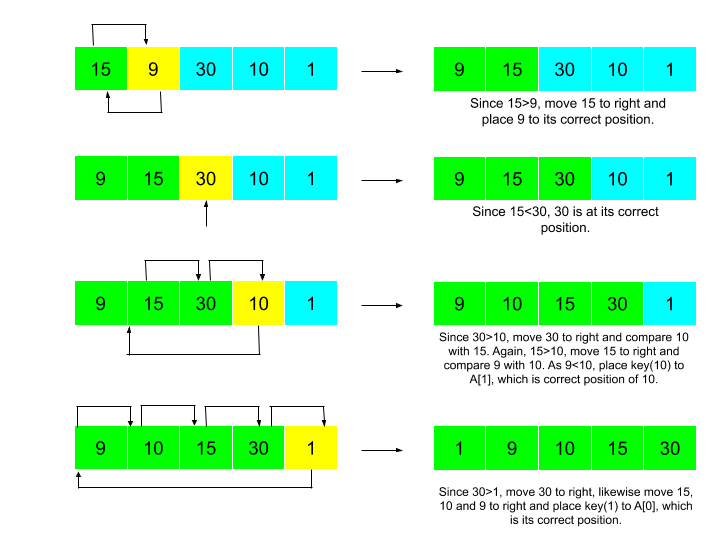

```{r setup, include=FALSE}
knitr::opts_chunk$set(echo = TRUE)
```



# DESCRIZIONE

> Dato un vettore di un elemento, esso è sempre ordinato



-   VERDE: porzione iniziale dell'array Array[ 1 ; J ] ORDINATO

-   BLU: elemento da spostare --\> Array[ J ]

-   GIALLO: porzione finale dell'array Array [ J+1 ; N ] NON ORDINATA

```{r}
minimo= 0
massimo = 1000
lunghezza = 10000
# vettore di 10000 interi randomici tra 0 e 999
vettore = floor(runif(lunghezza,minimo,massimo))
```

# ALGORITMO

```{r}
insertionSort = function (ARR){
  # n = length(ARR)
  for (j in 2:(length(ARR)-1)){   # 2c * n
    KEY = ARR[j]   # c* (n-1)
    i = j-1        # c* (n-1)
    while (i>0 && ARR[i]>KEY) {   # 2c* sum(2,n)tj
      ARR[i+1] = ARR[i]   # c* sum(2,n)tj - 1
      i=i-1     # c* sum(2,n)tj - 1
    }
    ARR[i+1] = KEY   # c*(n-1)
  }
}
```
