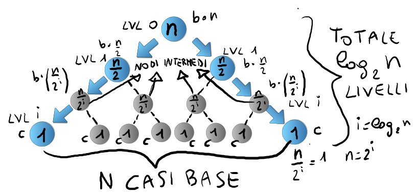
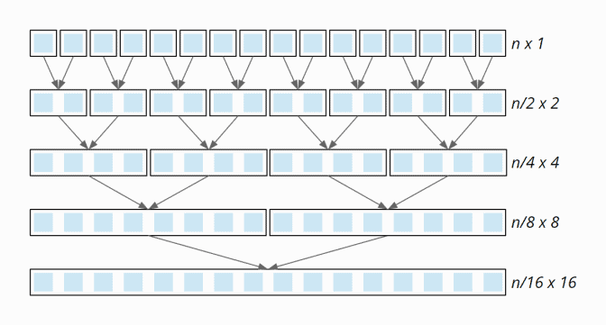
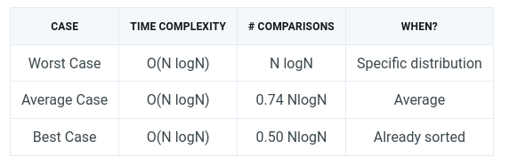
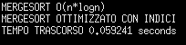

# DESCRIZIONE

> -   **SI TRATTA DI UN ALGORITMO DIVIDE ET IMPERA**
>
> -   **LO SCOPO È L'ORDINAMENTO DEGLI ELEMENTI NEL VETTORE**
>
>     -   CRESCENTE: spiegato nel documento
>
>     -   DESCRESCENTE: scambiare \< con \> nei confronti
>
> -   **UNA LISTA DI UN ELEMENTO È ORDINATA**
>
> -   **SFRUTTA LA TECNICA DELLA RICORSIONE**
>
>     -   DIVIDE A METÀ L'ARRAY IN INPUT
>
>     -   ORDINA RICORSIVAMENTE LE DUE METÀ
>
>         -   CASO BASE: LISTA DI UN ELEMENTO
>
>     -   UNISCE LE DUE METÀ ORDINANDOLE
>
> -   **ARRAY DI SUPPORTO:**
>
>     -   è necessario un array di copia per il confronto degli elementi
>
>     -   gli esiti del confronto vengono aggiornati nell'array di input iniziale

```{r}
minimo = 0
massimo =1000
lunghezza=10000
# vettore di 10000 interi randomico tra 0 e 1000
vettore = floor(runif(lunghezza,minimo,massimo))
# array di supporto vuoto
copyArray=vector("integer",lunghezza)
```

# SEPARAZIONE {#separazione}

```{r}


mergeSort = function(startIndex, endIndex){
  if (startIndex < endIndex){    # costo = c
    middleIndex = startIndex + (endIndex-startIndex)/2  #costo = c --> Theta(1)
    # chiamate rircorsive per le due metà separate
    mergeSort(startIndex,middleIndex)   # costo = T(N/2)
    mergeSort(middleIndex+1,endIndex)   # costo = T(N/2)
    # unione delle due metà ordinate
    unisci(startIndex,middleIndex,endIndex)  # costo = c * n operazioni = Theta(N)
  }
  # la porzione di riferimento contiene 0/1 elementi
  # di conseguenza già ordinati
}
```


> -   Dato N dimensione iniziale
>
> -   d = numero di divisioni
>
> -   Sono necessarie $log_{2}(N)$ divisioni al fine di ottenere elementi singoli

> Trattandosi di un algoritmo ricorsivo per semplificare i conti occorre creare l'albero delle chiamate ricorsive, e valutare l'andamento dei costi per i vari nodi



-   **CERCHIO = NODO/DIMENSIONE ; FRECCIA = ARCO/CHIAMATA RICORSIVA UNIDIREZIONALE**

-   La dimensione indica la lunghezza del vettore in input alla funzione [MERGESORT](#mergesort)

-   Secondo la procedura l'array viene diviso a metà fino a ottenere vettori di un unico elemento, quindi ordinati

-   Il livello espresso dalla lettera i indica la "profondità" del nodo a partire dal nodo radice

    -   0 = RADICE

    -   i = i-esimo livello con nodi di dimensone $dim = \frac{n}{2^i}$

    -   end = nodi con dimensione 1

        -   $dim = \frac{n}{2^i} = 1$

        -   $n = 2^i$

        -   $i = log_{2}(n)$

## OPERAZIONI ESEGUITE

-   if (start \< end) --\> costo unitario

    -   FALSO

        -   dimensione di riferimento \<= 1, vettore già ordinato

        -   costo nullo perchè non viene eseguita alcuna istruzione

    -   VERO

        -   2 chiamate ricorsive con dimezzamento dell'input

            -   2\* T(n/2) calcolato ricorsivamente

        -   1 chiamata alla funzione [unione](#unione) con costo lineare O(N) in quanto scandisce ogni elemento dell'array in input a mergeSort()

## TEMPO

$$
T(N) = (n  <= 1 )? \Theta(1) : 2*T(N/2) + O(N)
$$

### CORRETTEZZA

IPOTESI: MergeSort(vettore,start,end) termina con vettore[start;end] ordinato

#### DIMOSTRAZIONE

> SI DIMOSTRA CON LA TECNICA DELL'INDUZIONE

**CASO BASE**: MergeSort(vettore,start,end) termina con un vettore ordinato quando effettua 0 chiamate ricorsive, quindi quando start \<= end [([vedi codice](#separazione))]{.underline}

#### **PASSO INDUTTIVO**

**IPOTESI INDUTTIVA:** MergeSort(vettore,start,end) **ordina** **vettore[start;end]** con massimo **h chiamate ricorsive,** con $h = log_{2}(end-start+1)$

**TESI:** MergeSort() ordina con h+1 chiamate

-   h+1\>0 --\> start\<end

-   le prime due chiamate sono

    -   mergeSort(vettore, start, middle)

    -   mergeSort(vettore,middle+1,end)

-   restano ancora h-1 chiamate

    -   per ipotesi sappiamo che l'algoritmo è corretto se effettua h chiamate

    -   di conseguenza sappiamo che con h-1 chiamate l'algoritmo produce un risultato corretto

# UNIONE {#unione}

-   Le due metà sono ordinate

-   Controllare gli elementi da sinistra a destra per ognuno dei due vettori

-   Viene inserito il minore/maggiore e viene incrementato l'indice di ricerca per la metà in cui era presente l'elemento appena inserito

## OPERAZIONI ESEGUITE

```{r}
unisci = function(startIndex,middleIndex,endIndex){
   #indice di confronto metà SX
  leftIndex=startIndex  # costo = c
  #indice di confronto metà DX
  rightIndex=middleIndex+1 # costo = c
  #indice di aggiornamento del vettore originale
  inputIndex=startIndex  # costo = c
  
  
  # copia degli elementi selezionati da endIndex-startIndex nell'array di supporto, quindi entrambe le due metà
  for (i in startIndex:endIndex){   #costo =  2c*(endIndex-startIndex) = 2c*(n+1)
    copyArray[i] = vettore[i]  # costo = c*n
  }
  
  # costo = O(n) perchè vengono scanditi tutti gli n elementi per i vari confronti
  while(leftIndex<=middleIndex && rightIndex<=endIndex){  
        if (copyArray[leftIndex]<= copyArray[rightIndex]){  
            inputArr[inputIndex] = copyArray[leftIndex]   
            leftIndex = leftIndex+1    # sposta l'indice per cercare il successivo
        } else {
            inputArr[inputIndex]=copyArray[rightIndex]
            rightIndex=rightIndex+1
        }
        # incremento del contatore dell'inputArray
        inputIndex=inputIndex+1
  }
  # il ciclo finisce quando una delle due metà ha esaurito gli elementi
  
  
  # controlla se ci sono elementi nella metà SX
  while(leftIndex<=middleIndex){  # costo = O(N/2)  perchè viene scandita solo la metà di SX
    vettore[inputIndex] = copyArray[leftIndex]
    leftIndex = leftIndex+1
    inputIndex = inputIndex+1
  }
  
  # nel caso in cui la metà di DX avesse ancora elementi da scrivere significa che essi sono maggiori di tutti gli elementi della metà SX,
  # e quindi appaiono nel vettore originale in ordine corretto
  
  
}

```

-   Inzializzazione contatori, ciascuno con costo unitario c

-   n operazioni per eseguire la copia

-   massimo n operazioni per i test del while

    -   n perchè vengono scanditi tutti gli elementi delle due metà nel caso peggiore in cui ci siano elementi alternati

-   operazioni dentro il while, eseguite a seconda del risultato del while e degli if interni

-   massimo n/2 operazioni per il secondo while di controllo



> -   N elementi singoli iniziali
>
> -   Si uniscono a coppie, come descritto nell'algoritmo [ricorsivo](#mergesort)
>
>     -   merge(start,middle,end)
>
>     -   prima metà = arr[start,middle]
>
>     -   seconda metà = arr[middle+1,end]
>
> -   Il numero totale di unioni è descritto nel grafico, e corrisponde sempre a $log_{2}(N)$
>
> -   Ogni unione ha un costo che corrisponde a
>
>     -   $T(N) = O(N) + O(N/2) + \Theta(1) = O(N)$

# COMPLESSITÀ TEMPORALE



> L'algoritmo di mergeSort viene influenzato dalla tipologia di vettore in input
>
> -   Complessità temporiale invariata, in quanto sono necessarie tutte le $log_{2}(N)$ operazioni di separazione e $log_{2}(N)$ di unione

## [C ALGO](./C-MergeSort.zip)

-   main.c = file eseguibile che si interfaccia con l'utente

-   merge.h = versione in C dell'algoritmo riportato sopra

-   mergeArr.h = versione non ottimizzata di mergeSort a causa di operazioni inutili e onerose da eseguire

### TEMPO



## [JAVA ALGO](./JAVA-MergeSort.zip)

-   main.java = programma eseguibile

-   Abstaction.java = classe contenente l'algoritmo efficiente mergeSort()

# COMPLESSITÀ SPAZIALE

-   Vettore in INPUT di dimensione N --\> non viene contato in quanto input

-   Vettore di SUPPORTO anch'esso di dimensione N

    -   Se la dimensione N raddoppia, anche il vettore di SUPPORTO raddoppia

-   Le chiamate ricorsive vengono inserie nello STACK

    -   Il numero totale di [chiamate](#tempo) ricorsive è $nC = log_{2}(N)$

    -   Perciò lo STACK sarà occupato per nC spazi

    -   anche nC dipende dalla dimensione del vettore di INPUT

-   NON È IN PLACE in quanto la dimensione occupata dalla memoria non è prefissata, ma dipende dalla dimensione del vettore INPUT

### STABILITÀ

> Se due elementi sono uguali, quello che occuperà la posizione più a SX dell'array finale deve essere quello che era più a SX nell'array di INPUT

-   Questa condizione è verificata dal test effettuato nell'algoritmo di UNIIONE

    -   if (copyArray[leftIndex] \<= copyArray[rigthIndex])

        -   inputArr[inputIndex] = copyArray[leftIndex]

        -   viene mantenuto l'ordine iniziale

### 
