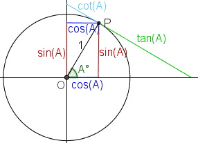

```{r}
library(dplyr)
library(tidyr)
library(gapminder)
library(ggplot2)
library(stringr)
```

# CERCHIO

> DISEGNARE DEI PUNTI LUNGO LA CIRCONFERENZA

## GEOM_POINT()

 > È UNA FUNZIONE CHE PERMETTE DI GENERARE UN PUNTO SUL PIANO CARTESIANO DATE DUE COORDINATE (X , Y)



> LA CIRCONFERENZA GONIOMETRICA HA COME RAGGIO = 1

* **DISEGNARE DEI PUNTI SULLA CIRCONFERENZA EQUIDISTANTI CON UN ANGOLO INTERMEDIO DI (piGreco / 8)rad = 180°/8 = 22,5°**

## GONIOMETRIA

* R = raggio Cerchio
* alfa = angolo
* P = (a,b) appartenente a (R,R) = PIANO R^2
* a = ascissa(x) del punto P
  * a = R * cos(alfa)
* b = ordinata(y) del punto P
  * b = R * sin(alfa)
  
```{r}
# RAGGIO CIRCONFERENZA GONIOMETRICA
R = 1
# LISTA DI ANGOLI ESPRESSI IN RADIANTI
(angoli = seq(0,2*pi,length.out = 17))
# A = {a1,a2,...,a17}: ai= R * cos(angoli[i])
(A = R*cos(angoli))
# B = {b1,b2,...,b17}: bi = R*sin(angoli[i])
(B = R*sin(angoli))
```

> UNA VOLTA OTTENUTE L'INSIEME DELLE COORDINATE SI CREA UN DATAFRAME

```{r}
(DF = data.frame(angoli,A,B))
```

## GRAFICO

> **GRAZIE ALLE FUNZIONI DI LIBRERIA DI ggplot2 È POSSIBILE GENERARE UN GRAFICO, DEFINITO SCATTERPLOT, CON I DATI DELLA TABELLA CREATA**

```{r}
(base = ggplot(data = DF, aes(A,B)))
```

> LA BASE DEL GRAFICO CORRISPONDE ALLA DEFINIZIONE DEGLI INTERVALLI DEL DOMINIO E CODOMINIO NEI QUALI VERRANNO VISUALIZZATI I PUNTI DEFINITI

```{r}
base + geom_point(aes(x = A,y=B)) + coord_fixed()
```

> **GEOM_POINT() DEFINISCE I PUNTI CHE DEVONO ESSERE VISUALIZZATI, COORD_FIXED() DEFINISCE UNA SCALA FISSA PER RAPPRESENTARE IL GRAFICO, E NON LO ADATTA ALLE DIMENSIONI DELLO SCHERMO**


# GOLDEN RATIO

> DISEGNARE UNA SPIRALE AUREA TENENDO CONTO DELL'ANGOLO AURE = GOLDEN RATIO = piGreco*(3-sqrt(5))

```{r}
# ESPRESSO IN RADIANTI
(GoldRatioRads = pi*(3-sqrt(5)))
(GoldRatioDegs = 180*(3-sqrt(5)))
# fattore conversione GRADI --> RADIANTI
DegsToRads = 2*pi/360
GoldRatioRads == GoldRatioDegs*DegsToRads
# fattore conversione RADIANTI --> GRADI 
RadsToDegs = 360/(2*pi)
GoldRatioDegs == GoldRatioRads*RadsToDegs
```


> OTTENUTI GLI ANGOLI ORA È POSSIBILE CREARE IL GRAFICO

```{r}
# numero di puntini da disegnare
points = 500
T = (1:points)*GoldRatioRads
A = cos(T)
B = sin(T)
df = data.frame(T,A,B)
ggplot(df, aes(A*T,B*T)) + 
  geom_point() +
  coord_fixed() +
  theme_void()
```

# COLORAZIONE

* DIMENSIONE DEI PUNTI = 0.8
* TRASPARENZA = ALPHA = 0.5
* COLOR = DARKGREEN/BLUE
* REMOVE LEGEND

```{r}
ggplot(df, aes(A*T,B*T)) + 
  geom_point(show.legend = FALSE,alpha = 0.5, size = 0.8, color = "blue") + coord_fixed() + theme_void()
```

# DIMENSIONE VARIABILE

> I PUNTI FINORA POSSIEDONO TUTTI LA STESSA CARATTERISTICA.    TALVOLTA PERò È OPPORTUNO CAMBIARE L'ASPETTO IN BASE AL VALORE DI DETERMINATE VARIABILI DEL DATAFRAME

* COLORE = NERO
* SHAPE = "*" = 8
* MAPPARE LA DIMENSIONE DEI PUNTI NELLA VARIABILE T DEL DATAFRAME

```{r}
ggplot(df, aes(A*T,B*T)) + 
  geom_point(color = "black", shape = 8, aes(size = T),show.legend = FALSE,alpha=0.5) + coord_fixed() + theme_void()
```

