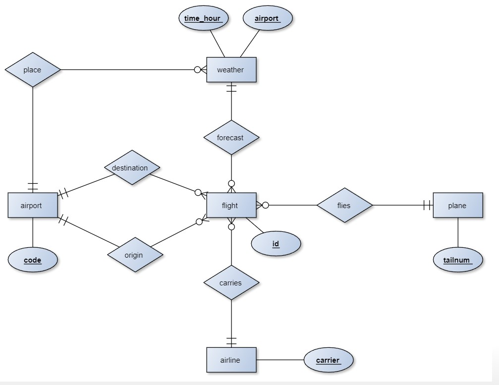

```{r}
library(dplyr)
library("nycflights13")
library(tibble)
library(tidyr)
library(readr)
library(stringr)
library(lubridate)
```

## NYCFLIGHTS13



* IL NOME DEI PERSONAGGI CON OCCHI BLU E CAPELLI BIONDI

```{r}
starwars %>% filter(eye_color == "blue", hair_color == "blonde") %>% select(name)
```


* I FILM IN CUI è PRESENTE LUKE SKYWALKER

```{r}
# RESTITUISCE UN TIBBLE 1x1 com VALORE LISTA DI FILMS
(listaFilm = starwars %>% filter(name == "Luke Skywalker") %>% select(films))
(nomiFilms = listaFilm[[1]])
# SOLUZIONE ALTERNATIVA IN PIPELINE
(nomiPull = starwars %>% filter(name == "Luke Skywalker") %>% pull(films))
typeof(nomiPull)
if (typeof(nomiPull) == typeof(nomiFilms)) print("RISULTATO ANALOGO")
## ESTRAE I VALORI DALLE COPPIE ($chiave:valore) --> STRINGHE

(a = unlist(nomiPull))
# VETTORE DI STRINGHE CHARACTER
typeof(a)
```

* VOLI NEL GIORNO DI NATALE

```{r}
flights %>% filter(day == 25,month == 12)
```

* VOLI CON RITARDO NON NULLO

```{r}
flights %>% filter(!is.na(dep_delay) | !is.na(arr_delay))
```


* NOME E ANNO DI NASCITA DI TUTTI GLI UMANI CHE VIVONO SU TATOOINE, IN ORDINE CRESCENTE PER ANNO DI NASCITA


```{r}
starwars %>% filter(species == "Human", homeworld == "Tatooine") %>% select(name, birth_year) %>% arrange(birth_year)
# arrange( desc(birth_year) ) --> ORDINE DECRESCENTE
```

* PERSONAGGI IN ORDINE DESCRESCENTE DI POPOLARITÀ (numero di film partecipati)

```{r}
starwars %>% mutate(popularity = sapply(films, length)) %>% arrange(desc(popularity)) %>% select(name, popularity)
```


* IL NUMERO DI PERSONAGGI CON COLORE CAPELLI E OCCHI VALIDI IN ORDINE DECRESCENTE 

```{r}
count(starwars, hair_color, eye_color, sort=TRUE)
```


**VOLI CON AEREI DELLA BOEING**

```{r}
flights %>% mutate(id = 1:nrow(flights))
View(flights)
View(planes)
inner_join(flights, planes, by = "tailnum") %>% select(tailnum,manufacturer, id) %>% filter(manufacturer == "BOEING") 
```


## DATA CHALLENGE 3.3

> QUAL è la migliore squadra in italia dal dataset = [LINK](https://football-data.co.uk//mmz4281/)


```{r eval=FALSE}
# prepare link structure
link1 = "https://www.football-data.co.uk/mmz4281/"
link2 = "/I1.csv"
# first solution
years = sprintf("%02d", c(seq(93, 99), seq(0, 21)))
# second solution
years = c(as.character(seq(93, 99)), str_c("0", as.character(seq(0, 9))), as.character(seq(10, 21)))
# link vector
nseasons = length(years)-1
links = str_c(link1, str_c(years[1:nseasons], years[2:(nseasons+1)]), link2)

# scrape data
# make a list of lists (each list element is a season)
l = vector("list", nseasons)
for (i in 1:nseasons) {
  # read the season dataset
  l[[i]] = read_csv(links[i], show_col_types = FALSE)
}
# name the seasons with years
names(l) = years[1:nseasons]


View(l)
# clean data (filter columns and rows)
for (i in 1:nseasons) {
  l[[i]] = l[[i]] %>% 
    select(Date, HomeTeam, AwayTeam, FTHG, FTAG) %>%
    filter(!is.na(Date), !is.na(FTHG), !is.na(FTAG)) %>% 
    mutate(Date = dmy(Date)) 
}

# combine seasons in a unique data frame
DF = list()
for (i in 1:nseasons) {
  DF = rbind(DF, l[[i]])
}

View(DF)
# save data on disk
write_csv(DF, "history.csv")

```


```{r echo=FALSE, eval=FALSE}
# read data
#history = read_csv("history.csv")

# home statistics
dfH = DF %>% 
  mutate(outcome = ifelse(FTHG > FTAG, "H", ifelse(FTHG < FTAG, "A", "D"))) %>% 
  count(HomeTeam, outcome) %>% 
  #spread(key = outcome, value = n) %>% 
  pivot_wider(names_from = outcome, values_from = n) %>% 
  rename(team = HomeTeam, winsHome = H, drawsHome = D, losesHome = A) %>% 
  # se una squadra possiede un NA lo rimpiazzamo con 0 per ottenere un valore numerico
  mutate(winsHome = ifelse(is.na(winsHome), 0, winsHome), 
         drawsHome = ifelse(is.na(drawsHome), 0, drawsHome), 
         losesHome = ifelse(is.na(losesHome), 0, losesHome)) %>% 
  select(team, winsHome, drawsHome, losesHome) %>% 
  mutate(pointsHome = 3 * winsHome + drawsHome) %>% 
  arrange(team)

# away statistics
dfA = history %>%
  mutate(outcome = ifelse(FTHG > FTAG, "H", ifelse(FTHG < FTAG, "A", "D"))) %>% 
  count(AwayTeam, outcome) %>% 
  #spread(key = outcome, value = n) %>% 
  pivot_wider(names_from = outcome, values_from = n) %>% 
  rename(team = AwayTeam, winsAway = A, drawsAway = D, losesAway = H) %>% 
  mutate(winsAway = ifelse(is.na(winsAway), 0, winsAway), 
         drawsAway = ifelse(is.na(drawsAway), 0, drawsAway), 
         losesAway = ifelse(is.na(losesAway), 0, losesAway)) %>% 
  mutate(pointsAway = 3*winsAway + drawsAway) %>% 
  arrange(team)

# overall statistics
rating = inner_join(dfH, dfA) %>% 
  mutate(wins = winsHome + winsAway, 
         draws = drawsHome + drawsAway,
         loses = losesHome + losesAway, 
         points = pointsHome + pointsAway,
         matches = wins + loses + draws,
         pointsPerMatch = points / matches) %>% 
  select(team, pointsPerMatch, matches, points, everything()) %>% 
  arrange(-pointsPerMatch)

```


