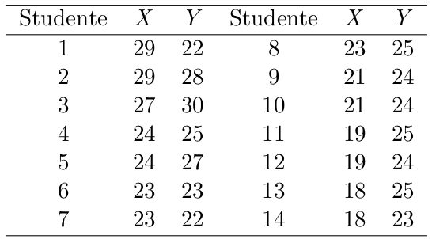

```{r setup, include=FALSE}
library("dplyr")
library("ggplot2")
```

# ES 3)



> X = VOTO ESAME SCRITTO
>
> Y = VOTO ESAME ORALE

```{r}
(Tabella = data.frame(
  X = c(29,29,27,24,24,23,23,23,21,21,19,19,18,18),
  Y = c(22,28,30,25,27,23,22,25,24,24,25,24,25,23)
))
```

## Y=ESAME ORALE

```{r}

(TabellaY = Tabella %>% group_by(Y) %>% summarise(fi = n()))
(TabellaY = cbind(TabellaY,Fi=cumsum(TabellaY$fi)))

(TabellaY = TabellaY %>% mutate(pi=fi/sum(fi)))

(TabellaY = cbind(TabellaY,Pi=cumsum(TabellaY$pi)))


```

### MEDIA

$$
E(Y) = \frac{1}{n}*\sum_{i=1}^{n}y_i = \sum_{j=1}^{J}y_j*p_j
$$

```{r}
(Y_Media = mean(Tabella$Y))
sum(TabellaY$Y*TabellaY$pi)
```

### VARIANZA

$$
V(Y) = E[(Y-E(Y))^2] = E(Y^2) - (E(Y))^2 = \sum_{j=1}^{J}(y_j-E(Y))^2*p_j
$$

```{r}
# valori grezzi
(Y_Varianza = mean((Tabella$Y - Y_Media)**2))
(Y_sigma = Y_Varianza**0.5)
# valori con frequenze relative
sum(((TabellaY$Y-Y_Media)**2)*TabellaY$pi)
```

## X = ESAME SCRITTO

```{r}

(TabellaX = Tabella %>% group_by(X) %>% summarise(fi = n()))
(TabellaX = cbind(TabellaX,Fi=cumsum(TabellaX$fi)))

(TabellaX = TabellaX %>% mutate(pi=fi/sum(fi)))

(TabellaX = cbind(TabellaX,Pi=cumsum(TabellaX$pi)))


```

### MEDIA

$$
E(Y) = \frac{1}{n}*\sum_{i=1}^{n}y_i = \sum_{j=1}^{J}y_j*p_j
$$

```{r}
(X_Media = mean(Tabella$X))
sum(TabellaX$X*TabellaX$pi)
```

### VARIANZA

$$
V(Y) = E[(Y-E(Y))^2] = E(Y^2) - (E(Y))^2 = \sum_{j=1}^{J}(y_j-E(Y))^2*p_j
$$

```{r}
# valori grezzi
(X_Varianza = mean((Tabella$X - X_Media)**2))
(X_sigma = X_Varianza**0.5)
# valori con frequenze relative
sum(((TabellaX$X-X_Media)**2)*TabellaX$pi)
```

## COVARIANZA

$$
Cov(X,Y) = E(XY) - E(X)E(Y)
$$

```{r}
(XY_Covarianza = mean(Tabella$X*Tabella$Y) - Y_Media*X_Media)
```

### CORRELAZIONE LINEARE

$$
\rho_{XY} = \frac{Cov(X,Y)}{\sigma_Y*\sigma_X}
$$

```{r}

(rhoXY = XY_Covarianza/( Y_sigma*X_sigma))


```

$$
\beta = \frac{Cov(X,Y)}{V(X)} = \rho_{XY}*\frac{\sigma_Y}{\sigma_X}
$$

$$
\alpha = E(Y)-\beta*E(X)
$$

```{r}
(beta = XY_Covarianza / X_Varianza)
(beta = rhoXY*Y_sigma/X_sigma)
(alfa = Y_Media - beta*X_Media)
```


$$
Ys = \beta X + \alpha
$$

```{r}
(Ystimata = beta*Tabella$X + alfa)
(Ys_Varianza = mean(Ystimata**2) - mean(Ystimata)**2)
(ErroriStimati = Tabella$Y - Ystimata)
(Es_Varianza = mean(ErroriStimati**2) - mean(ErroriStimati)**2)
```

```{r}
ggplot(Tabella,aes(x=X,y=Y)) + geom_point()  + geom_abline(aes(intercept=alfa,slope=beta) ) +geom_segment(aes(yend=Ystimata,xend=X))  + labs(x="VOTO ESAME SCRITTO", y="VOTO ESAME ORALE")
```


$$
R^2 = \frac{V(Ys)}{V(Y)} = 1-\frac{V(Es)}{V(Y)}
$$

```{r}
(Rquadro = Ys_Varianza / Y_Varianza)
1-(Es_Varianza/Y_Varianza)
```
