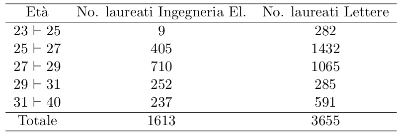

```{r setup, include=FALSE}
library("ggplot2")
library("dplyr")
```

# 1)



> **Y = Età degli studenti laureati in Ingegneria Elettronica e Lettere**

## INGEGNERIA ELETTRONICA

```{r}
# frequenze assolute
(Ing_El_Table = data.frame(
  ETA_MIN = c(23,25,27,29,31),
  ETA_MAX = c(25,27,29,31,40),
  fi = c(9,405,710,252,237)
) )

fCumulate =  cumsum(Ing_El_Table$fi)

(Ing_El_Table = cbind( Ing_El_Table,Fi=fCumulate))
# aggiunge la colonna frequenze relative pi
(Ing_El_Table = Ing_El_Table %>% mutate(pi = fi/sum(fi)))


(fRelCum = cumsum(Ing_El_Table$pi))

# TABELLA DI FREQUENZE ASSOLUTE E RELATIVE, CUMULATE E NON
(Ing_El_Table = cbind(Ing_El_Table,Pi = fRelCum))


```

### CLASSE MEDIANA

$$
y_{0.5} = y_i, i = 0.5*100*n
$$

```{r}
(ING_EL_Classe_Mediana =  Ing_El_Table[Ing_El_Table$Pi >= 0.5,c("ETA_MIN","ETA_MAX")][1,])

(Mediana_ING_EL = (ING_EL_Classe_Mediana$ETA_MAX+ING_EL_Classe_Mediana$ETA_MIN)/2)
```

### MEDIA ARITMETICA

$$
E(Y) = \sum_{i=1}^{J}y^c_i*p_i
$$

```{r}
# Valori Centrali della classe
(Yc = (Ing_El_Table$ETA_MIN +  Ing_El_Table$ETA_MAX)/2)
(Ing_El_Table = cbind(Yci = Yc,Ing_El_Table))

(Media_ING_EL = sum(Yc*Ing_El_Table$pi))
```

### VARIANZA

$$
V(Y) = E[ (Y-E(Y))^2] = E(Y^2) - (E(Y))^2
$$

$$
V(Y) = \sum_{i=1}^{J}(y^c_i-E(Y))^2*pi
$$

```{r}
(Varianza_ING_EL = sum(((Ing_El_Table$Yci-Media_ING_EL)**2)*Ing_El_Table$pi))

```

### ISTOGRAMMA

```{r}
Ing_El_Table
ggplot(Ing_El_Table,aes(x=Yci,y=fi)) + geom_col( color="black", fill="green",width =  Ing_El_Table$ETA_MAX-Ing_El_Table$ETA_MIN) + labs(x = "ETÀ",y="Frequenza Assoluta",colour="Mediana") + geom_vline(aes(xintercept=Mediana_ING_EL,color="red")) 
```

#### SIMMETRIA

$$
\gamma_Y = \frac{ E[(Y-E(Y))^3]  }{\sigma^3_Y}
$$

```{r}
(sigma_ING_EL = Varianza_ING_EL**0.5)  #radice quadrata della varianza

(gamma_ING_EL = mean((Ing_El_Table$Yci-Media_ING_EL)**3)/(sigma_ING_EL**3))
```

> Avendo un valore POSITIVO c'è asimmetria positiva, quindi a destra della mediana, come si evince dall'istogramma

#### CURTOSI

$$
\beta_Y = \frac{ E[(Y-E(Y))^4]  }{\sigma^4_Y}
$$

```{r}
(curtosi_ING_EL = mean((Ing_El_Table$Yci-Media_ING_EL)**4)/(sigma_ING_EL**4))
```

> Avendo un valore \> 3 vi è una situazione LEPTOCURTICA, quindi le frequenze possiedono un valore elevato ai margini del Range di Y.
>
> Ciò conferma anche la situazione di ASIMMETRIA POSITIVA

## LETTERE

```{r}
# frequenze assolute
(Lettere_Table = data.frame(
  ETA_MIN = c(23,25,27,29,31),
  ETA_MAX = c(25,27,29,31,40),
  fi = c(282,1432,1065,285,591)
) )

(fCumulate =  cumsum(Lettere_Table$fi))

(Lettere_Table = cbind( Lettere_Table,Fi=fCumulate))
# aggiunge la colonna frequenze relative pi
(Lettere_Table = Lettere_Table %>% mutate(pi = fi/sum(fi)))


(fRelCum = cumsum(Lettere_Table$pi))

# TABELLA DI FREQUENZE ASSOLUTE E RELATIVE, CUMULATE E NON
(Lettere_Table = cbind(Lettere_Table,Pi = fRelCum))
```

### CLASSE MEDIANA

$$
y_{0.5} = y_i, i = 0.5*100*n
$$

```{r}
(ING_EL_Classe_Mediana =  Lettere_Table[Lettere_Table$Pi >= 0.5,c("ETA_MIN","ETA_MAX")][1,])

(Mediana_ING_EL = (ING_EL_Classe_Mediana$ETA_MAX+ING_EL_Classe_Mediana$ETA_MIN)/2)
```

### MEDIA ARITMETICA

$$
E(Y) = \sum_{i=1}^{J}y^c_i*p_i
$$

```{r}
# Valori Centrali della classe
(Yc = (Lettere_Table$ETA_MIN +  Lettere_Table$ETA_MAX)/2)
(Lettere_Table = cbind(Yci = Yc,Lettere_Table))

(Media_LET = sum(Yc*Lettere_Table$pi))
```

### VARIANZA

$$
V(Y) = E[ (Y-E(Y))^2] = E(Y^2) - (E(Y))^2
$$

$$
V(Y) = \sum_{i=1}^{J}(y^c_i-E(Y))^2*pi
$$

```{r}
(Varianza_LET = sum(((Lettere_Table$Yci-Media_LET)**2)*Lettere_Table$pi))

```

### ISTOGRAMMA

```{r}
Lettere_Table
ggplot(Lettere_Table,aes(x=Yci,y=fi)) + geom_col( color="black", fill="green",width =  Lettere_Table$ETA_MAX-Lettere_Table$ETA_MIN) + labs(x = "ETÀ",y="Frequenza Assoluta",colour="Mediana") + geom_vline(aes(xintercept=Media_LET,color="red")) 
```

#### SIMMETRIA

$$
\gamma_Y = \frac{ E[(Y-E(Y))^3]  }{\sigma^3_Y}
$$

```{r}
(sigma_LET = Varianza_LET**0.5)  #radice quadrata della varianza

(gamma_LET = mean((Lettere_Table$Yci-Media_LET)**3)/(sigma_LET**3))
```

> Avendo un valore POSITIVO c'è asimmetria positiva, quindi a destra della mediana, come si evince dall'istogramma

#### CURTOSI

$$
\beta_Y = \frac{ E[(Y-E(Y))^4]  }{\sigma^4_Y}
$$

```{r}
(curtosi_LET = mean((Lettere_Table$Yci-Media_LET)**4)/(sigma_LET**4))
```

> Avendo un valore \> 3 vi è una situazione LEPTOCURTICA, quindi le frequenze possiedono un valore elevato ai margini del Range di Y.
>
> Ciò conferma anche la situazione di ASIMMETRIA POSITIVA

## CONFRONTO

### COEFFICIENTE DI VARIAZIONE

$$
CV_Y = \frac{\sigma_Y}{E(Y)}
$$

```{r}
(Coeff_Var_ING_EL = sigma_ING_EL / Media_ING_EL)
(Coeff_Var_LET = sigma_LET / Media_LET)

```

### BOXPLOT

```{r}
(TabellaTotale = data.frame(
  ETA_MIN = c(23,25,27,29,31),
  ETA_MAX = c(25,27,29,31,40),
  fi_ING  = c(9,405,710,252,237),
  fi_LET = c(282,1432,1065,285,591)
))
(Yci = (TabellaTotale$ETA_MIN+TabellaTotale$ETA_MAX)/2)

(TabellaTotale = cbind(Yci,TabellaTotale))


```
