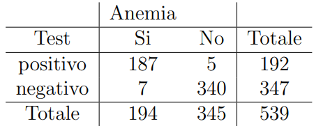
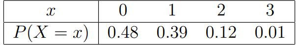

```{r setup, include=FALSE}
knitr::opts_chunk$set(echo = TRUE)
```

# ES 1

> Date 10 urne $A_i$ = evento scegliere a caso una delle 10 urne
>
> -   $S_{A_1,…,A_9} = \{B,B,N,N\}$
>
> -   $S_{A_{10}} = \{B,B,B,B,B,N\}$
>
> Trovare La probabilità che l'urna estratta sia la 10 data una pallina bianca

-   $P(B)$ = probabilità che la pallina sia bianca tra tutte quelle disponibili nelle 10 urne

    -   $P(B) = \sum P(A_i)P(B|A_i) = 0.53333$

-   $P(A_i) = 1/10$

-   $P(B|A_i)$ probabilità che la pallina sia bianca all'interno dell'urna i-esima

$$
P(A_{10}|B) = \frac{P(A_{10})P(B|A_{10})}{P(B)} = \frac{1/10*5/6}{(9/20+5/60)} = 0.156
$$

# ES 2

> $B$ = evento il test è positivo
>
> $A$ = evento la persona è malata
>
> $A^c$ = evento la persona è sana

-   $P(A)=1/1000$

-   $P(B|A) = 0.999$

-   $P(B|A^c) = 0.002$

> Determinare la probabilità che la persona sia malata dato il test positivo

$$
P(A|B) = \frac{P(A)P(B|A)}{P(B)} 
$$

$$
P(B) = \sum P(A_i)P(B|A_i) = P(A)P(B|A) + P(A^c)P(B|A^c) = 1/1000*0.999 + (1-1/1000)0.002 = 0.003
$$

$$
P(A|B) = \frac{1/1000 * 0.999}{0.003} = 0.33
$$

# ES 3

$$
P(B) = \sum P(B|A_i)P(A_i)
$$

-   $A_i$ = evento esce la faccia i dal dado

-   $P(B|A_i) = \binom{n}{i}$

$$
U = \{N,N,N,N,N,x,x,x,x,x\}
$$

# ES 5

> $A$ = evento persona propensa all'incidente
>
> $B$ = evento fa l'incidente entro il 1° anno

-   $P(A) = 0.3$= probabilità che una persona sia propensa a un incidente

-   $P(B|A) = 0.2$ = probabilità che una persona faccia un incidente essendo propensa a fare un incidente

-   $P(B|A^c)=0.05$

> La probabilità che una persona effettui un incidente si calcola con la formula della probabilità totale

$$
P(B) = \sum P(A_i)P(B|A_i)
$$

$$
P(B) = 0.3*0.2+(1-0.3)*0.05 = 0.635
$$

> Se una persona ha fatto un incidente, qual è la probabilità che essa fosse propensa a farlo?

$$
P(A | B) = \frac{P(B \cap A)}{P(B)} = \frac{P(A)P(B|A)}{P(B)} = \frac{0.3*0.2}{0.635}=0.095
$$

# ES 6

> $A$ = elemento non conforme
>
> $B$ = scarta elemento

-   $P(A)= 0.001$ : probabilità che un elemento non sia conforme

-   $P(B|A) =0.9$: probabilità che l'elemento venga scartato se non è conforme

-   $P(B|A^c) = 0.01$: probabilità che venga scartato essendo conforme

> Si vuole determinare la probabilità che l'oggetto sia non conforme nel caso in cui venga scartato

$$
P(A|B) = \frac{P(B \cap A)}{P(B)} = \frac{P(A)P(B|A)}{P(B)}
$$

> $P(B)$ rappresenta la probabilitò totale che l'oggetto venga scartato, e si calcola con la regola delle probabilità totale

$$
P(B) = \sum P(A_i)P(B|A_i) = 0.001*0.9+(1-0.001)*0.01 = 0.011
$$

> Ottenuto $P(B)$ è possibile calcolare $P(A|B)$

$$
P(A|B) = \frac{P(A)P(B|A)}{P(B)} = \frac{0.001*0.9}{0.011} = 0.082
$$

# ES 7

> $A$ = evento conosce la risposta
>
> $B$ = evento risponde esattamente

-   $P(A)=0.7$: probabilità che conosca la risposta

-   $P(B|A)=1$: se conosce la risposta si presuppone che risponda correttamente

-   $P(B|A^c) = 1/6$: se non conosce la risposta, la probabilità di rispondere correttamente corrisponde a 1/6 in quanto le possibili risposte per ogni domanda sono 6

> Si vuole determinare la probabilità che risponda esattamente, con la regola delle probabilità totale

$$
P(B) = \sum P(A_i)P(B|A_i) = 0.7*1+(1-0.7)*1/6 = 0.75
$$

> Si vuole determinare la probabilità che fosse a conoscenza della risposta avendo risposto correttamente

$$
P(A|B) = \frac{P(B \cap A)}{P(B)} =  \frac{P(A)P(B|A)}{P(B)} = \frac{0.7*1}{0.75} = 0.933
$$

> SI vuole determinare la probailità che su 2 domande risponda esattamente ad almeno una
>
> $B_i$: risponde esattamente alla i-esima domanda

$$
P(B_1 \cup B_2) = P(B_1)+P(B_2)-P(B_1 \cap B_2)
$$

-   $P(B_1)=P(B_2) = P(B) = 0.75$

-   $P(B_1 \cap B_2) = P(B_1)P(B_2)$: in quanto $B_1,B_2$ sono indipendenti

    -   $P(B_1 \cap B_2) = 0.75*0.75 = 0.5625$

$$
P(B_1 \cup B_2) = P(B_1)+P(B_2) - P(B_1 \cap B_2) = 0.75+0.75-0.5625=0.9375
$$

# ES 8

> $A_1$ = evento esce la pallina bianca dalla 1 urna
>
> $A_2$ dalla seconda bianca
>
> Determinare la probabilità che dalla seconda urna si estrae una pallina bianca

-   $P(A_2)=\sum P(A_1)P(A_2|A_1) = 7/10*4/7 + 3/10*3/7 = 0.528$

$$
P(A_1|A_2) = \frac{P(A_1)P(A_2|A_1)}{P(A_2)} = \frac{7/10*4/7} {0.528} = 0.757
$$

# ES 9

> Un telegrafo trasmette linee e punti
>
> $A$ simbolo = punto, $A^C$ simbolo è una linea
>
> $B$ segnale ricevuto = PUNTO $B^c$ = segnale ricevuto = LINEA

-   $P(A)=5/8$: probabilità che venga trasmesso un punto

-   $P(A^c)=1-P(A) = 3/8$: viene trasmesso linea

-   $P(B^c|A)=2/5$: che il segnale ricevuto sia diverso da un PUNTO

-   $P(B|A^c)=1/3$: il segnale ricevuto è diverso da LINEA

> Si vuole determinare la correttezza del simbolo ricevuto

## PUNTO

> Determinare se il simbolo inviato è uguale a quello ricevuto

$$
P(A|B) = \frac{P(B \cap A)}{P(A)} = \frac{P(A)P(B|A)}{P(B)}
$$

> $P(B)$ rappresenta la probabiltà che il segnale ricevuto sia un PUNTO

$$
P(B) =  \sum P(A_i)P(B|A_i) =  5/8*(1-2/5) + 3/8*1/3 = 0.5
$$

$$
P(B^c) = 0.5
$$

$$
P(A|B) = \frac{P(A)P(B|A)}{P(B)} = \frac{5/8*(1-2/5)}{0.5}= 3/4 = 0.75
$$

$$
P(A^c|B) = 1-P(A|B) = 0.25
$$

## LINEA

$$
P(A^c | B^c) = \frac{P(A^c)P(B^c|A^c)}{P(B^c)} = \frac{3/8*(1-1/3)}{0.5} = 1/2=0.5
$$

# ES 10

> Un'urna contiene 10 palline, 3 nere e 7 bianche.
>
> A ogni estrazione di una pallina viene reinserita un'altra pallina dello stesso colore di quella appena estratta
>
> $A_i$ = esce una pallina nera alla i-esima estrazione

$$ 
P(A_1 \cap A_2 \cap A_3) = P(A_1)P(A_2|A_1)P(A_3|A_2 \cap A_1) = 3/10*4/11*5/12=1/22=0.045
$$

-   $P(A_2|A_1)$ indica la probabilità che esca una pallina nera della 2 estrazione dopo aver estratto una pallina nera nella prima urna.

    -   Dopo la estrazione si reinseriscono le palline aggiungendone una del colore appena estratto

    -   Se alla prima estrazione si trova una nera l'urna conterrà 11 palline di cui 4 nere

-   $P(A_2|A_1)=4/11$

-   $P(A_3|A_2 \cap A-1)$ è analogo, quindi l'urna conterrà 12 palline di cui 5 nere

-   $P(A_3|A_2 \cap A_1) = 5/12$

> Determinare la probabilità che se la seconda estrazione ha prodotto una pallina nera allora anche la prima ha prodotto una pallina nera

$$
P(A_1|A_2) = \frac{P(A_1)P(A_2|A_1)}{P(A_2)} = \frac{3/10*4/11}{3/10*4/11 + (1-3/10)*3/11} = 12/33=0.364
$$

# ES 11

> $A$ fumatore, $A^c$ non fumatore
>
> $B$ affetto da patologia, $B^c$ non affetto da patologia

-   $P(A)=0.32$: percentuale di fumatori nella popolazione

-   $P(B|A)=0.25$: il 25% dei fumatori è affetto da patologia

-   $P(B|A^c)=0.05$: il 5% dei fumatori non è affetto da patologia

> Si vuole determinare la probabilità che un individuo scelto a caso nella popolazione sia affetto da malattia

$$
P(B) = \sum P(A_i)P(B|A_i) = P(A)P(B|A)+P(A^c)P(B|A^c) = 0.32*0.25+(1-0.32)*0.05=0.114
$$

> Ora si vuole determinare la probabilità che data una persona malata essa sia un fumatore

$$
P(A|B) = \frac{P(A \cap B)}{P(B)} = \frac{P(A)P(B|A)}{P(B)} = \frac{0.32*0.25}{0.114} = 0.70
$$

# ES 12

> $A_i$ = l'oggetto si trova nella classe i-esima
>
> $B$ = pezzo difettoso, $B^c$ non difettoso

-   $P(A_A) = 0.15$, $P(B|A^A)=0.03$

-   $P(A_B) = 0.35$, $P(B|A^B)=0.09$

-   $P(A_C)=0.5$ , $P(B|A^C)=0.13$

$$
P(A_C|B) = \frac{P(A_c)P(B|A_c)}{P(B)} = \frac{0.5*0.13}{0.101} = 0.64
$$

$$
P(B)  = \sum P(A_i)P(B|A_i) = P(A_A)P(B|A_A)+P(A_B)P(B|A_B) + P(A_C)P(B|A_C)
$$

$$
0.15*0.03+0.35*0.09+0.5*0.13 = 0.101
$$

# ES 13

> $i \in [1,5]$
>
> $A_i$ = estrazione dall'i-esima urna
>
> $P(A_i) = 1/5$
>
> i-esima urna contiene 4 palline nere e i+2 bianche
>
> $B$ la pallina è bianca

> Si vuole determinare la probabilità che la pallina sia bianca indipendentemente dall'urna

$$
P(B)  = \sum P(A_1)P(B|A_i) = 0.2*3/7+0.2*0.5+0.2*5/9+0.2*0.6+0.2*7/11 = 0.544
$$

-   $P(B|A_1) = 3/7$,

    -   $P(A_1|B) = \frac{P(A_1)P(B|A_1)}{P(B)} = \frac{0.2*3/7}{0.544}=0.157$

-   $P(B|A_2)=0.5$

-   $P(B|A_3)=5/9$

-   $P(B|A_4)=0.6$

-   $P(B|A_5)=7/11$

# ES 14



> $A$ = test positivo
>
> $P(A)=192/539=0.356$
>
> $B$ = malato
>
> $P(B)=0.005$

-   $P(A|B)=187/194=0.964$

-   $P(A^c|B^c)=340/345=0.986$

$$
P(B|A) = \frac{P(B)P(A|B)}{P(A)} = 0.013
$$

$$
P(B^c|A) = \frac{(1-0.005)*(1-0.986)}{0.37}
$$

# ES 15

> $A$ =test positivo
>
> $B$ malato
>
> $P(B)=0.2$

-   $P(A|B)=0.34$

-   $P(A^c|B^c)=0.86$

$$
P(B|A) = \frac{P(B)P(A|B)}{P(A)} = \frac{0.2*0.34}{0.18} = 0.378
$$

$$
P(A) = \sum P(B_i)P(A|B_i) = 0.2*0.34+0.8*(1-0.86)=0.18
$$

# ES 16

$$
F_X(x)=\begin{cases} 0,  & \mbox{if } x < -0.5 \\ 0.5+2x+2x^2,  & \mbox{if } -0.5 \le x < 0 \\ 0.5+2x-2x^2,  & \mbox{if } 0 \le x < 0.5 \\ 1,  & \mbox{if } x \ge 0.5  \end{cases} 
$$

$$
P(|X| \le 0.25)
$$

$$
|X| \le 0.25 \implies -0.25 \le X \le 0.25
$$

$$
P(|X|\le0.25)=P(-0.25 \le X \le 0.25)=F(0.25)-F(-0.25)= (0.5+2(0.25) - 2(0.25)^2) - (0.5+2(-0.25)+2(-0.25)^2) =  0.875 - 0.125 = 0.75
$$

$$
P(X=0) = 0
$$

> Essendo una variabile casuale con supporto continuo ogni punto possiede probabilità nulla

$$
P(A|B) = \frac{P(A \cap B)}{P(B)}
$$

$$
P(|X| \le 0.25|X \ge 0) =  \frac{P(X \ge 0 \cap |X| \le 0.25)}{P(X \ge 0)} = \frac{P(|X| \le 0.25)}{P(|X|\ge0)} = \frac{0.75}{1} = 0.75 
$$

## VALORE ATTESO

$$
E(X) = \int_{-\infty}^{+\infty}xf_X(x)dx = 
$$

$$
f_X(x) = F'_X(x) = \begin{cases} 0,  & \mbox{if } x < -0.5 \\   2+4x,  & \mbox{if } -0.5 \le x < 0 \\ 2-4x,  & \mbox{if } 0 \le x < 0.5 \\ x,  & \mbox{if }   0 \ge 0.5   \end{cases} 
$$

$$
E(X) = \int_{-0.5}^{0}xf_X(x)dx + \int_{0}^{0.5}xf_X(x)dx + \int_{0.5}^{+\infty}xf_X(x)dx = \int_{-0.5}^{0}2x+4x^2 + \int_{0}^{0.5}2x-4x^2 + \int_{0.5}^{+\infty}x 
$$

$$
\int 2x+4x^2 = x^2+ 4x^3/3
$$

-   $\int_{-0.5}^02x+4x^2 = (0)^2-4(0)^3/3 - (-0.5)^2+4(-0.5)^3/3 = -0.41666$

$$
\int2x-4x^2 = x^2- 4x^3/3
$$

-   $\int_{0}^{0.5} 2x-4x^2 = [(0.5)^2-4(0.5)^3/3] - [(0)^2-4(0)^3/3] = 0.083333$

$$
\int x  = x^2/2
$$

-   $\int_{0.5}^{+\infty} = 1 - (0.5)^2/2 = 1-0.125=0.875$

$$
\int 0 = c
$$

### VARIANZA

$$
V(X) = \int_{-\infty}^{+\infty}x^2f_X(x)dx = \int_{-0.5}^{0}x^2f_X(x)dx  + \int_{0}^{0.5} x^2f_X(x)dx = \int_{-0.5}^{0}x^2(2+4x)dx + \int_{0}^{0.5}x^2(2-4x)dx
$$

$$
\int x^2(2+4x)dx = 2/3x^3+x^4
$$

-   $\int_{-0.5}^{0}x^2(2+4x)dx = [2/3(0)^3+(0)^4] - [2/3(-0.5)^3+(-0.5)^4] = 0.0208$

$$
\int x^2(2-4x)dx = 2/3x^3-x^4
$$

-   $\int_{0}^{0.5}x^2(2-4x)dx = 2/3(0.5)^3-(0.5)^4 = 0.0208$

$$
V(X) = \int_{-\infty}^{+\infty}x^2f_X(x)dx = 0.0208+0.0208 = 0.0416
$$

# ES 17

> $X$ = n° utenti connessi $X \sim Bi(n,p)$
>
> Dati $n=15$ PC e ognuno ha una probabilità di collegarsi alla rete di $p=0.5$
>
> Si può definire un modello Binomiale

$$
Bi(n,p) = Bi(15,0.5)
$$

$$
E(X) = np = 15*0.5=7.5
$$

> La probabilità che la rete sia satura

$$
P(X \ge 10) = \sum_{i=10}^{15}f_X(x_i) = \sum_{i=10}^{15}\binom{15}{i}*p^i*p^{15-i}
$$

$$
P(X=10)+P(X=11)+..+P(X=15)
$$

```{r}
PXmag10=0
for (i in 10:15){
  PXmag10 = PXmag10+(choose(15,i)*(0.5**i)*(0.5**(15-i)))
} 
PXmag10


```

# ES 18

$$
a \in [0,1], b > 0
$$

$$
F_X(x) = \begin{cases}  aexp(bx),  & \mbox{if } x < 0 \\ 1,  & \mbox{if } x \ge 0\end{cases} 
$$

$$
f_X(x) = \begin{cases}  ab*exp(bx),  & \mbox{if } x < 0 \\ 0,  & \mbox{if } x \ge 0\end{cases}
$$

$$
f_X(x) \ge 0, \forall x \in R
$$

$$
ab*exp(bx) \ge 0
$$

$$
exp(bx) \ge 0 : \forall b,x \in R
$$

$$
ab \ge 0 
$$

$$
a \in [0,1], b > 0
$$

# ES 19

> Sia $X$ una variabile continua con supporto $S_X=[2,+\infty)$

$$
f_X(x) = \begin{cases}  kx^{-2},  & \mbox{if } x \in S_X \\ 0,  & \mbox{if } x \notin S_X\end{cases}
$$

$$
F_X(x) = \int_{-\infty}^{+\infty}f_X(x)dx = \int_{2}^{+\infty}f_X(x)dx
$$

## VALIDITÀ FUNZIONE DI DENSITÀ

-   $f_X(x) \ge 0$

-   $\int_{-\infty}^{+\infty}f_X(x)dx=1$

$$
kx^{-2} \ge 0 \implies \begin{cases}  k \ge 0  \\ 1/x^2 \ge0, \forall x \ne 0    \end{cases}
$$

$$
\int kx^{-2} = \frac{-k}{x}
$$

$$
1=\int_{-\infty}^{+\infty}f_X(x)dx = \int_{2}^{+\infty}kx^{-2} = \lim_{x \to \infty}\frac{-k}{x}  -  \frac{-k}{2} = 0+\frac{k}{2}                                     
$$

$$
\frac{k}{2} = 1, k = 2
$$

## MEDIA

$$
E(X) = \int_{-\infty}^{+\infty}xf_X(x)dx =  \int_{-\infty}^{+\infty}\frac{k}{x} = 0
$$

## MODA

$$
x_{mo}: f_X(x_{mo}) = max \{f_X(x)\}
$$

> Il massimo di una funzione si calcola trovando la derivata prima e ponendola = 0

$$
f'_X(x)=0
$$

\$\$

\$\$

> Siccome $x \ne 0$ significa che la funzione di ripartizione del punto $x=0$ non esiste, perciò bisogna calcolare il limite

# ES 20

> Sia $X$ una variabile continua con supporto $S_X= [-1,+\infty)$

$$
f_X(x) = \begin{cases}  ke^{-x},  & \mbox{if } x \in S_X \\ 0,  & \mbox{if } x \notin S_X\end{cases}
$$

## DEFINIZIONE

$$
\int_{-\infty}^{+\infty}f_X(x)dx = 1
$$

$$
\int ke^{-x} = -ke^{-x}
$$

$$
\int _{-\infty}^{+\infty}f_X(x)dx = \int _{-1}^{+\infty}f_X(x)dx = F(\infty)-F(-1) = -ke^{-\infty} - (-ke^1) = 0 + ke 
$$

$$
ke = 1 \implies k = e^{-1}
$$

## FUNZIONE DI DENSITÀ

$$
f_X(x) = e^{-x-1}
$$

## FUNZIONE DI RIPARTIZIONE

$$
F_X(x) = \int f_X(x)dx = \int e^{-x-1} = -e^{-x-1}
$$

## MEDIANA

> Avendo a disposizione una variabile continua la mediana corrisponde al valore $x_{0.5}$ per cui

$$
F_X(x_{0.5}) = 0.5
$$

$$
-e^{-x-1} = 0.5
$$

$$
e^{-x-1} = 0.5
$$

$$
e^{-x} = e/2
$$

$$
-x = log(e/2) 
$$

$$
x = log(2)-1
$$

# ES 21

> Dato un campione casuale di 100 automobili,di cui lo 0.01% richiede un intervento.

$$
X \sim Bi(n,p) \sim Bi(100,0.01)
$$

## MEDIA

$$
E(X) = np = 100*0.01 = 1
$$

## VARIANZA

$$
V(X) = np(1-p) = 100*0.01*0.99 = 0.99
$$

> Si determini la probabilità dell'evento $X=0$

$$
P(X=0) = f_X(0) = \binom{n}{0}p^0(1-p)^n=(1-p)^2=0.99^{100}=0.366
$$

# ES 22

> Sia X la variabile che conta il numero di volte che esce un numero maggiore o uguale a 5 dopo 3 lanci di un dado regolare

## SUPPORTO

> I possibili valori del conteggio sono

$$
S_X = [0;3]
$$

## FUNZIONE DI DENSITÀ

> Si può prendere come modello quello binomiale

$$
X \sim Bi(n,p) \sim Bi(3,2/6)
$$

-   $n=3$ è il numero totale di lanci / esperimenti bernoulliani

-   $p=2/6$ è la probabilità di successo di un singolo esperimento bernoulliano

    -   I valori ammessi dal dado sono $\{5,6\}$

> In un modello Binomiale la funzione di densità ha il seguente valore

$$
f_X(x) = \binom{n}{x}p^x(1-p)^{n-x}
$$

## FUNZIONE DI RIPARTIZIONE

> Trattandosi di una variabile discreta la funzione di ripartizione è definita come la somma delle singole probabiità fino a un certo valore $x$

$$
F_X(x) = \sum_{x_i \le x}f_X(x_i)
$$

## MEDIA

$$
E(X) = np = 3*1/3 = 1
$$

## VARIANZA

$$
V(X) = np(1-p) = 3*1/3*2/3=2/3=0.6666
$$

## MODA

> Nel modello binomiale la moda coincide con la media e con la mediana

# ES 23

> Si considerino dei lanci ripetuti di un dado fino all'uscita di un valore maggiore o uguale a 5.
>
> X è la variabile casuale che conta i lanci necessari
>
> Trattandosi di un conteggio senza limiti il modello da usare è quello Geometrico

$$
X \sim Ge(p)
$$

-   $p$ corrisponde alla probabilità di successo di un singolo lancio

    -   $p=2/6=1/3$

## SUPPORTO

$$
S_X = [1,+\infty) = N^+
$$

## FUNZIONE DI DENSITÀ

$$
f_X(x) = p(1-p)^{x-1}
$$

## MEDIA

$$
E(X) = 1/p = 3
$$

## VARIANZA

$$
V(X) = \frac{1-p}{p^2} = \frac{1-1/3}{1/9} = 6
$$

# ES 24

> Date 4 domande con 5 risposte possibili
>
> Determinare il numero di risposte esatte in un test di 4 domande
>
> Modello Binomiale

$$
X \sim Bi(n,p)
$$

-   $n=4$ è il numero di esperimenti bernoulliani, quindi le singole domande

-   $p=1/5$ è la probabilità di successo di un singolo esperimento

$$
X \sim Bi(4,0.2)
$$

## FUNZIONE DI DENSITÀ

$$
f_X(x) = \binom{n}{x}p^x(1-p)^{n-x}
$$

## MEDIA

$$
E(X) = np = 4*0.2 = 0.8
$$

## VARIANZA

$$
V(X) = np(1-p)=4*1/5*4/5=16/25 = 0.64
$$

> Si determini la probabilità dell'evento $X=3$

$$
P(X=3) = f_X(3) = \binom{4}{3}1/5^3(1-1/5)^{4-3} = 0.0256
$$

> Si determini la probabilità dell'evento $X=0$

$$
P(X=0)=f_X(0)=\binom{4}{0}(1/5)^0(1-1/5)^4 = 0.4096
$$

# ES 25

> In una concessionaria si presentano in media 1 cliente ogni 4 ore
>
> Si proponga un modello probabilistico che conta il numero di clienti registrati in 1 ora

$$
X \sim P(\lambda)
$$

-   $\lambda=vt=1/4$ media di v occorrenze in un intervallo di tempo t

$$
X \sim P(0.25)
$$

> Si determini la probailità che in un ora entri esattamente 1 cliente

## FUNZIONE DI DENSITÀ

$$
f_X(x)=\frac{\lambda^xe^{-\lambda}}{x!}
$$

$$
P(X=1) = f_X(1) = \frac{0.25^1e^{-0
.25}}{1!} = 0.195
$$

$$
P(X \ge 1) = 1 - P(X=0) = 1-f_X(0) = 1 - \frac{0.25^0e^{-0.25}}{0!} = 0.221
$$

# ES 26

$$
X \sim P(\lambda)
$$

-   $\lambda = 0.25$ : numero medio di clienti ogni minuto

$$
P(X > 5) = 1-P(X \le 5)
$$

## FUNZIONE DI DENSITÀ

$$
f_X(x)=\frac{\lambda^xe^{-\lambda}}{x!}
$$

## FUNZIONE DI RIPARTIZIONE

$$
F_X(x) = \sum_{x_i \le x}f_X(x_i)
$$

$$
P(X \le 5) = \sum_{x_i \le 5}f_X(x_i) = \frac{0.25^0e^{-0.25}}{0!} + \frac{0.25^1e^{-0.25}}{1!} + \frac{0.25^2e^{-0.25}}{2!} + \frac{0.25^3e^{-0.25}}{3!} + \frac{0.25^4e^{-0.25}}{4!} + \frac{0.25^5e^{-0.25}}{5!} = 0.778 + 0.195 + 
$$

```{r}
sum = 0
for (i in 0:4){
  print(i)
  sum = sum + ((0.25)**i)*exp(-0.25)/factorial(i)
}
sum
```

# ES 27

$$
X \sim N(0.05,1.1)
$$

## FUNZIONE DI DENSITÀ

$$
f_X(x) = \binom{n}{x}p^x(1-p)^{n-x}
$$

$$
P(X < 1.58) = F_X(1.58) 
$$

> Siccome $F_X(x)$ non c'è, è opportuno standardizzare la variabile X con la seguente formula

$$
Z = \frac{X-\mu}{\sigma} \sim N(0,1)
$$

$$
P(X < 1.58) = P(Z < \frac{1.58-0.05}{\sqrt{1.1}})  = P(Z < 1.459)
$$

> Il valore $z=1.459$ si cerca nella [tabella](../TEORIA/Tavole/Tavole.pdf)

$$
P(Z < 1.459) =  \Phi(1.459) = 0.9279
$$

-   $P(X > -1.23)$

$$
P(X > -1.23) = P(Z > \frac{-1.23-0.05}{\sqrt{1.1}}) = 1-P(\le -1.22) = 1- \Phi(-1.22) = 1-0.1112=0.888
$$

-   $P(-2 \le X \le 1.5)$

$$
P(-2 \le X \le 1.5) = P(\frac{-2-0.05}{\sqrt{1.1}} \le Z \le \frac{1.5-0.05}{\sqrt{1.1}}) = 
$$

$$
P(-1.955 \le Z \le 1.383 ) = \Phi(1.383) - \Phi(-1.955) = 0.9162  - 0.0256 = 0.8906
$$

> Si determini il valore di x per cui a SX vi è un valore di probabilità di $0.025$

$$
P(X \le x_{0.025})\ge0.025
$$

$$
P(Z \le z_{0.025}) \ge 0.025
$$

> Il valore si cerca nelle tavole

$$
z_{0.025} = -1.96
$$

$$
x_{0.25} = z_{0.25}*\sigma+\mu = -1.96*\sqrt{1.1}+0.05= -2.006
$$

> Si determini il valore di x per cui a DX vi è un valore di probabilità di $0.025$

$$
P(X > x_{1-0.025}) = 0.025
$$

$$
1 - P(X \le x_{1-0.025}) = 1- P(Z \le z_{1-0.025}) = 0.025
$$

$$
P(Z \le z_{1-0.025}) = 1-0.025=0.975
$$

$$
z_{1-0.025}=1.97
$$

$$
x_{1-00.25} = z_{1-0.025}*\sigma+\mu = 1.97*\sqrt{1.1}+0.05= 2.116
$$

# ES 28

> Distribuzione esponenziale con media $\mu=2$

$$
X \sim Esp(\lambda)
$$

-   $\lambda=1/\mu=1/2=0.5$

## MEDIA

$$
E(X) =  \mu= \frac{1}{\lambda}
$$

> Si determini la probabilità che il circuito duri più di 3 anni

## FUNZIONE DI DENSITÀ

$$
f_X(x) =  \lambda e^{-\lambda x}
$$

## RIPARTIZIONE

$$
F_X(x) = 1-e^{-\lambda x}
$$

$$
P(X > 3) = 1-P(X \le 3) = 1-F_X(3) = 1-(1-e^{-0.5*3}) = 0.223
$$

$$
P(X > 7|X = 4) = P(X > 3) = 0.223
$$

> Per la proprietà di assenza di memoria

$$
P(X > s+t|X=t) = P(X>s)
$$

# ES 29


