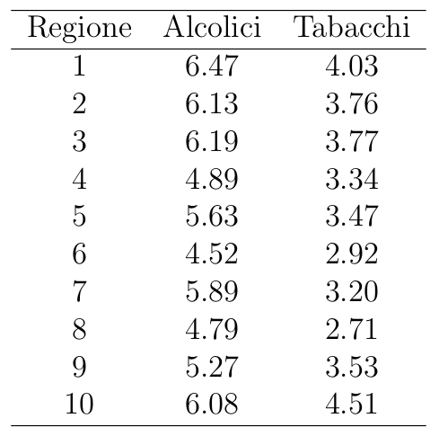
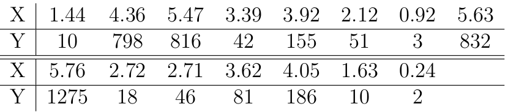
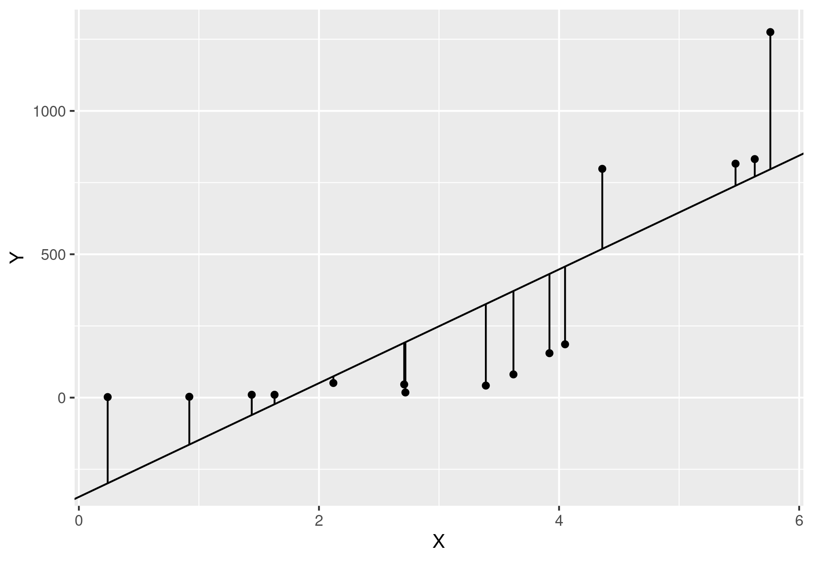
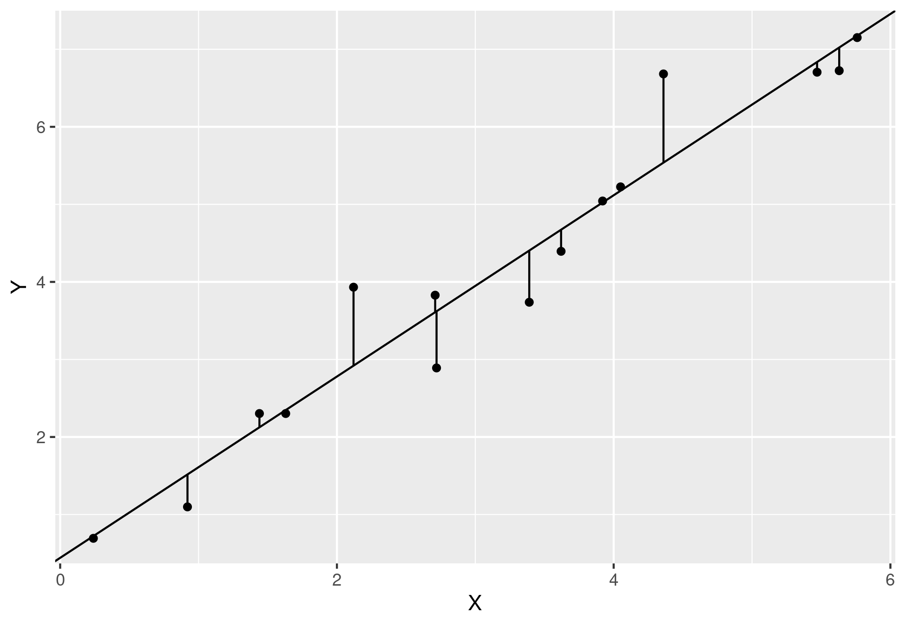
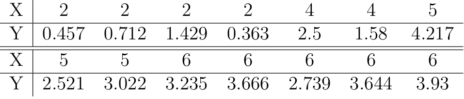
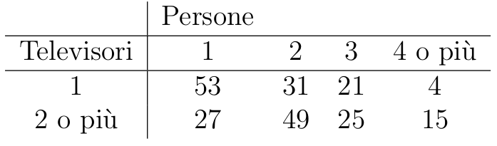

```{r include=FALSE}
library("ggplot2")
```

# STATISTICA DESCRITTIVA

```{r}
library("dplyr")
library("ggplot2")
```

## A.1)

> La tabella rappresenta 40 osservazioni della lunghezza (in mm) di una foglia di platano.


-   VARIABILE Y = Lunghezza: QUANTITATIVA CONTINUA

```{r}
#vettore unidimensionale in quanto vi è un'unica variabile di riferimento
Y = c(138,164,150,132,144,125,149,157,146,158,140,147,136,148,152,144,168,126,138,176,163,119,154,165,146,173,142,147,135,153,140,135,161,145,135,142,150,156,145,128)
(n=length(Y)) #numero di osservazioni totali
# SUPPORTO DI Y
(Sy=unique(Y))
```

-   Suddivisione del supporto in classi:

    -   $118 \dashv 128, 128 \dashv138, ..., 168 \dashv 178$

```{r}
# frequenze assolute per ogni valore del supporto
Fy = table(Y)
# frequenze relative per ogni valore del supporto
Py = table(Y)/length(Y)

FreqTable = data.frame(table(Y))


data.frame(cumsum(table(Y)))
#frequenze relative cumulate
(FreqRelCum=   data.frame(Y=sort(Sy),Pn=cumsum(table(Y)/length(Y))))
# ecdf() funzione di ripartizione empirica
plot(ecdf(Y),main=" ",xlab="X = Lunghezza Foglia [mm]", ylab="Y = Frequenze Relative Cumulate Pn(x)")

classIntervals=c(118,128,138,148,158,168,178) 

# tabella delle frequenze assolute per le classi di valori
table(cut(Y,classIntervals))
# frequenza assolute cumulate
cumFreqAss = cumsum( 
  table(cut(Y,classIntervals)) 
)


#tabella frequenze relative
table(
  cut(Y , classIntervals )
)/length(Y)
# frequenze relative cumulate
cumsum(
  table(cut(Y,classIntervals))/length(Y)
)


```

### ISTOGRAMMA

```{r}
# crea l'istogramma impostando le basi dell'asse X come le classi definite in precedenza
hist(Y,classIntervals,xlab = "Lunghezza Foglia [mm]",ylab = "Frequenza assoluta")


```

### POLIGONO DI FREQUENZA

```{r}

```

### INDICI

#### MODA

```{r}
moda = function(v){
  tmp = unique(v)
 Sy[which.max(tabulate(match(v,tmp)) )]
}
(modaY=moda(Y))


```

#### MEDIANA

```{r}
(medianaY = median(Y))

# frequenze relative cumulate
freqRelCum = cumsum(table(Y)/length(Y))


quantile(Y,c(0.25,0.5,0.75))

median(Y) == quantile(Y,0.5)
```

### BOXPLOT

```{r}
ggplot(data.frame(Y)) + geom_boxplot(aes(y=Y)) + geom_hline(yintercept = modaY)  + geom_hline(yintercept = medianaY,aes(color = "blue")) 
```

### CAMPO DI VARIAZIONE

> RANGE DI VALORI

```{r}
(dimRange = max(Y)-min(Y))
(range = c(min(Y),max(Y)))
```

### SCARTO INTERQUANTILICO

```{r}
(Scy = quantile(Y,0.75)-quantile(Y,0.25))

FreqRelCum[FreqRelCum$Pn>=0.75,"Y"][1] - FreqRelCum[FreqRelCum$Pn>=0.25,"Y"][1]
```

## A.2)


> Y = numero di guasti delle autovetture di marce OPEL e FIAT
>
> Quantitaviva discreta == qualitativa nominale

```{r}
Sy_FIAT = c(0,1,2,3,4)   #Supporto di Y_FIAT , 
Sy_OPEL = c(0,1,2,3)


(FreqFIAT = data.frame(nGuasti = c(0,1,2,3,4), fi = c(9,13,10,5,3)))
# calcola le frequenze relative
(FreqFIAT = FreqFIAT %>% mutate(pi=fi/sum(fi)))

if (sum(FreqFIAT$pi) == 1){
  print("LA SOMMA DELLE FREQUENZE RELATIVE CORRISPONDE AL 100%")
}


ggplot(FreqFIAT) + geom_col(aes(nGuasti,fi,fill="red"))
# I DUE GRAFICI SONO ANALOGHI
ggplot(FreqFIAT) + geom_col(aes(nGuasti,pi,fill="red"))

# funzione per il calcolo delle frequenze cumulate assolute o relative
calcolaFreqCum = function(arr){
  a = c(arr[1])
  for (i in 2:length(arr)){
    a = append(a,arr[i]+a[i-1])
  }
  return (a)
}


```

```{r}
(FreqFIAT = FreqFIAT %>% mutate(Fi=calcolaFreqCum(fi))    )

(FreqFIAT = FreqFIAT %>% mutate(Pi=calcolaFreqCum(pi))    )


FreqOPEL = data.frame(nGuasti = c(0,1,2,3), fi = c(33,20,6,1))
# calcola le frequenze relative
FreqOPEL = FreqOPEL %>% mutate(pi=fi/sum(fi))

if (sum(FreqOPEL$pi) == 1){
  print("LA SOMMA DELLE FREQUENZE RELATIVE CORRISPONDE AL 100%")
}

ggplot(FreqOPEL) + geom_col(aes(nGuasti,fi,fill="red")) 


(FreqOPEL = FreqOPEL  %>% mutate(Fi=calcolaFreqCum(fi))  )

(FreqOPEL = FreqOPEL  %>% mutate(Pi=calcolaFreqCum(pi))  )
```

### MODA

> Elemento con più occorrenze

```{r}
(ModaFIAT = FreqFIAT[FreqFIAT$fi == max(FreqFIAT$fi),"nGuasti" ])

(ModaOPEL = FreqOPEL[FreqOPEL$fi == max(FreqOPEL$fi),"nGuasti" ])
```

### MEDIANA

> Corrisponde al quantile di livello 0.5, quindi il valore che è preceduto da 50%n valori \<= mediana

```{r}
(MedianaFIAT = FreqFIAT[FreqFIAT$Pi >=0.5 ,"nGuasti" ][1])


(MedianaOPEL = FreqOPEL[FreqOPEL$Pi >=0.5 ,"nGuasti" ][1])
```

### MEDIA

```{r}
calcolaMedia = function(valori,frequenze){
  somma =0
    for (i in 1:length(valori)){
      somma = somma + (valori[i]*frequenze[i])
    }
  return (somma)
}

(MediaFIAT = calcolaMedia(FreqFIAT$nGuasti,FreqFIAT$pi))
(MediaOPEL = calcolaMedia(FreqOPEL$nGuasti,FreqOPEL$pi))
```

### VARIANZA

$$
V(Y) = \frac{1}{n}* \sum_{j=1}^J(y_j-E(Y))^2*f_j
$$

$$
J = |Sy|
$$

```{r}
calcolaVarianza = function(valori,frequenze,media){
  somma = 0
  for (i in 1:length(valori)){
    somma = somma + (((valori[i]-media)**2) *frequenze[i])
  }
  return (1/sum(frequenze)*somma)
}

(VarianzaFIAT = calcolaVarianza(FreqFIAT$nGuasti,FreqFIAT$fi,MediaFIAT))


(VarianzaOPEL = calcolaVarianza(FreqOPEL$nGuasti,FreqOPEL$fi,MediaOPEL))
```

### COEFFICIENTE DI VARIAZIONE

$$
CVy = \frac{\sigma_y}{|E(Y)|}
$$

$$
\sigma_y = \sqrt{V(Y)}
$$

```{r}
(sigmaFIAT = VarianzaFIAT**0.5)
(sigmaOPEL = VarianzaOPEL**0.5)

(CV_FIAT = sigmaFIAT / abs(MediaFIAT))
(CV_OPEL = sigmaOPEL / abs(MediaOPEL))
```

## A.4)


> Y = stipendio
>
> QUANTITATIVA CONTINUA

```{r}
(FreqTable = data.frame(Low = c(1000,1100,1200,1300,1400,1500,1800),High= c(1100,1200,1300,1400,1500,1800,2500),fi = c(8,10,16,14,10,5,2)))
# calcolo frequenza relativa

(FreqTable = FreqTable %>% mutate(pi = fi/sum(fi)))
if (sum(FreqTable$pi) == 1){
  print("LA SOMMA DELLE FREQUENZE RELATIVE CORRISPONDE AL 100%")
}


(FreqTable = FreqTable %>% mutate(Fi=calcolaFreqCum(fi))    )

(FreqTable = FreqTable %>% mutate(Pi=calcolaFreqCum(pi))    )


ggplot(FreqTable) + geom_col(aes((High+Low)/2,fi,width =(High-Low),color="red")) + labs(x="STIPENDIO $",y="Frequenza Assoluta")


ggplot(FreqTable,aes((High+Low)/2,fi)) + geom_label(aes(label=(High+Low)/2  ))+geom_line()  + labs(x="Valori Centrali delle classi Reddito $",y="Frequenze assolute") 
```

### MEDIANA

> Avendo come riferimento delle classi si va a cercare quale classe è preceduta dal 50% delle osservazioni \<= classe stessa

```{r}
(ClasseMediana = FreqTable[FreqTable$Pi >= 0.5,c("Low","High")][1,])
```

### MEDIA

> Avendo a disposizione le classi di valori è opportuno trovare dei valori intermedi che permettano il calcolo della MEDIA

$$
E(Y) =  \frac{1}{n} \sum_{j=1}^{J}y^c_jf_j
$$

$$
y^c_i = (y_{i-1}+y_i)/2
$$

```{r}
(Yc = (FreqTable$Low+FreqTable$High)/2)
(MediaClassi = calcolaMedia(Yc,FreqTable$pi))


```

### VARIANZA

$$
[ y_{j-1} \dashv y_{j}], j \in [1,J]
$$

$$
y^c_j = \frac{ (y_{j-1} + y_j)}{2}, j \in [1,J]
$$

> punto centrale per le singole classi di valori

$$
V(Y) = \frac{1}{n}\sum_{j=1}^{J}(y^c_j - E(Y))^2*f_j 
$$

```{r}
(VarianzaClassi= calcolaVarianza(Yc,FreqTable$fi,MediaClassi))
```

# A.24)



> Y = TABACCO
>
> X = ALCOLICI
>
> Y = f(X)
>
> f: funzione di regressione lineare, della forma $Y = \beta *X+ \alpha$

```{r}
(Tabella = data.frame(
  Regione = 1:10,
  Alcol = c(6.47,6.13,6.19,4.89,5.63,4.52,5.89,4.79,5.27,6.08),
  Tabacco = c(4.03,3.76,3.77,3.34,3.47,2.92,3.2,2.71,3.53,4.51)
))

X = Tabella$Alcol
Y = Tabella$Tabacco
```

$$
V(Y) = E[ (Y-E(Y))^2] = E(Y^2) - (E(Y))^2
$$

```{r}
(X_Varianza= mean(X**2) - mean(X)**2)
```

$$
CovXY =  E(XY)-E(X)E(Y)
$$

```{r}
(CovarianzaXY = mean(X*Y) - mean(X)*mean(Y))
```

$$
\beta  = \frac{Cov(X,Y)}{V(X)} = \rho_{XY}*\frac{\sigma_Y}{\sigma_X}
$$

```{r}
(beta = CovarianzaXY / X_Varianza)
```

$$
\alpha = E(Y) - beta*E(X)
$$

```{r}

(alfa = mean(Y) - beta*mean(X))


```

## VALORI STIMATI DAL MODELLO

$$
y^s_i = \beta*x_i + \alpha
$$

```{r}
# Ys = Ystimata
(Ystimata = beta*X + alfa)
```

## RESIDUI STIMATI

$$
e_i = y_i - y^s_i
$$

```{r}
# E  = ErroriStimati
(ErroriStimati = Y - Ystimata)
```

$$
V(Y) = V(Ys) + V(E)
$$

```{r}
(Ys_Varianza = mean(Ystimata**2) - mean(Ystimata)**2)          
(Es_Varianza = mean(ErroriStimati**2) - mean(ErroriStimati)**2)         


(Y_Varianza = mean(Y**2) - (mean(Y))**2)
# ==
Ys_Varianza + Es_Varianza


```

## COEFFICIENTE DI DETERMINAZIONE

$$
R^2 = \frac{V(Ys)}{V(Y)} = 1- \frac{V(E)}{V(Y)}
$$

```{r}
(RQuadro = Ys_Varianza / Y_Varianza)
(RQuadro = 1-(Es_Varianza / Y_Varianza))

```

## VERIFICA IPOTESI

$$
R^2 = \rho^2_{XY}
$$

$$
\rho_{XY} = \beta*\frac{\sigma_X}{\sigma_Y} = \frac{Cov(X,Y)* \sigma_X } {V(X)\sigma_Y}
$$

$$
\sigma_X = \sqrt(V(X)
$$

```{r}
(sigmaX = X_Varianza**0.5)
(sigmaY = Y_Varianza**0.5)

(rho = beta*sigmaX/sigmaY)

(rho = (CovarianzaXY*sigmaX)/(X_Varianza*sigmaY))


(rho**2)
(RQuadro)

```

## GRAFICO

```{r}
ggplot(Tabella,aes(x=X,y=Y)) +geom_point() + geom_abline(aes(intercept=alfa,slope=beta)) + geom_segment(aes(yend = Ystimata,xend=X)) 


```

# A.27)



```{r}
Tabella = data.frame(
  X = c(1.44,4.36,5.47,3.39,3.92,2.12,0.92,5.63,5.76,2.72,2.71,3.62,4.05,1.63,0.24),
  Y = c(10,798,816,42,155,51,3,832,1275,18,46,81,186,10,2)
)

X = Tabella$X
Y = Tabella$Y

```

## RETTA DI REGRESSIONE

$$
Y = \beta*X + \alpha + e
$$

$$
\beta = \frac{Cov(X,Y) }{V(X)} = \rho_{XY}*\frac{\sigma_Y}{\sigma_X}
$$

$$
\alpha = E(Y) - b*E(X)
$$

$$
Cov(X,Y) = E[ (X-E(X)] * E[ (Y-E(Y)] = E(XY) - E(X)E(Y)
$$

```{r}
(CovarianzaXY = mean(X*Y) - mean(X)*mean(Y))
```

```{r}
(X_Varianza = mean((X-mean(X))**2))
(Y_Varianza = mean((Y-mean(Y))**2))
# Disuguaglianza di Cauchy-Schwarz
-1*(X_Varianza*Y_Varianza) <= CovarianzaXY && CovarianzaXY<= (X_Varianza*Y_Varianza)

```

$$
\beta = \frac{Cov(X,Y) }{V(X)} = \rho_{XY}*\frac{\sigma_Y}{\sigma_X}
$$

```{r}
(beta= CovarianzaXY / X_Varianza)
(alfa = mean(Y) - beta*mean(X))
```

$$
Ys = \alpha + \beta*X
$$

```{r}
(Ystimata = alfa + beta*X)
(Ys_Varianza = mean((Ystimata-mean(Ystimata))**2))
```

$$
Es = Y - Ys
$$

```{r}
(ErroriStimati = Y - Ystimata)
(Es_Varianza = mean((ErroriStimati - mean(ErroriStimati))**2))
```

## COEFFICIENTE DI DETERMINAZIONE

$$
V(Y) = V(Ys) + V(Es)
$$

```{r}
Ys_Varianza + Es_Varianza == Y_Varianza
```

$$
R^2 = \frac{V(Ys)}{V(Y)} = 1- \frac{V(Es)}{V(Y)} 
$$

```{r}
(Rquadro = Ys_Varianza / Y_Varianza)
(Rquadro = 1 - (Es_Varianza / Y_Varianza))


```

$$
\rho_{XY} = \frac{Cov(X,Y)}{V(X)*V(Y)}
$$

```{r}
(rhoXY = CovarianzaXY / (X_Varianza*Y_Varianza))
Rquadro

rhoXY**2
```

$$
R^2 = \rho_{XY}
$$

> Non è verificata in quanto $\rho_{XY}=0$ indica assenza di legame lineare tra le due grandezze

## GRAFICO

```{r}
ggplot(Tabella,aes(x=X,y=Y)) + geom_point() + geom_abline(aes(intercept=alfa,slope=beta)) + geom_segment(aes(yend=Ystimata,xend=X))

ggsave("LinearPlot.png")
```

# ALTERNATIVA LOGARITMICA

```{r}

Tabella2 = Tabella %>% mutate(Y = log(Y))


Y = Tabella2$Y
X = Tabella2$X
```

## RETTA DI REGRESSIONE

$$
Y = \beta*X + \alpha + e
$$

$$
\beta = \frac{Cov(X,Y) }{V(X)} = \rho_{XY}*\frac{\sigma_Y}{\sigma_X}
$$

$$
\alpha = E(Y) - b*E(X)
$$

$$
Cov(X,Y) = E[ (X-E(X)] * E[ (Y-E(Y)] = E(XY) - E(X)E(Y)
$$

```{r}
(CovarianzaXY = mean(X*Y) - mean(X)*mean(Y))
```

```{r}
(X_Varianza = mean((X-mean(X))**2))
(Y_Varianza = mean((Y-mean(Y))**2))
# Disuguaglianza di Cauchy-Schwarz
-1*(X_Varianza*Y_Varianza) <= CovarianzaXY && CovarianzaXY<= (X_Varianza*Y_Varianza)

```

$$
\beta = \frac{Cov(X,Y) }{V(X)} = \rho_{XY}*\frac{\sigma_Y}{\sigma_X}
$$

```{r}
(beta= CovarianzaXY / X_Varianza)
(alfa = mean(Y) - beta*mean(X))
```

$$
Ys = \alpha + \beta*X
$$

```{r}
(Ystimata = alfa + beta*X)
(Ys_Varianza = mean((Ystimata-mean(Ystimata))**2))
```

$$
Es = Y - Ys
$$

```{r}
(ErroriStimati = Y - Ystimata)
(Es_Varianza = mean((ErroriStimati - mean(ErroriStimati))**2))
```

## COEFFICIENTE DI DETERMINAZIONE

$$
V(Y) = V(Ys) + V(Es)
$$

```{r}
Ys_Varianza + Es_Varianza == Y_Varianza
```

$$
R^2 = \frac{V(Ys)}{V(Y)} = 1- \frac{V(Es)}{V(Y)} 
$$

```{r}
(Rquadro = Ys_Varianza / Y_Varianza)
(Rquadro = 1 - (Es_Varianza / Y_Varianza))


```

$$
\rho_{XY} = \frac{Cov(X,Y)}{V(X)*V(Y)}
$$

```{r}
(rhoXY = CovarianzaXY / (X_Varianza*Y_Varianza))
Rquadro

rhoXY**2
```

$$
R^2 = \rho_{XY}
$$

## GRAFICO

```{r}
ggplot(Tabella2,aes(x=X,y=Y)) + geom_point() + geom_abline(aes(intercept=alfa,slope=beta)) + geom_segment(aes(yend=Ystimata,xend=X))
ggsave("LogPlot.png")
```

## CONFRONTO GRAFICI

### LINEARE



### LOGARITMICO



# A.26)



```{r}
(Tabella = data.frame(
  X = c(2,2,2,2,4,4,5,5,5,6,6,6,6,6),
  Y = c(0.457,0.712,1.429,0.363,2.5,1.58,4.217,2.521,3.022,3.235,3.666,2.739,3.644,3.93)
))
X = Tabella$X
Y = Tabella$Y
```

## RETTA DI REGRESSIONE

$$
Y = \beta*X + \alpha + e
$$

$$
\beta = \frac{Cov(X,Y) }{V(X)} = \rho_{XY}*\frac{\sigma_Y}{\sigma_X}
$$

$$
\alpha = E(Y) - b*E(X)
$$

$$
Cov(X,Y) = E[ (X-E(X)] * E[ (Y-E(Y)] = E(XY) - E(X)E(Y)
$$

```{r}
(CovarianzaXY = mean(X*Y) - mean(X)*mean(Y))
```

```{r}
(X_Varianza = mean((X-mean(X))**2))
(Y_Varianza = mean((Y-mean(Y))**2))
# Disuguaglianza di Cauchy-Schwarz
-1*(X_Varianza*Y_Varianza) <= CovarianzaXY && CovarianzaXY<= (X_Varianza*Y_Varianza)

```

$$
\beta = \frac{Cov(X,Y) }{V(X)} = \rho_{XY}*\frac{\sigma_Y}{\sigma_X}
$$

```{r}
(beta= CovarianzaXY / X_Varianza)
(alfa = mean(Y) - beta*mean(X))
```

$$
Ys = \alpha + \beta*X
$$

```{r}
(Ystimata = alfa + beta*X)
(Ys_Varianza = mean((Ystimata-mean(Ystimata))**2))
```

$$
Es = Y - Ys
$$

```{r}
(ErroriStimati = Y - Ystimata)
(Es_Varianza = mean((ErroriStimati - mean(ErroriStimati))**2))
```

## COEFFICIENTE DI DETERMINAZIONE

$$
V(Y) = V(Ys) + V(Es)
$$

```{r}
Ys_Varianza + Es_Varianza == Y_Varianza
```

$$
R^2 = \frac{V(Ys)}{V(Y)} = 1- \frac{V(Es)}{V(Y)} 
$$

```{r}
(Rquadro = Ys_Varianza / Y_Varianza)
(Rquadro = 1 - (Es_Varianza / Y_Varianza))


```

$$
\rho_{XY} = \frac{Cov(X,Y)}{V(X)*V(Y)}
$$

```{r}
(rhoXY = CovarianzaXY / (X_Varianza*Y_Varianza))
Rquadro

rhoXY**2
```

$$
R^2 = \rho_{XY}
$$

## GRAFICO

```{r}

ggplot(Tabella,aes(x=X,y=Y)) + geom_point() + geom_abline(aes(intercept=alfa,slope=beta)) + geom_segment(aes(yend=Ystimata,xend=X))


```

# A.18)



```{r}

```
