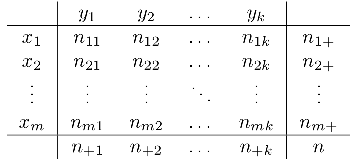

# **MEDIA**

$$
E(Y) = \frac{1}{n} \sum_{i=1}^{n}y_i 
$$

$$
E(Y) = \frac{1}{n} \sum_{j=1}^{J}y_jf_j 
$$

$$
E(Y) =  \frac{1}{n} \sum_{j=1}^{J}y^c_jf_j
$$

$$
 y^c_i = (y_{i-1}+y_i)/2
$$

$$
E(Y) = \sum_{j=1}^{J}y_ip_i
$$

## PROPRIETÀ

### CAUCHY

> Sia Sy il supporto di Y, $[y_1 , … , y_J], J = |Sy|, y_1 < ... < y_J$

$$
y_1 \le E(Y) \le y_J
$$

#### DIMOSTRAZIONE

$$
y_1 \le y_j \le y_J \implies y_1p_j \le y_jp_j \le y_Jp_j \implies 
$$

$$
\sum_{j=1}^{J}y_1p_j \le \sum_{j=1}^{J}y_jp_j \le \sum_{j=1}^{J}y_Jp_j \implies 
$$

$$
y_1*\sum_{j=1}^{J}p_j \le \sum_{j=1}^{J}y_jp_j \le  y_J*\sum_{j=1}^{J}p_j
$$

> **La somma di tutte le frequenze relative per definizione fa 1 perciò**

$$
y_1 \le \sum_{j=1}^{J}y_jp_j \le y_J
$$

$$
E(Y) = \sum_{j=1}^{J}y_ip_i    \implies y_1 \le E(Y) \le y_J
$$

### **BARICENTRO**

> **VARIABILE DI SCARTO Ys**

$$
Ys = Y - E(Y)
$$

$$
E(Ys)=0  = E(Y-E(Y))
$$

#### DIMOSTRAZIONE

$$
E(Y-E(Y)) = \frac{1}{n} \sum_{i=1}^{n}(y_i - E(Y)) =  \frac{1}{n} \sum_{i=1}^{n}(y_i) -  \frac{1}{n} \sum_{i=1}^{n}(E(Y))
$$

$$
E(Y) -  \frac{1}{n}*nE(Y) = 0
$$

### LINEARITÀ

> Data una trasformazione lineare della variabile Y $aY + b, a, b \in R$

$$
E(aY+b)=aE(Y)+b
$$

#### DIMOSTRAZIONE

$$
E(aY+b) = \frac{1}{n}\sum_{i=1}^{n}(ay_i+b) =  \frac{1}{n}\sum_{i=1}^{n}(ay_i)  +  \frac{1}{n}\sum_{i=1}^{n}(b) 
$$

$$
a \frac{1}{n}\sum_{i=1}^{n}(y_i) + \frac{1}{n}*nb = a*E(Y) + b 
$$

# MEDIANA

> Corrisponde al QUANTILE 0.5

$$
Y_{med} = y_{0.5} = y_i, i \in [1,n] 
$$

$$
[y_1 , ... , y_i] \le Y_{med} \implies | [y_1 , ... , y_i]| \ge \frac{50}{100}n 
$$

> Devono esserci almeno il 50% delle osservazioni minori o uguali alla mediana

$$
[y_i , ... , y_n] \ge Y_{med} \implies | [y_i , ... , y_n]| \ge \frac{50}{100}n 
$$

> Devono esserci almeno il 50% delle osservazioni maggiori o uguali alla mediana

#### CALCOLO INDICE

$$
|Y| mod 2 =0
$$

$$
i = [(n/2);(n/2)+1]  \implies Y_{med} = [y_{n+1};y_{  \frac{n+1}{2}   }]
$$

$$
|Y| mod 2 = 1
$$

$$
i = \frac{n+1}{2} \implies Y_{med}=y_{\frac{n+1}{2}}
$$

# QUANTILI

> Il quantile è rappresentato dal suo livello $\alpha \in [0,1]$

$$
y_{\alpha} = y_i
$$

$$
[y_1 , ... , y_i] \le Y_{\alpha} \implies | [y_1 , ... , y_i]| \ge \alpha*100n 
$$

$$
[y_i , ... , y_n] \ge Y_{\alpha} \implies | [y_i , ... , y_n]| \ge (1-\alpha)*100n 
$$

# MODA

> L'elemento che si ripete più frequentemente rispetto a tutte le osservazioni

$$
Y_{mo} = y_i , i \in [1,n] 
$$

$$
f_i > f_j, \forall j \ne i
$$

# RANGE

$$
R_Y=max(Y) - min(Y)
$$

# SCARTO INTERQUARTILICO

> Come suggerisce il nome è la differenza tra due QUARTILI, quantili di livello $\alpha \in [0.25,0.5,0.75]$

$$
SI_Y = y_{0.75} -  y_{0.25}
$$

# VARIANZA

$$
V(Y) = E[ ( Y - E(Y))^2]
$$

$$
V(Y) = E(Y^2) - (E(Y))^2
$$

$$
( Y - E(Y))^2 = Ys
$$

> **Ys VARIABILE SCARTO**

$$
V(Y) = \frac{1}{n}\sum_{i=1}^{n}(y_i - E(Y))^2
$$

$$
V(Y) = \frac{1}{n}\sum_{j=1}^{J}(y_j - E(Y))^2*f_j 
$$

$$
 \sum_{j=1}^{J}(y_j - E(Y))^2*p_j
$$

## CLASSI DI VALORI

$$
[ y_{j-1} \dashv y_{j}], j \in [1,J]
$$

$$
y^c_j = \frac{ (y_{j-1} + y_j)}{2}, j \in [1,J]
$$

> punto centrale per le singole classi di valori

$$
V(Y) = \frac{1}{n}\sum_{j=1}^{J}(y^c_j - E(Y))^2*f_j 
$$

$$
= \sum_{j=1}^{J}(y^c_j - E(Y))^2*p_j
$$

## SCARTO QUADRATICO MEDIO

$$
\sigma_Y =\sqrt{V(Y)}
$$

## PROPRIETÀ

### NON NEGATIVITÀ

$$
V(Y) \ge 0
$$

-   V(Y) = 0 se la variabile Y è degenere, cioè Sy={y1} ha solo un valore

-   $E(Y) = \frac{1}{n}\sum_{i=1}^{n}y_i$

-   $n = 1 \implies E(Y) = y_1$

-   $V(Y) = E [ (Y - E(Y))^2] = E [ 0^2] = 0$

### FORMULA PER IL CALCOLO

$$
V(Y) = E [(Y-E(Y))^2] = E[Y^2 + (E(Y)^2) - 2Y*E(Y)] 
$$

$$
E(Y^2) + (E(Y)^2) - 2E(Y)E(Y) = E(Y^2)-(E(Y)^2)
$$

##### INVARIANZA PER TRASLAZIONI

$$
V(Y+b)=V(Y) ; b \in R
$$

$V(Y+b) = E[(Y+b-E(Y+b))^2] = E[(Y +b-E(Y)-b)^2] =E[(Y-E(Y))^2]=V(Y)$

##### OMOGENEITÀ DI SECONDO GRADO

$$
V(a*Y) = a^2V(Y), a \in R
$$

$V(aY)=E[(aY-E(aY))^2]=E[(aY-aE(Y))^2]=E[a^2(Y-E(Y))^2]=a^2E[(Y-E(Y))^2]=a^2V(Y)$

-   E(Y)=0 --\>V(Y) = $E(Y^2)$

-   $V(aY+b)=a^2V(Y)$

# COEFFICIENTE DI VARIAZIONE

$$
CVy = \frac{ \sigma y}{|E(Y)|}
$$

# INDICE DI SIMMETRIA

$$
\gamma y = \frac{E[(Y-E(Y))^3]}{\sigma^3y}
$$

# INDICE DI CURTOSI

$$
\beta y = \frac{E[(Y-E(Y))^4]}{\sigma^4y}
$$

#### PLATICURTICA (IPONORMALE)

-   CODE LEGGERE

-   $\beta y < 3$

#### LEPTOCURTICA (IPERNORMALE)

-   CODE PENSANTI

-   $\beta y > 3$

#### NORMOCURTICA

-   $\beta y = 3$

#### 

# DIPENDENZA

## TABELLA CONTINGENZA

-   $X = [x_{1},...,x_{i},...,x_{m}], i \in [1,m], m = |Sx|$

-   $Y = [y_{1},...,y_{i},...,y_{k}], i \in [1,k], k = |Sy|$

$$
n = \sum_{i=1}^{m} n_{i+} =  \sum_{j=1}^{k} n_{+j}
$$

## INDIPENDENZA STATISTICA

$$
\frac{n_{rc}}{n_{+c}} = \frac{n_{r+}}{n}
$$

### FREQUENZE ASSOLUTE

$$
n_{rc} = \frac{n_{r+}*n_{+c}}{n}
$$

### FREQUENZE RELATIVE

$$
\frac{n_{rc}}{n}    = \frac{n_{r+}}{n}*\frac{n_{+c}}{n}
$$

> Determina la forza della dipendenza che c'è tra le due variabili considerate

$$
\chi^2 = \sum_{r=1}^{m} \sum_{c=1}^{k} \frac{(n_{rs} - n^{*}_{rs})^2}{n^{*}_{rs}}
$$

$$
n^{*}_{rs} = \frac{n_{r+}*n_{+c}}{n}
$$

> $n^{*}_{rs}$ **= valore nel caso di completa indipendenza tra X e Y**

### INDIPENDENZA

$$
\chi^2 = 0 = (n_{rs} - n^{*}_{rs})^2 = (n_{rs} - n^{*}_{rs}), \forall r \in [1;m], \forall s \in [1;k] 
$$

> I valori attesi coincidono con quelli osservati, quindi vi è completa indipendenza

### DIPENDENZA

$$
\chi^2 \in ]0;min(m-1,k-1)]
$$

# DIPENDENZA MEDIA {#dipmed}

> Si misura in maniera ASIMMETRICA

-   X = QUALITATIVA INDIPENDENTE

-   Y = QUANTITATIVA DIPENDENTE = in funzione di X

> Non viene misurata la distribuzione di frequenza della variabile Y, ma solo la sua MEDIA

$$
E(Y | X = x_{i}) 
$$

> Media dei valori di Y associati al valore $x_{i}$

## INDIPENDENZA IN MEDIA

$$
E(Y) = E(Y | X = x_{i}) = E(Y | X = x_{k}), \forall i \neq k
$$

> Due variabili si dicono indipendenti in media quando la media di Y condizionata da tutti i possibili valori di X è costante.
>
> Se le medie condizionate sono diverse allora vi è una dipendenza tra le due variabili

# CORRELAZIONE {#correl}

## COVARIANZA

> Misura l'intensità del legame lineare due variabili quantitative, e la direzione della loro relazione, quindi quale delle due variabili è dipendente dall'altra...

$$
Cov(X,Y) = E [(X-E(X))*(Y-E(Y))] = \frac{1}{n}*\sum_{i=1}^{n}(x_i - E(X))* (y_i - E(Y))
$$

$$
\sigma_{XY}=Cov(X,Y) = E(XY) - E(X)E(Y) = \frac{1}{n}*\sum_{i=1}^{n}x_iy_i - E(X)E(Y)
$$

## COEFFICIENTE DI CORRELAZIONE LINEARE

> Disuguaglianza di Cauchy-Schwarz

$$
-\sigma_X\sigma_Y \le  \sigma_{XY} \le \sigma_X\sigma_Y
$$

> Coefficiente di correlazione lineare

$$
\rho_{XY} = \frac{\sigma_{XY}}{\sigma_X \sigma_Y}
$$

-   Dalla disuguaglianza iniziale si ottiene che

    -   $-1 \le \rho_{XY} \le 1$

-   $\rho_{XY} > 0$: relazione lineare crescente

    -   $\rho_{XY} = 1$

        -   tutti i punti $(x_i;y_i)$ sono allineati in una retta a pendenza positiva

-   $\rho_{XY} < 0$: relazione lineare decrescente

    -   $\rho_{XY} = -1$

        -   tutti i punti $(x_i;y_i)$ sono allineati in una retta a pendenza negativa

-   $|\rho_{XY}|$ indica la forza del legame tra X e Y

-   $\rho_{XY} = 0$: indica l'assenza di legame lineare

    -   Se non sono correlate linearmente non è detto che non siano indipendenti

> **Indipendenza --\> incorrelazione**
>
> **Incorrelazione non -\> indipendenza**

### RANGHI

> Date variabili qualitative ordinali è possbile individuare i ranghi dei valori, dopo aver ordinato in ordine crescente le modalità

**INDICE DI CORRELAZIONE TRA RANGHI**

$$
-1 \le \rho^{S}_{XY} \le 1
$$

-   $\rho^S_{XY} = 1$ perfetta concordanza tra i ranghi di X e Y

-   $\rho^S_{XY} = -1$. discordnaza tra i ranghi

-   $\rho^S_{XY} = 0$ non vi è alcuna associazione

#REGRESSIONE LINEARE

$$
y_i = b*x_i + a + e_i, i \in [1,n]
$$

$$
Q(a,b) = \sum_{i=1}^{n} e^2_i = \sum_{i=1}^{n}(y_i - a - bx_i)^2
$$ $$
b = Cov(X,Y)/V(X) = \rho_{XY} \frac{\sigma_Y}{\sigma_X}
$$

$$
a = E(Y) - b*E(X)
$$

## RESIDUI STIMATI

$$
e_i = yi - a - bx_i  = y_i - y^s_i
$$

-   $y^s_i$ valore stimato dalla regressione

## COEFFICIENTE DI DETERMINAZIONE

$$
V(Y) = V(Y^s) + V(e^s)
$$

$$
R^2 = \frac{V(Y^s)}{V(Y)} = \frac{\sum_i (y^s_i - E(Y^s))^2 / n}{\sum_i (y_i - E(Y))^2 / n}
$$

$$
R^2 = \frac{V(e^s)}{V(Y)} = 1 - \frac{\sum_i (e^s_i - E(e^s))^2 / n}{\sum_i (y_i - E(Y))^2 / n}
$$

$$
0 \le R^2 \le 1
$$

$$
R^2 = \rho^2_{XY}
$$
