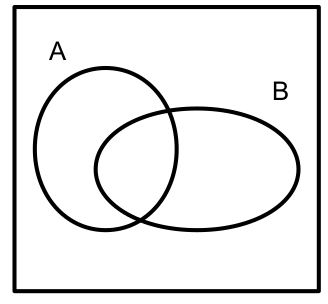
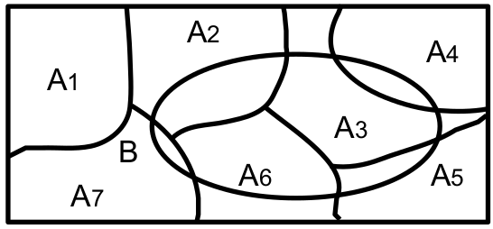

# EVENTI CASUALI

> Sono dei fenomeni con diversi valori possibili il cui esito è dettato dal caso

# SPAZIO FONDAMENTALE

> $\Omega$ = insieme di tutti i possibili risultati di un esperimento aleatorio

-   **DISCRETO: insieme** $\Omega$ **finito o numerabile**

    -   $\Omega=[1,2,3,...]=N^+$

-   **CONTINUO: insieme infinito o con valori che possono assumere infiniti valori all'interno del Range di valori**

    -   $\Omega=R^+$

## EVENTI ELEMENTARI

$$
\omega_i \in \Omega,i \in [1,2^{|\Omega|}]
$$

> Si tratta di tutti i possibii sottoinsiemi dello spazio fondamentale.
>
> Nell'algebra degli insiemi corrisponde alle parti di un insieme, e Omega rappresenta l'insieme delle parti

La lunghezza dell'insieme delle parti è per definizione 2\^n, con n = lunghezza dell'insieme

# INSIEMISTICA

Dati due eventi $A,B \subseteq \Omega$

## NOTAZIONI

### COMPLEMENTARE

-   $A^c$ indica l'evento complementare, e contiene tutti gli eventi che non appartengono ad A

    -   $A^c = \Omega \setminus A$

        -   $\forall a \in A, a\notin A^c \implies \forall b \in A^c, b\notin A$

### UNIONE

-   $A \cup B$ indica l'evento unione

### INTERSECAZIONE

-   $A \cap B$ indica l'evento intersecazione, cioè gli eventi comuni tra A e B

    -   $\exists a \in (A\cap B) \implies (a \in A) \land (a \in B)$

### DIFFERENZA

-   $A \setminus B$ evento differenza, come per il complementare

### CERTEZZA

-   $\Omega$ rappresenta l'evento certo

### TRASCURABILITÀ

-   $\emptyset$ rappresentra l'evento improbabile, non impossibile

## PROPRIETÀ

-   $A \subseteq B \implies (A \implies B)$

> Se A è contenuto in B, allora al verificarsi di A si verifica anche una parte di B
>
> Non è detto il contrario, in quanto potrebbero esistere degli elementi di B non appartenenti ad A

-   $A \cap B = \emptyset$

> Gli eventi A e B si dicono **disgiunti** e perciò non possono realizzarsi contemporaneamente

# ASSIOMI DI KOLMOGOROV

> **PROBABILITÀ : quantifica con un numero reale la possibilità di realizzazione di un evento**

## 1) NON NEGATIVITÀ

$$
P(A) \geq 0
$$

## 2) NORMALIZZAZIONE

$$
P(\Omega) = 1
$$

## 3) $\sigma$ ADDITTIVITÀ

$$
\forall A_i, i \in I \subseteq N | A_i \cap A_j = \emptyset, i \neq j \implies \\ P(U_{i \in I}A_i) = \sum_{i \in I}P(A_i)
$$

> Dato un insieme di eventi tutti **disgiunti** l'un l'altro, la probabilità di successo dell'insieme è data dalla somma delle probabilità di successo dei singoli eventi Ai

### ADDITTIVITÀ SEMPLICE

$$
A \cap B = \emptyset \implies P(A \cup B) = P(A) + P(B)
$$

### EVENTI SEMPLICI

$$
\omega_i \in \Omega
$$

> Ad ogni evento elementare è associato un peso pi, che quantifica la probabilità di successo dell'evento stesso

$$
pi = P(\omega_i)
$$

$$
A = [\omega_i], i \in I \subset N
$$

$$
P(A) = P([\omega_1 \cup , ...,\cup \omega_I ]) 
$$

> Siccome gli eventi elementari sono tutti disgiunti tra loro, dall'assioma 3 si ottiene che

$$
P(A) = \sum_{i \in I} P(\omega_i) \sum_{i \in I} p_i
$$

# CONSEGUENZE

> Gli assiomi precedenti hanno le seguenti conseguenze logiche

## 1)

$$
P(\emptyset) = 0
$$

$$
1 = P(\Omega) = P(\Omega \cup \emptyset) = P(\Omega) + P(\emptyset) = 1 + P(\emptyset)   
$$

## 2)

$$P(A^c) = 1 - P(A)$$

$$
1 = P(\Omega) = P(A \cup A^c) = P(A) + P(A^c)   
$$

## 3)

$$
A \subseteq B \implies P(A) \leq P(B) \\ P(B \setminus A ) = P(B) -P(A)
$$

$$
P(B) = P((B \setminus A) \cup A) = P(B \setminus A) + P(A)
$$

## 4)

$$
P(A \cup B) = P(A) + P(B) - P(A \cap B)
$$

$$
(A \cup B) = (A \cap B) \cup [ B \setminus (A \cap B)] \cup [ A \setminus (A \cap B)]
$$

$$
P(A \cup B) =  P(B)  + P(A) - P(A \cap B)
$$

## 5)

> Dato un evento B e una partizione di $\Omega$ , chiamata A = {Ai}

$$
P(B) = \sum_{i \in I} P(B \cap A_i)
$$

# PROBABILITÀ CONDIZIONATA

> Dati due eventi $A,B \subseteq \Omega$
>
> è possibile trovare la probabilità di successo di un evento data una particolare condizione verificata nell'altro

$$
P(B|A) = \frac{P(B \cap A)}{P(A)}, P(A)>0
$$

> Quando A si realizza, l'unica parte di B che può ancora realizzarsi è quella in comune con A

## COMPOSTA

$$
P(B \cap A) = P(B |A)*P(A), P(A)>0
$$

## TOTALE

> Dato un evento B, e una partizione di $\Omega$ $A_i, i \in I \subseteq N$ con $P(A_i)>0$

$$
P(B) = \sum_{i\in I}P(A_i)*P(B|A_i)
$$

# INDIPENDENZA

> Due eventi $A,B$ si dicono indipendenti quando il verificarsi di uno non influenza il verificarsi dell'altro

$$
P(A \cap B) = P(A)*P(B)
$$

> Secondo la regola della probabilità [composta](#composta) $P(B \cap A) = P(B |A)*P(A), P(A)>0$
>
> perciò se A e B sono indipendenti P(B\|A)=P(B) in quanto la probabilità del verificarsi di B dato A è sempre la stessa,non subendo influenza da parte di A

## DIPENDENZA

$$
P(A \cap B) \ne P(A)*P(B)
$$

## PROPRIETÀ

-   L'indipendenza tra due eventi A,B non trascurabili è verificabile dalle seguenti uguaglianze, spiegate in precedenza

    -   $P(A|B)=P(A)$

    -   $P(B|A)=P(B)$

-   A, B indipendenti implica che sono indipendenti anche le seguenti coppie

    -   A e $B^c$

    -   $A^c$ e B

    -   $A^c$ e $B^c$

-   $\Omega$ e $\emptyset$ sono indipendenti da qualsiasi evento

# TEOREMA DI BAYES

> Usato nella situazione in cui è noto il risultato di una certa probabilità di un evento A, si vuole determinare la probabilità che esso sia dovuto dal verificarsi di una certa causa
>
> Dato un evento B non trascurabile e una partizione $A_i, i \in I \subseteq N$ costituita da tutti eventi non trascurabili, quindi $P(A_i) > 0$

$$
P(A_i|B) = \frac{P(A_i)*P(B|A_i)}{P(B)} = \frac{P(A_i)*P(B|A_i)}{\sum_{j \in I}P(A_j)*P(B|A_j)}
$$

> Usando la formula delle probabilità [composta](#composta) $P(B \cap A_i) = P(A_i)*P(B|A_i)$

$$
P(A_i|B) = \frac{P(B \cap A_i)}{P(B)} 
$$

## CONSIDERAZIONI

-   $P(A_i)$ sono dette **probabilità a priori**, cioè sono note dall'inizio in quanto $A_i$ e $A_j, i \ne j$ sono indipendenti

-   $P(A_i|B)$ sono dette **probabilità a posteriori,** e tengono conto della realizzazione dell'evento B

-   $P(B|A_i)$ **verosimiglianza**
