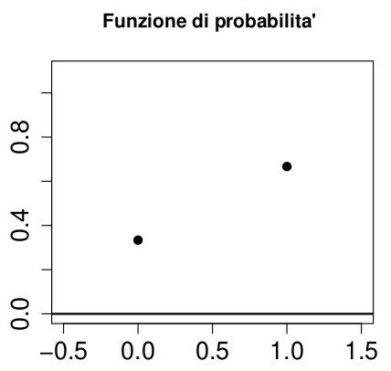
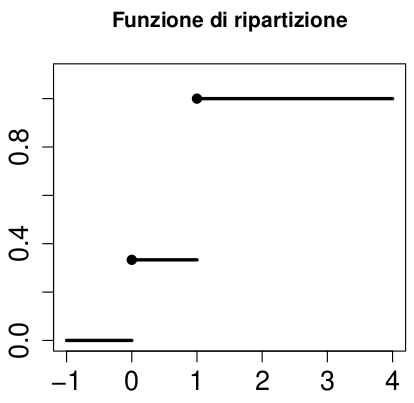
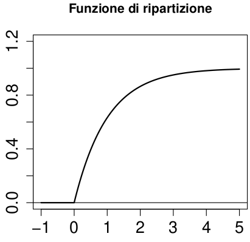

# FUNZIONE RIPARTIZIONE

$$
F_X(x) = P(X \le x)
$$

$$
F_X: R \to [0,1]
$$

> Dato un evento B, è possibile determinare una variabile casuale X.
>
> È possibile definire una distribuzione della probabilità degli eventi $X \in B, B \subseteq R$

## IDENTICAMENTE DISTRIBUITE

$$
P(X \in B) = P(Y \in B)
$$

> Se è valida la equazione sopra allora le due variabili casuali X e Y si dicono **indenticamente distribuite**
>
> **X \~ Y**

## PROPRIETÀ

> Per ogni $a,b \in R, a <b$

$$
P(a < X \le b) = F_X(b)-F_X(a)
$$

$$
P(X > a) = 1 - P(X \le a) = 1 - F_X(a)
$$

$$
P(X = b) = F_X(b) - \lim_{x \to b^-} F_X(x)
$$

-   $F_X$ è **monotona non decrescente**

-   $F_X$ è **continua da destra**

    -   è continua nei punti in cui $P(X = x)=0$

    -   è discontinua nei punti in cui $P(X = x)>0$

-   $F_X$ è tale che $\lim_{x \to -\infty}F_X(x) = 0$

-   $F_X$ è tale che $\lim_{x \to \infty}F_X(x) = 1$

# DISCRETE

-   [**BERNOULLIANA**]

> Una variabilie casuale X si dice **discreta** se esiste un insieme di numeri finito {$x_i$} $i \in I$

$$
P(X = x_i)=pi >0
$$

$$
\sum_{i \in I}pi = 1
$$

## FUNZIONE

### PROBABILITÀ

> La corrispondenza tra i valori di $X \in S_X = \{x_i\}, i \in I$ e la loro probabilità è dettata dalla funzione di probabilità

$$
f_X(x) =   {P(X=x_i)=pi \leftarrow x=x_i} \\ {0\leftarrow x\ne x_i}
$$

$$
f_X(x) =  \begin{cases}  P(X=x_i)=pi ,  & \mbox{if }  x \in S_X\\ 0  \end{cases} 
$$

### RIPARTIZIONE

$$
F_X(x) = P(X \le x) = \sum_{i:x_i \le x}pi
$$

> Il grafico di $F_X(x)$ rappresenta dei segmenti orizzontali a scalini con dei salti in corrispondenza dei valori del supporto di X e ampiezza del salto data da $p_i$

$$
p_i = f_X(x_i) = F(x_i) - F(x_{i-1})
$$


> L'immagine rappresenta la variabile casuale X che conta il numero di esiti testa in 3 lanci di una moneta regolare

-   $S_X = \{0,1,2,3\}$: sono i possibili valori che ammette X, la variabile conteggio

#### PROBABILITÀ ASSOCIATE

-   $P(X \ge 1)$: esca almeno 1 volta testa su 3 lanci

    -   **evento complementare:** esce 0 volte testa

    -   $P(X \ge 1) = 1 - P(X=0) = 1 - \frac{1}{8} = \frac{7}{8}$

-   $P(X < 2)$: escono meno di due valori testa, quindi solo $\{0,1\}$

    -   $\sum_{x_i<2}P(X=x_i) = F_X(1) = 1/2$

# CONTINUE

> A differenza di una variabile discreta, quella continua possiede infiniti valori del supporto

## FUNZIONI

### RIPARTIZIONE {#contdens}

$$
F_X(x) = \int_{-\infty}^{x}f_X(t)dt, \forall x \in R
$$


> Rapprenta la funzione di ripartizione delle variabili continue in quanto

$$
F_x(x_i)=P(X \le x_i)
$$

-   Il punto individuato dal grafico è circa (1;0.6)

    -   $F_X(1)=0,6 = P(X \le 1)$

#### PROBABILITÀ ASSOCIATE

-   $P(X > a) = 1 - P(X \le a) = 1-F_X(a), \forall a \in R$

-   $P(a < X \le b) = P(X \le b) - P(X \le a) = F_X(b)-F_X(a)$

    -   $\int_{a}^{b}f_X(x)dx$

### DENSITÀ PROBABILITÀ {#densprob}

$$
f_X(x) \ge 0, \forall x \in R
$$

$$
\int_{-\infty}^{\infty}f_X(x)dx = 1
$$

-   Questa formula indica che **la somma di tutte le probabilità** associate a ogni valore della variabile casuale X da come somma 1, verificando gli **assiomi di Kolmogorov**

$$
f_X(x) = \frac{d}{dx}F_X(x) = F'_X(x)
$$

-   La funzione di densità probabilità si traduce in termini matematici come la derivata prima della funzione di densitò


> A differenza del grafico precedente l'ordinata è rappresentata dalla singola probabilità

## PROPRIETÀ

$$
P(a < X \le B) = F_x(b)-F_x(a) = \int_{a}^{b}f_X(x)dx
$$

# INDICI SINTETICI

## VALORE ATTESO

> Data una variabile casuale X con supporto $S_X$ si chiama valore atteso (medio) la media di tutti i possibili valori assunti da X ponderati con le rispettive probabilità

### DISCRETA

$$
E(X) = \sum_{x \in S_X}x*f_X(x)dx = \sum_{x \in S_X}x*P(X=x)
$$

### CONTINUA

$$
E(X) = \int_{-\infty}^{+\infty}x*f_X(x)dx
$$

### PROPRIETÀ

-   **CAUCHY:**

    -   $inf\{Sx\} \le E(X) \le sup\{Sx\}$

-   **BARICENTRO**

    -   $E(X-E(X))=0$

-   **LINEARITÀ**

    -   $E(aX+b)=aE(X)+b, \forall a,b \in R$

    -   $E(aX + bY) = aE(X) + bE(Y)$

## MEDIANA

> Rappresenta il valore di $x_{0.5}$ in cui

$$
P(X \le x_{0.5}) \ge 0.5
$$

> Avendo a disposizione una variabile X continua la mediana è calcolabile immediatamente usando la [funzione di densità](#contdens)

$$
F_X(x_{0.5})=0.5
$$

## MODA

> $x_{MO}$ è il valore di X per cui la distribuzione di densità di probabilità è maggiore rispetto a tutti gli altri valori

$$
P(X = x_{mo}) > P(X \ne x_{mo})
$$

-   Può non esistere

-   Può avere un unico valore

    -   **DISTRIBUZIONI UNIMODALI**

-   Può avere più di un valore

    -   **DISTRIBUZIONI MULTIMODALI**

-   Se esiste allora appartiene al supporto della variabile

    -   $x_{mo} \in S_X$

> $x_{mo}$ rappresenta il massimo della [funzione di densità di probabilità](#densprob)

$$
x_{mo} = max\{ f_X(x) \}
$$

## QUANTILI

> Sia $\alpha$ il livello del quantile $x_{\alpha}$
>
> $\alpha \in \{0,1\}$

$$
P(X \le x_{\alpha}) \ge \alpha
$$

$$
P(X \ge x_{\alpha}) \ge 1-\alpha
$$

### CONTINUA

> Se X è una variabile continua

$$
F_X(x_{\alpha})=\alpha
$$

### DISCRETA

> Se X è discreta il quantile rappresenta il valore a cui la funzione di ripartizione raggiunge o supera $\alpha$

$$
F_X(x_{\alpha}) \ge \alpha
$$

## VARIANZA

$$
V(X) = E[(X-E(X))^2]
$$

### CONTINUA

$$
V(X) = \int_{-\infty}^{+\infty} (x-E(X))^2*f_X(x)dx
$$

### DISCRETA

$$
V(X) = \sum_{x \in S_X} (x-E(X))^2*f_X(x)
$$

### PROPRIETÀ

**NON NEGATIVITÀ**

-   $V(X) \ge 0$

-   $V(X)=0$ se X è **degenere**

    -   $S_X = \{x_1\}$

    -   $E(X) = x_1$

    -   $X - E(X) = 0$

1.  **FORMULA PER IL CALCOLO**

    > $V(X) = E(X2) - (E(X))^2$

2.  **INVARIANZA PER TRASLAZIONI**

    > $V(X+b) = V(X), \forall b \in R$

3.  **OMOGENEITÀ DI SECONDO GRADO**

    > $V(aX) = a^2V(X), \forall a \in R$

4.  **TRASFORMAZIONE LINEARE**

    > Dalle prorpeità 3 e 4 discende la seguente

    $V(aX+b) = V(aX) = a^2V(X)$

## STANDARDIZZAZIONE

> Data una variabile X, con media $\mu$ e varianza $\sigma^2$

È possibile standardizzare la variabile tramite la seguente formula

$$
Z = \frac{X-\mu}{\sigma}
$$

### PROPRIETÀ

-   **MEDIA NULLA**

    -   $E(Z) = 0$

-   **VARIANZA UNITARIA**

    -   $V(Z)=1$

-   **CONVERSIONE**

    -   È possibile passare da standard a normale tramite i seguenti passaggi

        -   Formula sopra

        -   $X = \sigma Z+\mu$

            -   $\mu = E(X)$

            -   $\sigma^2 = V(X)$

## COEFFICIENTE DI VARIAZIONE

> Se X è positiva $P(X>0)=1$ si può definire un coefficiente di variazione

$$
CV_X = \frac{\sigma}{\mu}
$$

## SCARTO MEDIO ASSOLUTO MEDIANA

$$
E( |X-x_{0.5}|)
$$

## SCARTO INTERQUARTILICO

$$
SI = x_{0.75} - x_{0.25}
$$

## CAMPO DI VARIAZIONE (RANGE)

$$
R= sup\{S_X\} - inf\{S_X\}
$$

## SIMMETRIA

$$
\gamma = \frac{E[(X-E(X))^3]}{\sigma^3}
$$

> Come per la statistica descrittiva indica se la funzione $f_X(x)$ di densità è simmetrica rispetto alla mediana $x_{0.5}$ o alla media $E(X)$

-   $\gamma = 0$ : **SIMMETRIA**

-   $\gamma > 0$: **ASIMMETRIA POSITIVA**

<!-- -->

-   $\gamma < 0$: **ASIMMETRIA NEGATIVA**

## CURTOSI

$$
\beta = \frac{E[(X-E(X))^4]}{\sigma^4}
$$

> La curtosi indica la presenza delle code pesanti, quindi la funzione di densità $f_X(x)$ agli esteremi del supporto $S_X$ avrà dei valori considerevoli di probabilità

-   $\beta = 3$ **NORMOCURTICA**

-   $\beta > 3$ **LEPTOCURTICA: code pesanti**

-   $\beta < 3$ **PLATICURTICA: code leggere**

# MULTIVARIATE

> Quando si considerano più variabili contemporaneamente $\{X_1,…,X_n\}$

## VETTORE ALEATORIO

> Si tratta della variabile casuale multivariata in cui ogni variabile è casuale

## BIVARIATA

> Quando si considerano 2 variabili $X, Y$, e la sua

### FUNZIONE DI RIPARTIZIONE

$$
F_{X,Y}(x,y) = P(X \le x, Y \le y), (x,y) \in R^2
$$

### SUPPORTO CONGIUNTO

$$
S_{X,Y} = \{(x,y) \in R^2 | F_{X,Y}(x,y)>0 \}
$$

### RIPARTIZIONE MARGINALE

$$
F_X(x)= \lim_{y \to +\infty}F_{X,Y}(x,y)
$$

> La formula è analoga anche per Y

### DISCRETA

> Si dice discreta se il suo supporto $S_X$ è finito o al più numerabile

$$
S_{X,Y} = \{(x_i,y_j) \in R^2| P(X=x_i,Y=y_j)=p_{ij}>0 \land \sum_{i,j}p_{i,j}=1  \}
$$

$$
S_{X,Y}=\{(x_i,y_j), (i,j)\in I \times J \}
$$

### FUNZIONE DI MASSA

$$
f_{X,Y} =  \begin{cases}  p_{i,j},  & \mbox{if } (x,y)\in S_{X,Y} \\ 0 \end{cases} 
$$

### PROBABILITÀ MARGINALE

$$
\forall x_i \in S_x, P(X=X_i)= \sum_{j \in J}P(X=x_i,Y=y_i) = \sum_{j \in J}p_{i,j} = p_{i+} 
$$

### TABELLA CONTINGENZA

> Come nel caso della statistica descrittiva è possibile rappresentare una coppia di variabili attraverso la seguente tabella

$$
p_{i,j}=P(X=x_i,Y=y_j)
$$


### ESEMPIO

```{r}
banca <- rbind(cbind(rep("cattivo",60),rep("si",60)),
cbind(rep("buono",520),rep("si",520)),
cbind(rep("cattivo",21),rep("no",21)),
cbind(rep("buono",609),rep("no",609)))
banca <- as.data.frame(banca)
colnames(banca) = c("tipo","cc")
head(banca)
# ordina la colonna tipo con prima "cattivo" e poi "buono"
banca$tipo<-ordered(banca$tipo, levels=c("cattivo","buono"))
# imposta i dati di cc come factor
banca$cc<-factor(banca$cc, levels=c("si","no"))
str(banca)

# TABELLA DI CONTINGENZA
(tab = table(banca$cc, banca$tipo))

tab/sum(tab)
```

> Si vuole valutare l'indipendenza di cc e tipo

```{r}
# distribuzione marginale di cc
margin.table(tab,1)
# relativa
margin.table(tab,1)/sum(margin.table(tab,1))


# distribuzione marginale di tipo
margin.table(tab,2)
# relativa
margin.table(tab,2)/sum(margin.table(tab,2))

# distribuzione condizionata di "tipo|cc=si"
# (frequenza relativa condizionata)
tab[1,]/sum(tab[1,])

# distribuzione condizionata di "tipo|cc=no"
# (frequenza relativa condizionata)
# in alternativa, prop.table(tab,1)
tab[2,]/sum(tab[2,])

# distribuzione marginale di "cc"
ccmarg<-margin.table(tab,1)/sum(margin.table(tab,1))

# distribuzione marginale di "tipo"
tipomarg<-margin.table(tab,2)/sum(margin.table(tab,2))

# probabilita' congiunta di "cc" e "tipo" in caso di indipendenza
prob_ind <- ccmarg%*%t(tipomarg)

```

## INDIPENDENZA

> Le distribuzioni marginali delle singole variabili $X,Y$ si dicono **indipendenti** quando ogni evento associato a X è indipendente da ogni evento associato a Y

$$
F_{X,Y} (x,y) = F_X(x) * F_Y(y), \forall (x,y) \in R^2
$$

> Se esiste almeno una coppia di valori $(x,y)$ per cui non è valida la relazione sopra allora X e Y si dicono **dipendenti**

### SUPPORTO

> Nel caso di completa indipendenza, il supporto delle due variabili è definito come il supporto congiunto di $S_X$ con $S_Y$

$$
S_{X,Y}=S_X \times S_Y
$$

### DISCRETA

> Se le due variabili sono discrete la definizione di indipendenza è data dalla seguente formula

$$
f_{X,Y}(x_i,y_j) = f_X(x_i) * f_Y(y_j), \forall (i,j)\in S_{X,Y}
$$

$$
= p_{i,j} = p_{i+}*p_{+j}
$$

### CONDIZIONATA

> Se $(X,Y)$ è **discreta** si ottiene la funzione di probabilità di una variabile condizionata da un valore dell'altra variabile, purchè questo valore abbia una probabilità positiva

$$
P(X | Y = y_j) \leftarrow P(Y=y_j)>0
$$

$$
f_{X|Y=y_j}(x_i) =  \begin{cases}  P(X=x_i|Y=y_j) = \frac{P(X=x_i,Y=y_j)}{P(Y=y_j)} = \frac{p_{i,j}}{p_{+j}},  & \mbox{if } x_i \in S_{X|Y=y_j} \\ 0 \end{cases} 
$$

### MEDIA

$$
 E(X|Y=y_j) = \sum_{x_i}x_i*f_{X|Y=y_j}(x_i)
$$

### VARIANZA

$$
V(X|Y=y_j)=\sum_{x_i}(x_i - E(X|Y=y_j) )^2*f_{X|Y=y_j}(x_i)
$$

#### PROPRIETÀ

-   **COMBINAZIONE LINEARE**

$$
V(aX+bY)=a^2V(X)+b^2V(Y) + 2abCov(X,Y)
$$

-   **CASI PARTICOLARI**

$$
V(X+Y) = V(X)+V(Y)+2Cov(X,Y) \\  V(X-Y)=V(X)+V(Y)-2Cov(X,Y)
$$

-   Nel caso in cui X e Y siano incorrelate $\rho_{XY}=0$ si ha che $Cov(X,Y)=0$

### INDIPENDENZA

> Nel caso in cui X e Y siano **indipendenti** allora la media e la varianza condizionata coincidono con quelli reali della singola variabile

$$
E(X|Y=y_j) = E(X)
$$

$$
V(X|Y=y_j) = V(X)
$$

## COVARIANZA

$$
\sigma_{X,Y}= Cov(X,Y) = E[(X-E(X))*(Y-E(Y))]
$$

$$
Cov(X,Y)= \sum_{x_i}\sum_{y_j}(x_i-E(X))*(y_j-E(Y))* f_{X,Y}(x_i,y_j)
$$

> Oppure sfruttando la formula per il calcolo

$$
Cov(X,Y)=E(XY)-E(X)E(Y)
$$

$$
E(X,Y)=\sum_{x_i}\sum_{y_j}x_iy_j*f_{X,Y}(x_i,y_j)
$$

## COEFFICIENTE DI CORRELAZIONE LINEARE

$$
\rho_{X,Y} = \frac{\sigma_{X,Y}}{\sigma_X\sigma_Y}
$$

-   disuguaglianza di **Cauchy-Schwarz :** $-1 \le \rho_{X,Y} \le 1$

-   $\rho_{X,Y} = 0$ : **ASSENZA DI LEGAME**

-   $\rho_{X,Y} > 0$ : **CRESCENTE**

-   $\rho_{X,Y} < 0$ : **DECRESCENTE**

### 

# TOPOLOGIA DI VARIABILE

## BERNOULLIANA

> Una variabile casuale X si dice bernoulliana, quando gli esiti possibili della variabile sono {0,1}

$$
S_X = \{0,1\}
$$

$$
X \sim Ber(p), p \in (0,1)
$$

> Avendo due possibili esiti la probabilità di uno dei due è dato da

$$
P(X=x_1)=p_1
$$

$$
P(X=x_2)=p_2=1-p_1
$$

### FUNZIONE DI DENSITÀ

$$
f_X(x) =  \begin{cases}  p_1,  & \mbox{if } X=x_1 \\ 1-p_1,  & \mbox{if } X\ne x_1 \\ 0 \end{cases} 
$$



### FUNZIONE DI RIPARTIZIONE

$$
F_X(x) =  \begin{cases}  0,  & \mbox{if } x<min\{S_X\} \\ 1-p,  & \mbox{if } x \in S_X \\ 1  ,  & \mbox{if } x > max\{S_X\} \end{cases} 
$$



### MEDIA

> Essendo **discreta** si usa la seguente formula

$$
E(X) = \sum_{x \in S_X}x*f_X(x)dx = \sum_{x \in S_X}x*P(X=x)
$$

> $S_X=\{x_1,x_2\}$
>
> $E(X) = x_1*f_X(x_1)+x_2*f_X(x_2) = x_1*p_1+x_2*(1-p_1)$

## ESPONENZIALE

$$
X \sim Esp(\lambda), \lambda >0
$$

$$
S_X=[0,+\infty[
$$

### DENSITÀ

$$
f_X(x) =  \begin{cases}  \lambda*e^{-\lambda x},  & \mbox{if } x \in S_X \\ 0  \end{cases} 
$$


### RIPARTIZIONE

$$
F_X(x) =   \begin{cases}  1-e^{-\lambda x} =\int_{-\infty}^{x} f_X(x)dx = \int_{0}^{x} f_X(x)dx ,  & \mbox{if } x \in S_X \\ 0  \end{cases}  
$$



#### PROBABILITÀ

-   $P(X>x_i) = 1-F_X(x_i)$

-   $P(x_1 \le X \le x_j)= F_X(x_j) - F_X(x_1)$

### MEDIA

$$
E(X) = \int_{-\infty}^{+\infty}x*f_X(x)dx
$$

$$
E(X) = \int_{-\infty}^{+\infty}x* \lambda e^{-\lambda x }dx , t=\lambda x \\ \frac{1}{\lambda}\int_{0}^{+\infty}x* \lambda te^{-t}dt = \frac{1}{\lambda}
$$

### VARIANZA

$$
V(X) = E(X^2) - (E(X))^2 = E(X^2) - \frac{1}{\lambda^2}  \\
E(X^2) = \int_{0}^{+\infty}\lambda x^2*  e^{-\lambda x }dx = \frac{2}{\lambda}\int_{0}^{+\infty}\lambda x *  e^{-\lambda x }dx = \frac{2}{\lambda^2}
$$

$$
V(X) = \frac{2}{\lambda^2} - \frac{1}{\lambda^2} = \frac{1}{\lambda^2}
$$

### MEDIANA

$$
F_X(x_{0.5})=0.5
$$

> Per ottenere il valore della mediana è sufficiente risolvere la seguente equazione

$$
1-e^{-\lambda x_{0.5}} = 0.5 \\ x_{0.5}= \lambda^{-1}*ln2 
$$

### QUANTILI

$$
F_X(x_{\alpha})=\alpha
$$

$$
1-e^{-\lambda x_{\alpha}} = \alpha \\ x_{\alpha} = \frac{ln(1-\alpha)}{-\lambda}
$$

## UNIFORME

> Una variabile casuale si dice uniforme in $\{0,1\}$ se il suo supporto è limitato in quell'intervallo

$$
X \sim U(0,1) \\ S_X= \{0 \le x_i \le 1\}
$$

### DENSITÀ

$$
f_X(x) =   \begin{cases}  1  ,  & \mbox{if } x \in S_X \\ 0  \end{cases} 
$$


### RIPARTIZIONE

$$
F_X(x) =   \begin{cases} 0  ,  & \mbox{if } x <0 \\ x  ,  & \mbox{if } x \in S_X \\ 1 ,  & \mbox{if } x \ge 1 \end{cases} 
$$


### PROBABILITÀ

> Dati due intervalli disgiunti $[a,b]$ $[c,d]$ con $a < b$ e $c < d$ e di uguale ampiezza $h = b-a = d-c$

$$
P(a \le X \le b)=P(c \le X \le d) = F_X(d)-F_X(c)=d-c=h
$$

> Perciò la probabilità che il valore sia all'interno di un dato intervallo equivale alla dimensione stessa dell'intervallo

### APPLICAZIONI

> È utile per rappresentare eventi aleatori di estrazione di numeri all'interno di un certo intervallo.
>
> Ogni numero è equiprobabile agli altri

### MEDIA

$$
E(X) = \int_{0}^{1}x*f_X(x)dx = \int_{0}^{1}x*1dx \\ x=F'(x) , F(x)= x^2/2 \\ E(X) = F(1)-F(0)=1/2
$$

### VARIANZA

$$
V(X) = E(X^2)-(E(X))^2
$$

$$
V(X) = E(X^2)-(1/2)^2 = E(X^2) - \frac{1}{4}
$$
