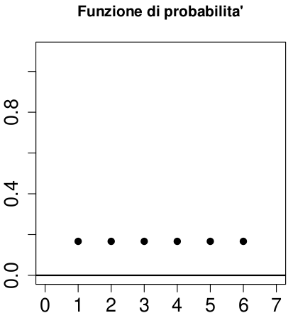
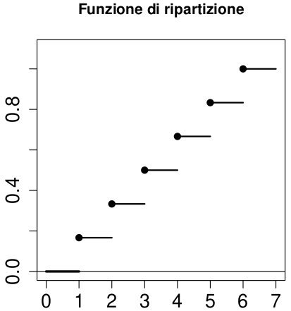
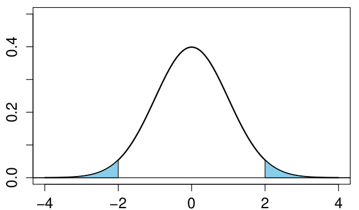
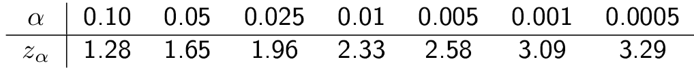
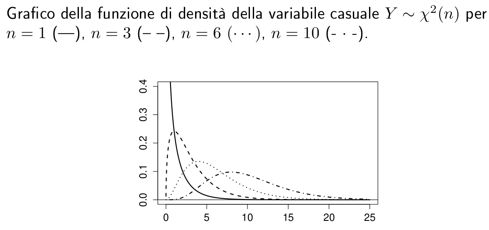
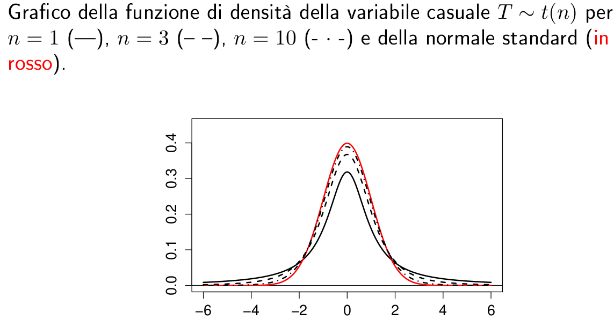
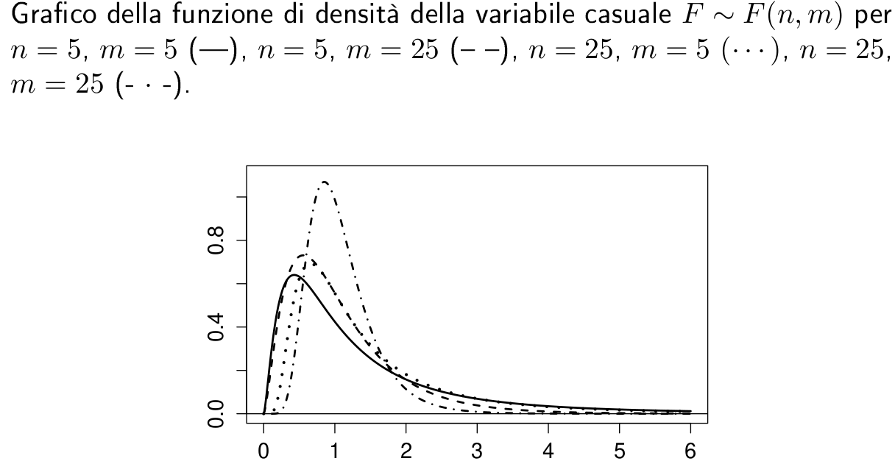

# MODELLO PROBABLISTICO

> Rappresenta una **famiglia** di distribuzioni di probabilità
>
> Due variabili X e Y appartengono allo stesso modello quando presentano la medesima funzione di densità di probabilità $f_X(x) = f_Y(y)$

Data una variabile casuale X con supporto $S_X$ appartenente alla seguente famiglia $f_X(x:\theta)$

## PARAMETRI

> $\theta \in \Theta$, $\Theta \subseteq R^n, n \ge 1$
>
> $\theta$ rappresenta il **vettore dei parametri** che verrà **associato alla variabile casuale** al fine di ottenere una **distribuzione identica**

# DISCRETI

> I seguenti modelli (famiglie) caratterizzano determinatie tipologie di variabili casuali

## UNIFORME

> La variabile casuale X di riferimento possiede un **supporto discreto**, con **elementi equiprobabili**, perciò con **funzione di densità costante**

$$
X \sim Ud(x_1,...,x_n) \\ S_X=\{x_1,...,x_n\}
$$

### DENSITÀ

$$
f_X(x;x_1,...,x_n) = \begin{cases}  1/n,  & \mbox{if } x\in S_X \\ 0 \end{cases} 
$$

### MEDIA

$$
E(X) = 1/n\sum_{i=1}^{n}x_i 
$$

### VARIANZA

$$
V(X) = 1/n\sum_{i=1}^n(x_i-E(X))^2
$$

### SUPPORTO

$$
S_X=\{x_i\}: x_i = i, i \in [1;n] \\ X \sim Ud(n)
$$

#### MEDIA

$$
E(X) = 1/n * \sum_{i=1}^nx_i=1/n * \sum_{i=1}^ni =  1/n*\frac{n(n+1)}{2} \\ =  \frac{n+1}{2}
$$

#### VARIANZA

$$
V(X) =   1/n*\sum_{i=1}^n(x_i-E(X))^2 =   \frac{n^2-1}{12}
$$

#### DEGENERE

> Se il supporto della variabile casuale è costituito da un unico valore si ottiene una variabile casuale **degenere**

-   $S_X=\{x_1,...,x_n\} = S_X\{x_1\}: n=1$

-   $E(X)=x_1$

-   $V(X) = E(X^2) - (E(X))^2 = x_1^2-x_1^2 = 0$

### ESEMPIO

> Si consideri un dado regolare a 6 facce.
>
> La variabile casuale X che indica quale faccia è uscita dopo il lancio si definisce come uniforme

$$
X \sim Ud(6)
$$

-   $S_X = \{x_i\}: x_i=i, i \in [1,6]$

#### DENSITÀ

> Ogni elemento del supporto ha la stessa probabilità, che corrisponde a $1/n=1/6$

#### RIPARTIZIONE

> Funzione a gradini con i salti in corrispondenza dei valori $x_i \in S_X$ e con ampiezza di salto pari a $P(X=x_i)= f_X(x_i) =pi=1/6$

## BINOMIALE

> Si possono rappresentare delle estrazioni con reinserimento da un urna con valori noti
>
> I valori ottenuti dall'estrazione si definiscono **dicotomici** in quando sono classificati in 2 esiti
>
> -   **SUCCESSO = 1**
>
> -   **INSUCCESSO = 0**

Ogni esito dell'esperimento è indipendente dagli altri esiti precedenti.

Gli esiti si definiscono come [**bernoulliani**](./5_VarCasuali.pdf#bernoulliana)perchè hanno solo due valori del supporto

### APPLICAZIONI

-   Controlli di qualità: si è interessati ai campioni difettosi all'interno di un insieme di $n \ge 1$ di campioni

-   Verifica di determinati requisiti: all'interno di un campione casuale individuare quali elementi verificano o meno il requisito stabilito

### DEFINIZIONE

> Una variabile causale X si dice **binomiale** di parametro $n \ge 1$ e probabilità di successo $p \in (0,1)$

$$
X \sim Bi(n,p) \\ S_X=\{0,...,n \}
$$

### DENSITÀ

$$
f_X(x;n,p)= \begin{cases} \binom{n}{x}*p^x(1-p)^{n-x} ,  & \mbox{if } x\in S_X \\ 0 \end{cases} 
$$

-   $n$ indica il numero di esperimenti bernoulliani indipendenti

-   $p$ è la probabilità di successo di un singolo esperimento bernoulliano

-   $p^x(1-p)^{n-x}$ indica la probabilità di osservare

    -   $x$ successi $p$

    -   $n-x$ insuccessi $1-p$

-   $\binom{n}{x}=\frac{n!}{x!(n-x)!}$ coefficiente binomiale

    -   indica il numero di possibili condigurazioni con $x$ successi

### CASI PARTICOLARI

> Se $n=1$ si ottiene una variabile casuale binomiale elementare, quindi con 1 solo esperimento da svolgere, quindi si può definire come una singola variabile casuale bernoulliana $Ber(p)$

$$
X \sim Bi(1,p) = X \sim Ber(p)
$$

> Data una variabile somma di n variabili bernoulliane, essa possiede la stessa distribuzioni di probabilità di una variabile binomiale

$$
X = \sum_{i=1}^nX_i: X_i \sim Ber(p) \\
X \sim Bi(n,p)
$$

### MEDIA

$$
E(X \sim Bi(n,p)) = E(\sum_{i=1}^nX_i \sim Ber(p)) = \sum_{i=1}^nE(X_i) = \\ E(X) = np
$$

### VARIANZA

$$
V(X \sim Bi(n,p))=V(\sum_{i=1}^nX_i \sim Ber(p)) = \sum_{i=1}^nV(X_i \sim Ber(p)) = \\ V(X) = np(1-p)
$$

### ESEMPIO

> Si consideri un'associazione di 100 atleti, di cui 30 sono più alti di 180cm
>
> Considerando un campione casuale di n=10 atleti
>
> La variabile X che descrive il numero di atleti che soddisfano il requisito **altezza \> 180 cm** sarà di tipo **binomiale**

$$
X \sim Bi(n,p) : n=10, \\ X \sim Bi(10,30/100)
$$

> $p = 30/100$ è la probabilità di successo dell'evento Bernoulliano $Ber(p)$ altezza \> 180

#### CALCOLI

> Cercare la probabilità che all'interno del campioni vi sia almeno 1 atleta più alto di 180cm

-   $P(X \ge 1)=1-P(X=0)$ si cerca il valore di $f_X(0)$

    -   $f_X(x)=\binom{n}{x}p^x(1-p)^{n-x} \\ f_X(0)= \binom{10}{0}p^0(1-p)^{10}$

        -   $\binom{10}{0}=\frac{10!}{0!(10-0)!}=\frac{10!}{10!}=1$

        -   $p=0.3$

    -   $f_X(0) = 1*0.3^0*(1-0.3)^{10}=0.7^{10}=0.03$

-   $P(X \ge 1)=1-0.03=0.97$

## BERNOULLIANA

> Come espresso nel capitolo precedente una variabile casuale si dice bernoulliana quando il suo supporto è costituito da 2 elementi {0,1} con probabilità $p$ e $1-p$

Se si considera la variabile casuale X **somma di di n esperimenti bernoulliani** si ottiene una variabile **binomiale**

### MEDIA

$$
E(X) = \sum_{x \in S_X}x f_X(x) = 1p+0(1-p)=p
$$

### VARIANZA

$$
V(X)=E(X^2)-(E(X))^2= (1)^2p+(0)^2(1-p) - p^2 = p - p^2 \\ p(1-p)
$$

## POISSON

> Descrive problemi di conteggio quando non vi è un limite superiore di valori del conteggio
>
> I conteggi possono essere valutati all'interno di un **intervallo di tempo**

$$
X \sim P(\lambda)
$$

### SUPPORTO

> Non essendoci un limite superiore, il supporto comprende tutti i valori naturali $N$
>
> $S_X=N$

### DENSITÀ

$$
f_X(x;\lambda) = \begin{cases}  \frac{ \lambda^xe^{-\lambda}}{x!} ,  & \mbox{if } x\in S_X \\ 0 \end{cases} 
$$

### MEDIA

$$
E(X)=\lambda \\  E(X^2)=\lambda^2+\lambda
$$

### VARIANZA

$$
V(X)=E(X^2)-(E(X))^2 = \lambda^2 + \lambda - \lambda^2 \\V(X)= \lambda
$$

### PARAMETRO

> Avendo a disposizione un numero di successi medio $v$ all'interno di un dato intervallo di tempo $t$ è possibile calcolare il parametro lambda

$$
\lambda = vt
$$

### CASI PARTICOLARI

> Può essere interpretata come il caso limite di una distribuzione binomiale quando si parla di grandi numeri

$$
(n^p\to0 ) \implies Bi(n,p) \sim P(np)
$$

$$
\lambda = np
$$

#### LIMITAZIONI

> L'approssimazione sopra ha validità per

-   $n \ge 50$

-   $p\le1/25$

### INDIPENDENZA

> Date due variabili poisson indipendenti $X \sim P(\lambda_X) , Y \sim P(\lambda_Y)$

$$
X+Y \sim P(\lambda_X+\lambda_Y)
$$

### ESEMPIO

> Al pronto soccorso si presentano in media 3 pazienti ogni ora
>
> Indicando con $X \sim P(3)$ la variabile casuale conteggio

-   Si vuole determinare la probabilità che in un ora arrivino esattamente 2 pazienti

    -   $P(X=2) = f_X(2) = \frac{3^2e^{-3}}{2!}=0.224$

-   Più di 2 pazienti

    -   $P(x>2)=1-P(X \le 2) = 1- \sum_{i=0}^2P(X=i)=1-0.423=0.577$

        -   $P(X=0)=f_X(0)= \frac{3^0e^{-3}}{0!}=e^{-3}=0.05$

        -   $P(X=1)=f_X(1) = \frac{3^1e^{-3}}{1!}=3e^{-3}=0.15$

    -   $\sum_{i=1}^2P(x=i)=0.05+0.15+0.223=0.423$

> Dato un macchinario che produce 1/100 pezzi difettosi si vuole calcolare la probabilità di 3 pezzi difettosi su un campione casuale di 100 pezzi

#### BINOMIALE

> Definita $X \sim Bi(100,0.01)$

$$
P(X=3) = f_X(3) = \binom{100}{3}(1/100)^3(1-1/100)^{97} = 0.0609
$$

#### POISSON

> Al fine di poter interpretare la binomiale come una poisson devono essere verificate le condizioni

-   $n \ge50, 100 \ge 50$

-   $p \le 1/25, 1/100 \le 1/25$

-   $n^p \to 0: 100^{0.01}=1.047 \sim 0$

$$
X \sim P(np) = X \sim P(1) 
$$

$$
P(X=3)=f_X(3)=\frac{1^3e^{-1}}{3!}=0.0613
$$

#### CONCLUSIONI

> I due valori di probabilità misurati con due modelli diversi hanno prodotto risultati molto simili

## GEOMETRICO

> Esprime un tempo di attesa espresso come numero di replicazioni di un esperimento bernoulliano per misurare dopo quante volte vi è il primo successo

$$
X \sim Ge(p), p \in (0,1)
$$

> $p$ è la probabilità di successo dell'evento bernouliano $Ber(p)$

### SUPPORTO

$$
S_X=N^+
$$

### DENSITÀ

$$
f_X(x;\lambda) = \begin{cases}  p(1-p)^{x-1} ,  & \mbox{if } x\in S_X \\ 0 \end{cases} 
$$

### MEDIA

$$
E(X) = 1/p
$$

### VARIANZA

$$
V(X)=\frac{1-p}{p^2}
$$

### ASSENZA MEMORIA

> È una proprietà che caratterizza il modello geometrico, ed è dimostrato dal seguente caso

$$
P(X > s+t| X > s) = P(X >t), \forall s,t \in S_X
$$

> A parole di descrive come la probabilità che l'evento bernoulliano abbia successo dopo s+t tentativi
>
> Logicamente esso include il fatto che l'evento non sia stato verificato entro s tentatvi, perciò $X > S$
>
> Di conseguenza considerare l'esito di uscita dopo $t$ tentativi equivale cercare il caso spiegato prima

### ESERCIZIO

> Si consideri che la probabilità di uscita del numero 3 nel superenalotto sia di 1/18
>
> Determinare la variabile casuale $X \sim Ge(1/18)$ che conta dopo quante volte esce il risultato 3

$$
P(X=30|X>10)=  \frac{P(X = 30)}{P(X > 10)} = \frac{(1/18)(17/18)^{29}}{(17/18)^{10}} =\frac{1}{18} (\frac{17}{18})^{19}
$$

> Per la regola dell'assenza di memoria, questo valore corrisponde a $P(X=20)$

# CONTINUI

## UNIFORME CONTINUO

> Estrazione di numeri casuali all'interno di un intervallo [a,b].
>
> Ogni sottointervallo ha equiprobabilità rispetto agli altri se hanno tutti la stessa lunghezza

$$
X \sim U(a,b)
$$

### SUPPORTO

$$
S_X=[a,b]: a,b \in R: a < b
$$

### DENSITÀ

$$
f_X(x;a,b) = \begin{cases}  1/(b-a) ,  & \mbox{if } x\in S_X \\ 0 \end{cases} 
$$

### RIPARTIZIONE

$$
F_X(x;a,b) = \begin{cases}  0 ,  & \mbox{if } x < min\{S_X\} \\ (x-a)/(b-a) ,  & \mbox{if } x\in S_X \\ 1 ,  & \mbox{if } x > max\{S_X\} \end{cases} 
$$

### MEDIA

$$
E(X) = \int_{a}^{b}xf_X(x)dx = \int_{a}^{b}x\frac{1}{b-a}dx = \frac{b^2-a^2}{2}\frac{1}{b-a}= \frac{b+a}{2}
$$

### VARIANZA

$$
V(X) = E(X^2)-(E(X))^2 = \int_a^bx^2\frac{1}{b-a}dx - (\frac{b+a}{2})^2= \frac{b^3-a^3}{3(b-a)} - (\frac{b+a}{2})^2 = \frac{(b-a)^2}{12}
$$

### PROPRIETÀ

> Data una variabile Y trasformazione lineare di X

$$
X \sim U(a,b) \\
Y = \alpha+\beta X \sim U(\alpha +\beta a, \alpha +\beta b), \alpha,\beta \in R
$$

## ESPONENZIALE

> Viene usato per rappresentare durate di vita o tempi di funzionamento nel caso sia plausibile ammettere la proprietà di assenza di memoria

$$
X \sim Esp(\lambda)
$$

### SUPPORTO

$$
S_X=[0,+\infty)
$$

### DENSITÀ

$$
f_X(x;\lambda) = \begin{cases}  \lambda e^{-\lambda x} ,  & \mbox{if } x\in S_X \\ 0 \end{cases} 
$$

### RIPARTIZIONE

$$
F_X(x;\lambda) = \begin{cases}  1 e^{-\lambda x} ,  & \mbox{if } x>0 \\ 0 & \mbox{if } x\le0\end{cases} 
$$

### MEDIA

$$
E(X)=\frac{1}{\lambda}
$$

### VARIANZA

$$
V(X) = \frac{1}{\lambda^2}
$$

### PROPRIETÀ

$$
aX \sim Esp(\lambda/a): a > 0
$$

> Assenza di memoria come per il modello geometrico

$$
P(X > s+t|X>s)=P(X>t): \forall t,s \in R^+
$$

## NORMALE

$$
X \sim N(\mu_X, \sigma^2_X) \\ \mu_X=E(X) \\ \sigma^2_X=V(X)
$$

### SUPPORTO

$$
S_X = R
$$

### DENSITÀ

$$
f_X(x;\mu,\sigma) = \frac{1}{\sigma \sqrt{2\pi}}exp\{- \frac{(x-\mu)^2}{2\sigma^2}\} 
$$

-   la funzione possiede un massimo assoluto in corrispondenza di $x =\mu$

    -   $\mu = x_{mo}$

-   punti di flesso in

    -   $\mu - \sigma$

    -   $\mu+\sigma$

-   simmetrica rispetto alla retta $x=\mu$

### RIPARTIZIONE

> Non ha una forma definita ma corrisponde sempre all'area sottesa del grafico di densità

## STANDARD

> Quando una distribuzione normale possiede media nulla e varianza unitaria si può definire come **normale standardizzata**

$$
X \sim N(0,1)
$$

### MEDIA

$$
E(X) = \mu = 0
$$

### VARIANZA

$$
V(X)=\sigma^2=1
$$

### PROPRIETÀ

> Data una variabile Y trasformazione lineare di X

$$
Y = aX+b: a,b \in R \\
Y \sim N(a\mu+b,a^2\sigma^2)
$$

#### STANDARDIZZAZIONE

> Data una variabile casuale $X \sim N(\mu,\sigma^2)$ è possibile trasformarla in una variabile casuale standardizzata $Z \sim N(0,1)$

$$
Z = \frac{X-\mu}{\sigma}
$$

### DENSITÀ

$$
\phi(x): \forall x \ge 0
$$

> Simmetrica rispetto all'origine

### RIPARTIZIONE

$$
\Phi(z) = \int_{-\infty}^z\frac{1}{\sqrt{2\pi}}e^{-z^2/2}dz
$$

> A causa della simmetria della funzione di densità.
>
> I valori sono [tabellati](../Tavole/Tavole.pdf)

$$
\Phi(z)=1-\Phi(-z), \forall z \ge 0
$$

> Questa proprietà è evidenziata nell'immagine sopra

### PROPRIETÀ

$$
P(Z<z) = \Phi(z)-\Phi(-z) = 2(1-\Phi(-z))
$$

#### STANDARDIZZAZIONE

$$
P(a \le X \le b) = P(\frac{a-\mu}{\sigma} \le \frac{X-\mu}{\sigma} \le \frac{b-\mu}{\sigma}) \\ 
P(\frac{a-\mu}{\sigma} \le Z \le \frac{b-\mu}{\sigma}) = \\
\Phi(\frac{b-\mu}{\sigma}) - \Phi(\frac{a-\mu}{\sigma})
$$

$$
P(X \le b) = F_X(b;\mu,\sigma) = P(Z \le \frac{b-\mu}{\sigma}) = \Phi(\frac{b-\mu}{\sigma})
$$

> Valore assoluto

$$
P(|Z|<z) = P(-z < X < +z) = P(Z < +z) - P(Z<-z) = \Phi(z)-\Phi(-z) 
$$

> Se si pone $z=2$
>
> $P(|Z|<2)$ equivale all'area bianca del grafico della funzione di densità
>
> -   $\Phi(z)=P(Z \le z) = \int_{-\infty}^zf_X(x)dx$ = area del grafico prima del punto $z$
>
> -   $\Phi(-z) = P(Z \le -z) = \int_{-\infty}^{-z}f_X(x)dx$ = area del grafico prima del punto $-z$
>
> -   Sottraendo i due valori si ottiene l'area del grafico tra il punto $-z$ e $z$

### VALORI CRITICI

> Data una variabile $Z \sim N(0,1)$ un **valore critico** $z_{\alpha}$ è quel valore che soddisfa la seguente relazione

$$
P(Z > z_{\alpha})=\alpha , \alpha \in (0,0.5)
$$

> Il valore critico individua la coda destra del grafico di densità partendo da una determinata $z_{\alpha}$
>
> Per la proprietà della simmetria del grafico il valore $-z_{\alpha}$ individua una coda a SX di valore $\alpha$

### ESEMPIO

> Variabile casuale $X \sim N(\mu,\sigma^2)$ che rappresenta la pressione in mmHg di un generico individuo

$$
X \sim N(129,239.04)
$$

> Scelto a caso 1 indiviuduo

-   $P(X < 135)$

Per ottenere velocemente il valore è possibile **standardizzare la variabile X**

$$
Z = \frac{X-\mu}{\sigma} \sim N(0,1)
$$

-   $P(X < 135) = P(Z < \frac{135-129}{\sqrt{239.04}}) = \Phi(\frac{135-129}{\sqrt{239.04}}) = 0.619$

-   $P(120 < X < 150| X > 129) = \frac{P(120<X<150 \cap X > 129)}{P(X > 129)} = \frac{P(129 < X < 150)}{1 - P(X \le 129)} =\\= \frac{\Phi(\frac{150-129}{\sqrt{239.04}}) - \Phi(\frac{129-129}{\sqrt{239.04}})}{1-\Phi(\frac{129-129}{\sqrt{239.04}})} = \frac{\Phi(\frac{150-129}{\sqrt{239.04}})-\Phi(0)}{1-\Phi(0)}=0.711$

## VERIFICA DI NORMALITÀ

> Si consideri un insieme di dati $\{x_1,...,x_n\}$ interpretabili come una serie di osservazioni ripetute e indipendenti tra loro di una certa variabile $X \sim N(\mu,\sigma^2)$
>
> Per verificare che i dati selezionati appartengano a un modello **normale**

-   Confronto dell'istogramma calcolato sui dati grezzi rispetto alla funzione di densità di una normale con

    -   media $\hat{\mu} = 1/n*\sum_{i=1}^nx_i$
    -   varianza $\hat{\sigma}^2=1/n*\sum_{i=1}^n(x_i-\mu)^2$

-   Confronto tra la stima di densità basata sui dati e la funzione di densità di una normale $X \sim N(\mu,\sigma^2)$ con media e varianza spiegate prima

    -   Rappresentazione dei quantili dei dati e di quelli della distribuzione normale

## CHI-QUADRO

> Date le variabili casuali $Z_1,...,Z_n$ indipendenti e identicamente distribuiti secondo il modello normale standard $Z_i \sim N(0,1)$

$$
Y = \sum_{i=1}^nZ_i^2 \\
Y \sim \chi^2(n)
$$

> Y avrà una distribuzione chi-quadro con **n gradi di libertà**

### SUPPORTO

> Essendo una variabile continua il suo supporto è

### $$
S_X=[0,+\infty)
$$MEDIA

$$
E(Y)=n
$$

### VARIANZA

$$
V(Y)=2n
$$

### SOMMA

> Date due variabili chi-quadro indipendenti e identicamente distribuite $Y_1 \sim \chi^2(n_1), Y_2 \sim \chi^2(n_2)$

$$
Y_1+Y_2 \sim \chi^2(n_1+n_2)
$$

### APPROSSIMAZIONE

> Per $n \to \infty$ la distribuzione chi-quadro converge alla distribuzione normale.
>
> L'approssimazione è buona per $n > 80$

### VALORI CRITICI

> Come per la distribuzione normale è possibile trovare i valori critici

$$
P(Y > \chi^2_{\alpha,n})=\alpha \\ \alpha \in (0,1)
$$

## T DI STUDENT

> Date due variabili casuali indipendenti $Z \sim N(0,1)$ e $Y \sim \chi^2(n)$

$$
T = \frac{Z}{\sqrt{Y/n}} \sim t(n)
$$

> T si definisce una variabile **t di student** con n **gradi di libertà**

### SUPPORTO

$$
S_T = R
$$

### MEDIA

$$
E(T) = 0, n > 1
$$

### VARIANZA

### $$
V(Y) = \frac{n}{n-2}, n > 2
$$DENSITÀ

> La funzione è simmetrica rispetto all'asse Y, quindi alla retta $x=0$ e possiede delle code più pesanti rispetto alla distribuzione normale standard

### APPROSSIMAZIONE

> Per $n \to \infty$ il grafico della funzione t di student tende al graffico della distribuzione normale
>
> Approssimazione buona per $n > 30$

### VALORI CRITICI

$$
P(T > t_{\alpha,n})=\alpha \\ \alpha \in (0,0.5), n \ge 1
$$

> Per la proprietà di simmetria del grafico

$$
t_{1-\alpha,n}=-t_{\alpha,n}
$$

## F DI FISHER

> Date due variabili casuali indipendenti $X \sim \chi^2(n)$ e $Y \sim \chi^2(m)$ con $n,m \ge 1$

$$
F = \frac{X/n}{Y/m} \sim F(n,m)
$$

### SUPPORTO

$$
S_F = [0,+\infty)
$$

### MEDIA

$$
E(F) = \frac{m}{m-2} \\ m>2
$$

### PROPRIETÀ

> **INVERSA**
>
> Se $F \sim F(n,m)$

$$
F^{-1} \sim (m,n)
$$

### **APPROSSIMAZIONE**

> Se $T \sim t(n)$

$$
T^2 \sim F(1,n)
$$

### DENSITÀ

### VALORI CRITICI

$$
P(F > F_{\alpha,n,m} = \alpha \\ \alpha \in (0,1), n,m \ge 1
$$
