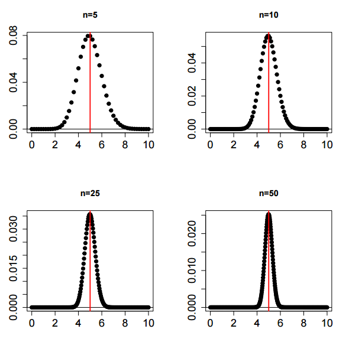

# STATISTICA CAMPIONATORIA

> Data una popolazione reale, possibilmente infinita, essa è analizzabile solo parzialmente, tramite estrazioni casuali di campioni

## INDAGINI CAMPIONARIE

-   Vincoli di tempo/costo

-   Popolazione di interessa virtuale o reale infinita

-   La rilevazione potrebbe distruggere le unità statistiche

-   La precisione dei risultati ottenuti potrebbe non essere ottimale

# CAMPIONE CASUALE

> Sono i dati che vengono presi di riferimento in seguito a una estrazione casuale

## CASUALE SEMPLICE

> Può venire interpretato come una serie di n realizzazioni indipendenti di un dato esperimento

### DATI OSSERVATI

> $x = (x_1,...,x_n), n \ge 1$
>
> Si riferiscono tutti alla stessa caratteristica di interesse
>
> $x_i$ rappresenta il valore osservato sulla $i$-esima unità statistica

### IPOTESI FONDAMENTALE

> I dati campionari $x$ si possono interpretare come un vettore di variabili all'interno di un **vettore di variabili casuali**
>
> $X = (X_1,...,X_n)$
>
> $X_i$ rappresenterebbe la variabile casuale associata a $x_i$ , quindi $x_i$ , un generico valore ottentuo dal campione, apparterrebbe al supporto della variabile $X_i$
>
> In sintesi ogni valore misurato fa parte di una variabile casuale che avrebbe potuto fornire valori diversi da quello rilevato, sempre però all'interno del suo supporto

La distribuzione di provababilità di $X$ è ingnota, o almeno in parte, ed è necessario stimarla

$$
X = (X_1,...,X_n)
$$

X rappresenta un vettore di variabili casuali, in cui ogni variabile è **indipendente e identicamente distribuita** rispetto alle altre, quindi possiedono lo stesso **modello probabilistico**

# MODELLI STATISTICI PARAMETRICI

> Dato un campione casuale semplice $X_1,…,X_n$, la distribuzione di probabilità delle singole variabili dipende dalla loro natura e dal fenomeno di interesse

## TIPOLOGIA DI FENOMENO

### BINARI

$$
X_i \sim Ber(p)\\ p \in (0,1)
$$

### MISURAZIONI

$$
X_i \sim N(\mu,\sigma^2)
$$

### CONTEGGI

$$
X_i \sim P(\lambda)
$$

### TEMPI DI FUNZIONAMENTO

$$
X_i \sim Esp(\lambda)
$$

## PARAMETRI

> Ogni modello è caratterizzato da uno o più parametri, i quali dipendono ovviamente dalla variabile di interesse

Nella statistica inferenziale parametrica si presuppone di conoscere il modello di appartenenza,ma non si conoscono i parametri, i quali andranno opportunamente stimati

## MODELLO PARAMETRICO

-   $X_1,…,X_n$ sono indipendenti

-   Le variabili possono anche non appartenere allo stesso modello

-   i parametri da stimare sono detti $\theta = (\theta_1,...,\theta_d), d \ge 1$

## OBIETTIVO

> Usare i dati rilevati $x = (x_1,...,x_n)$ per stimare opportunamente i valori di $\theta$

$$
\theta \in \Theta \subseteq R^d
$$

> $\Theta$ è chiamato spazio parametrico

## SUPPORTO CONGIUNTO

> Viene definito anche come **spazio campionario**

$$
X_1,...,X_n
$$

> Come spiegato in precedenza esso corrisponde allo spazio occupato da tutti i possibili campioni $x_1,…,x_n$

## SCELTA DEL MODELLO

-   Capire la natura dei dati

-   Aspetti/caratteristiche notevoli

-   Informazioni sul meccanismo generatore dei dati della popolazione di interesse

## ESEMPIO

> Controllo di qualità: si analizzano n oggetti
>
> Campione osservato $x = (x_1,...,x_n)$
>
> Ogni valore $x_i \in X_i$ con $X_i \sim Ber(p)$ in quanto l'evento singolo è di tipo binario: valido(1) o non valido (0)

### PARAMETRI

> Una volta individuato il modello di appartenenza è necessario trovare $\theta$, cioè il vettore dei parametri da stimare.
>
> Nel caso in esame $\theta = p$, quindi la probabilità di successo dell'evento bernoulliano

### SPAZIO PARAMETRICO

$$
\theta \in \Theta = \{0,1\}
$$

### SPAZIO CAMPIONARIO

$$
S_X = \{0,1\} \times ... \times \{0,1\} = \{0,1\}^n
$$

> L'insieme di tutti i vettori di n dimensioni costituiti dai valori 0 e 1, esiti dell'esperimento bernoulliano

## ESEMPIO 2

> Misurazioni
>
> Campione osservato $x = (x_1,…,x_n)$ è costituito da una serie di valori numerici associati alla variabile $X$ di riferimento

$$
X_i \sim N(\mu,\sigma^2)
$$

### PARAMETRI

> Dopo aver determinato il modello è necessario stimare i parametri $\theta = (\theta_1,\theta_2) = (\mu,\sigma^2)$

### SPAZIO PARAMETRICO

$$
\theta \in \Theta = R \times R^+
$$

> $R^+$ perchè $V(X)=\sigma^2 \ge 0$

### SPAZIO CAMPIONARIO

$$
S_X = R \times ... \times R = R^n
$$

> Ogni variabile $X_i \sim N(\mu,\sigma^2)$ ha come supporto R

# VERIFICA DEL MODELLO

> Per verificare la correttezza del modello usato è utile
>
> -   Sovrapporre istogramma con funzione di densità associata al modello scelto
>
> -   Confrontare i grafici dei quantili

# PROCEDURE INFERENZIALI

## STIMA PUNTUALE

> Si vuole ottenere un valore numerico del parametro in base ai dati disponibili

## STIMA INTERVALLARE

> Si vuole determinare un intervallo di valori all'interno del quale trovare il valore vero del parametro da stimare

### VERIFICA IPOTESI

> Si parte da un valore associato al parametro e si dimostra la sua validità e correttezza

# SATISTICHE CAMPIONARIE

> Dato un campione casuale $X_1,...,X_n$,

Si chiama **statistica campionaria** una opportuna trasformata lineare di X

$$
T = t(X_1,...,X_n)
$$

> La scelta di T deve essere fatta tenendo conto del modello di riferimento delle singole variabili $X_i$
>
> Siccome T sintetizza il vettore di variabil casuali $X = (X_1,...,X_n)$ allora T avrà anch'esso un valore osservato $t = t(x_1,...,x_n)$, quindi la trasformata lineare sui dati osservati $x_i \in X_i$

## OBIETTIVO

> Il valore ottenuto $t$ è utile per l'inferenza su $\theta$

## RIPETIZIONE

> Se si rieffettua l'esperimento delle medesime condizioni si otterrà $x' = (x'_1,...,x'_n)$ che sarà diverso dal campione casuale precedentemente misurato

$$
t'=t(x') \ne t=t(x)
$$

## DISTRIBUZIONE CAMPIONARIA

> La variabile $T = t(X_1,...,X_n)$ avrà una distribuzione di probabilità denominata **distribuzione campionaria**
>
> A ogni $X_i$ viene associato un parametro $\theta_i$ , perciò la il vero valore di $T$ verrà stimato supponendo la verità del valore del parametro $\theta$ associato

## SOMMA CAMPIONARIA

$$
S_n = \sum_{i=1}^nX_i
$$

### PROPRIETÀ

$$
E(S_n) = \sum_{i=1}^nE(X_i) = n\mu
$$

$$
V(S_n) = \sum_{i=1}^n V(X_i) = n\sigma^2
$$

### MODELLI

#### GAUSSIANA

> Dato campione casuale $X_1,…,X_n$ gaussiano $X_i \sim N(\mu,\sigma^2)$

$$
S_n \sim N(n\mu,n\sigma^2)
$$

#### BINOMIALE

> Dato campione casuale $X_1,…,X_n$ gaussiano $X_i \sim Bi(k_i,p)$

$$
S_n \sim Bi(\sum_{i=1}^nk_i,p)
$$

#### POISSON

> Dato campione casuale $X_1,…,X_n$ gaussiano $X_i \sim P(\lambda_i)$

$$
S_n \sim P(\sum_{i=1}^n\lambda_i)
$$

#### CHI-QUADRO

> Dato campione casuale $X_1,…,X_n$ gaussiano $X_i \sim \chi^2(r_i)$

$$
S_n \sim \chi^2(\sum_{i=1}^nr_i)
$$

#### BERNOULLIANA

> Dato campione casuale $X_1,…,X_n$ gaussiano $X_i \sim Ber(p)$

$$
S_n \sim Bi(n,p)
$$

## MEDIA CAMPIONARIA

$$
\bar{X_n} = \frac{1}{n}S_n
$$

### PROPRIETÀ

$$
E(\bar{X_n}) = \frac{E(S_n)}{n}
$$

$$
V(\bar{X_n}) = \frac{\sigma^2}{n}
$$

### GAUSSIANO

> Dato campione casuale $X_1,…,X_n$ gaussiano $X_i \sim N(\mu,\sigma^2)$

$$
\bar{X_n} \sim N(\mu,\sigma^2/n)
$$

### STIMA

> La media campionaria $\bar{X_n}$ costituisce uno **stimatore** per $\mu$ e il suo valore osservato $\bar{x_n}$ corrisponde alla media calcolata sul campione attuale $x = (x_1,...,x_n) \in X = (X_1,...,X_n)$
>
> All'aumentare della dimensione $n$ del campione la varianza della media campionaria $V(\bar{X_n}) = \sigma^2/n$ diminuisce.

### LEGGE DEBOLE DEI GRANDI NUMERI

> La variabile casuale $\bar{X_n}$ media campionaria avrà una distribuzione di probabilità sempre più simile al vero valore di $\mu$

$$
n \to \infty \implies \bar{X_n} \to^p \mu
$$

> $\to^p$ significa **convergenza in probabilità**

> Al crescere di $n$ la distribuzione di probabilità di $\bar{X_n}$ converge sempre di più a $\mu$

## TEOREMA DEL LIMITE CENTRALE

> Valido per **MEDIA e SOMMA campionaria**
>
> Data una successione di variabili casuali $X_i, i \ge 1$ Indipendenti e Identicamente Distribuite con media $\mu$ e varianza $\sigma^2 \ne 0$ **finite**

### STANDARDIZZAZIONE

> Dopo aver standardizzato **SOMMA e MEDIA** la loro distribuzione di probabilità coincide

$$
\frac{\bar{X_n}-\mu}{\sqrt{\sigma^2/n}} = \frac{\bar{S_n}-n\mu}{\sqrt{n\sigma^2}}  \to^d Z \sim N(0,1)
$$

> $\to^d$ **convergenza in distribuzione**
>
> Al crescere di n la la distribuzione di probabilità converge a Z normale standardizzata

$$
\bar{X_n} \sim N(\mu,\sigma^2) \\  S_n \sim N(n\mu,n\sigma^2)
$$

### PROPRIETÀ

$$
P(a < \bar{X_n} \le b) = \Phi(\frac{b-\mu}{\sigma/\sqrt{n}}) - \Phi(\frac{a-\mu}{\sigma/\sqrt{n}})   \\    P(a < S_n \le b) = 
$$

## VARIANZA CAMPIONARIA

$$
S^2 = \frac{1}{n}\sum_{i=1}^n(X_i-\bar{X_n})^2
$$

$$
S^2 = \frac{1}{n}\sum_{i=1}^nX^2_i - \bar{X}^2_n
$$

> La sua versione corretta definita $S_c^2$
>
> Il suo valore osservato $s^2$ viene considerato come una stima del valore di $\sigma^2$
>
> Al crescere di $n$ la differenza tra $S^2$ e $\sigma^2$ diventa trascurabile

## VARIANZA CAMPIONARIA CORRETTA

> Si usa definire una versione alternativa della varianza campionaria, che sia il più fedele possibile al vero valore di $\sigma^2$ anche per $n$ piccoli

$$
S^2_c = \frac{n}{n-1}S^2 = \frac{n}{n-1}\frac{1}{n}\sum_{i=1}^n(X_i-\bar{X}_n)^2
$$

$$
S^2_c = \frac{1}{n-1}\sum_{i=1}^n(X_i-\bar{X}_n)^2
$$

### MEDIA

$$
E(S^2_c) = \frac{n}{n-1}E(S^2)
$$

$$
E(S^2_c) = \frac{n}{n-1}\frac{n}{n-1}\sigma^2 = \sigma^2
$$

> Perciò $S^2_c$ costituisce uno stimatore per la **varianza campionaria** con **valore atteso (media)**

= $\sigma^2$

### GRANDI NUMERI

$$
n \to +\infty
$$

$$
S^2\overset{p}{\to} \sigma^2
$$

$$
S^2_c\overset{p}{\to} \sigma^2
$$

> **Al crescere di** $n$ **le distribuzioni di probailità di varianza campionaria normale e corretta tendono a quella della varianza effettiva dell'intera popolazione**

### CASO PARTICOLARE

> Dato un campione casuale $X_1,…,X_n$ con variabili **gaussiane**

$$
X_i \sim N(\mu,\sigma^2)
$$

> Le varianze campionarie possiedono una distribuzione di probabilità legato al modello **chi quadro** con $n-1$ gradi di libertà

$$
\chi^2(n-1) \sim  \frac{n}{\sigma^2}S^2 = \frac{n-1}{\sigma^2}S^2_c = \frac{\sum_{i=1}^n(X_i-\bar{X_n})^2}{\sigma^2}
$$

#### INDIPENDENZA

> **Media campionaria e varianza campionaria corretta sono indipendenti**

#### MEDIA CAMPIONARIA STANDARDIZZATA

> Se si standardizza la **media campionaria** si ha

$$
\frac{\bar{X_n}-\mu}{\sigma/\sqrt{n}} \sim N(0,1)
$$

> Siccome media campionaria $\bar{X_n}$ e varianza campionaria corretta $S^2_c$ sono **indipendenti**

$$
\frac{n-1}{\sigma^2}S^2_c \sim \chi^2(n-1)
$$

$$
\frac{\bar{X_n}-\mu}{ \sqrt{S^2_c/n}} \sim t(n-1)
$$

> La media campionaria standardizzata con sigma corretto ha una distribuzione di probabilità tendente al modello **T di Student** con $n-1$ gradi di libertà

### MULTIVARIABILI

> Dati due campioni casuali $X_1,…,X_n$ e $Y_1,…,Y_n$ gaussiane e tutte indipendenti tra loro

$$
X_i \sim N(\mu_X,\sigma^2_X)
$$

$$
Y_i \sim N(\mu_Y,\sigma^2_Y)
$$

#### VARIANZA CAMPIONARIA

## STATISTICHE ORDINATE

$$
X_{(1)} \le ... \le X_{(n)}
$$

## MINIMO

$$
X_{(1)} = min\{X_1,...,X_n\}
$$

## MASSIMO

$$
X_{(n)} = max\{X_1,...,X_n\}
$$

## MEDIANA CAMPIONARIA

$$
X_{0.5} = \begin{cases}  X_{(n+1)/2},  & \mbox{if } x\%2 \ne 0 \\ \frac{X_{n/2}+X_{(n/2)+1}}{2},  & \mbox{if } x\%2 = 0\end{cases} 
$$

## MOMENTI CAMPIONARI

### CENTRATI

$$
\frac{1}{n}\sum_{i=1}^n(X_i-\bar{X_n})^r \\
r \in N^+
$$

### DECENTRATI

$$
\frac{1}{n}\sum_{i=1}^nX^r_i \\
r \in N^+
$$
