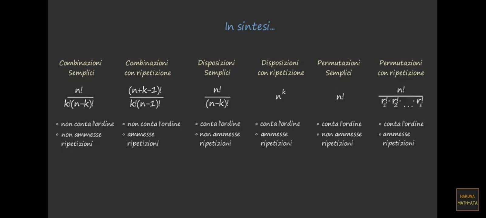
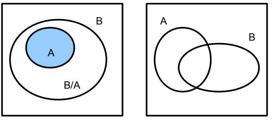
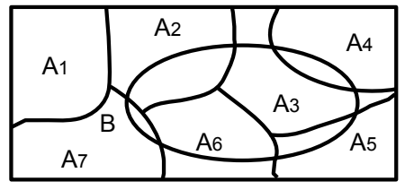
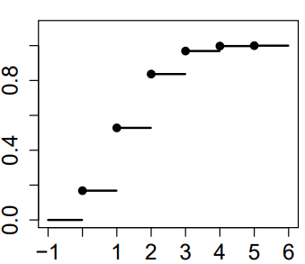
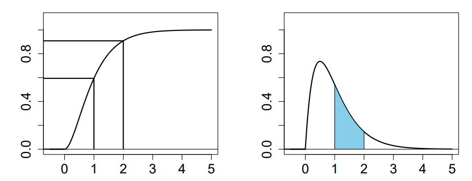

# COMBINATORIA



## DISPOSIZIONI

```{r}
Omega = 1:10
```

### NON CONTA L'ORDINE

#### SENZA RIPETIZIONI

> Dato un insieme $A, |A|=n$ si vogliono disporre gli elementi senza ripetizioni in un insieme $B,|B|=k \le n$

$$
D_{n,k} = n(n-1)(n-2)...(n-k+1) = \frac{n!}{(n-k)!}
$$

#### RIPETIZIONI

$$
D^r_{n,k} = n*...*n = n^k 
$$

## PERMUTAZIONI

### SENZA RIPETIZIONE

$$
k = n \\
P_n=Dn,n = n(n-1)...(n-n+1) = n(n-1)...1 = n!
$$

```{r}
sample(Omega,length(Omega))
```

### RIPETIZIONE DI ELEMENTI

$$
P^*_{n,k,h,...,p} = \frac{n!}{k!h!...p!}
$$

## COMBINAZIONI

### NON CONTA L'ORDINE

#### SENZA RIPETIZIONI

> Coincide con il numero di sottoinsiemi aventi $k$ elementi partendo da $n$

$$
C_{n,k}=\binom{n}{k} = \frac{D_{n,k}}{k!} = \frac{n!}{k!(n-k)!}
$$

$$
\sum_{k=0}^n\binom{n}{k} = \binom{n}{0} + ... + \binom{n}{n} = 2^n
$$

$$
(a+b)^n = \sum_{k=0}^n\binom{n}{k}a^kb^{n-k}
$$

```{r}
choose(5,2) # = 5!/2!3! = 5*4/2 = 10
```

#### RIPETIZIONE

$$
\frac{(n+k-1)!}{k!(n-1)!}
$$

# CAP4) FORMULARIO PROBABILITÀ

## INSIEMISTICA

### SPAZIO FONDAMENTALE

$$
\Omega
$$

### EVENTO

$$
A \subseteq \Omega
$$

### COMPLEMENTARE

$$
A^C = \Omega \setminus A
$$

### UNIONE

$$
A \cup B
$$

### INTERSEZIONE

$$
A \cap B
$$

### DIFFERENZA

$$
A \setminus B
$$

### PROPRIETÀ

#### DISGIUNZIONE

$$
A \cap B = \emptyset
$$

#### IMPLICAZIONE

$$
A \subseteq B = A \implies B
$$

#### EQUIVALENZA

$$
A \subseteq B \land B \subseteq A \implies A = B
$$

## ASSIOMI KOLMOGOROV

### NON NEGATIVITÀ

$$
P(A) \ge 0
$$

### NORMALIZZAZIONE

$$
P(\Omega)=1 = 
$$

### ADDITTIVITÀ

$$
A = \{A_1,...,A_n\}: i \ne j,A_i \cap A_j = \emptyset \\
P(\bigcup A_i) = \sum P(A_i)
$$

### ADDITTIVITÀ SEMPLICE

$$
A \cap B = \emptyset \implies P(A \cap B) = P(A)+P(B)
$$

### COMPLEMENTARE

$$
A, A^c \subseteq \Omega : A \cap A^c=\emptyset \\
P(A) = 1-P(A^c) \\
1 = P(\Omega) = P(A \cup A^c) = P(A) + P(A^c)
$$

### IMPLICAZIONE

$$
A \subseteq B \\
P(A) \le P(B) \\
P(B \setminus A) = P(B) - P(A) \\
P(B) = P((B\setminus A) \cup A) = P(B\setminus A) + P(A)  \\
(B \setminus A) \cap A = \emptyset
$$

### UNIONE

$$
P(A \cup B) =  P(A) + P(B) - P(A \cap B) \\
A \cup B =  (A \cap B) \cup [B \setminus (A \cap B)] \cup[A \setminus(A \cap B)] \\
P(A \cup B) = P(A \cap B) + P(B)  - P(A \cap B) + P(A)- P(A \cap B)
$$



### PARTIZIONI

$$
B, A = \{A_1,...,A_n\} \\
P(B) = \sum P(B \cap A_i) \\
P(B) = P(B \cap \Omega) = P(B \cap \bigcup A_i) = P(\bigcup (B \cap A_i)) = \sum P(B \cap A_i)
$$



## PROBABILITÀ CONDIZIONATA

$$
P(B | A) = \frac{P(B \cap A)}{P(A)}
$$

### MOLTIPLICAZIONE

$$
P(B \cap A) = P(B|A)P(A): P(A) > 0
$$

$$
P(A_1 \cap A_2 \cap A_3) = P(A_1)P(A_2|A_1)P(A_3|A_2\cap A_1)
$$

### TOTALE

$$
P(B)  = \sum P(A_i)P(B|A_i)
$$

## EVENTI INDIPENDENTI

$$
P(A \cap B) = P(A) P(B)
$$

### CONDIZIONAMENTO

$$
P(B | A) = \frac{P(B \cap A)}{P(A)} = \frac{P(A)P(B)}{P(A)} = P(B)
$$

### COMPLEMENTARE

> Se $A,B$ sono **indipendenti** allora lo sono anche

$$
A, B^c \\ A^c,B \\A^c,B^c
$$

### MULTIVARIABILI

> Se $A_1,A_2,A_3$ sono indipendenti

$$
P(A_1 \cap A_2 \cap A_3) = P(A_1)P(A_2|A_1)P(A_3|A_2\cap A_1) \\ 
P(A_2|A_1) = P(A_2), P(A_3|A_2\cap A_1) = P(A_3) \\
P(A_1 \cap A_2 \cap A_3) = P(A_1)P(A_2)P(A_3)
$$

### UNIONE

$$
P(B) = P(A_1 \cap ...\cap A_n) =   \prod_{i=1}^n P(A_i) 
$$

## TEOREMA BAYES

$$
P(A_i|B) = \frac{P(B \cap A_i)}{P(B)}= \frac{P(A_i)P(B|A_i)}{P(B)} \\ 
$$

$$
P(B)  = \sum P(A_i)P(B|A_i)
$$

# VARIABILI CASUALI

## DISCRETE

### DENSITÀ

$$
f_X(x) =  \begin{cases}  P(X=x_i)=pi ,  & \mbox{if }  x \in S_X\\ 0  \end{cases} 
$$

### RIPARTIZIONE

$$
F_X(x) = P(X \le x) = \sum_{i:x_i \le x}pi
$$

$$
pi = f_X(x_i) = F_x(x_i)-F_x(x_{i-1})
$$

## CONTINUE

### RIPARTIZIONE

$$
F_X(x) = \int_{-\infty}^x f_X(x)dx
$$

# CAP 5) VARIABILI CASUALI

## FUNZIONE RIPARTIZIONE

$$
F_X(x) = P(X \le x), x \in R
$$

$$
P(a < X \le b) = F_X(b)-F_X(a)
$$

$$
P(X > a) = 1 - P(X \le a) = 1-F_X(a)
$$

$$
P(X=b) = F_X(b) - \lim_{x \to b^-}F_X(x)
$$

-   **MONOTONA NON DECRESCENTE**

-   **CONTINUA DA DESTRA**

    -   **NON è CONTINUA IN OGNI PUNTO**

-   $\lim_{x \to -\infty}F_X(x) = 0$

-   $\lim_{x \to +\infty}F_X(x) = 1$

## SUPPORTO

> è definito come l'insieme di valori i cui intorni sono eventi di probabilità strettamente positiva

$$
S_X = \{ x \in R: \forall \epsilon>0, P(x-\epsilon<X<x+ \epsilon)>0  \}
$$

$$
P(x-\epsilon<X<x+ \epsilon) = F_X(x+ \epsilon)-F_X(x- \epsilon) 
$$

$$
F_X(x+ \epsilon)-F_X(x- \epsilon) > 0 
$$

$$
F_X(x+ \epsilon) > F_X(x- \epsilon)
$$

> Quest'ultima formula significa che il valore di probabilità di $P(X + \epsilon)$ si troverà più in alto rispetto al valore $P(x - \epsilon)$



> Nel disegno i puntini rappresentano i valori del supporto, infatti $F_X(x+ \epsilon) > F_X(x- \epsilon), \forall \epsilon>0$

## VARIABILI DISCRETE

> Il $S_X$ è finito o al più numerabile

$$
S_X = \{x_i:P(X = x_i)=pi > 0\}
$$

### FUNZIONE DI PROBABILITÀ

$$
f_X(x) = P(X=x_i)=pi
$$

### FUNZIONE DI RIPARTIZIONE

$$
F_X(x) = P(X \le x) = \sum_{i:x_i \le x}pi
$$


> Il grafico è una funzione a gradini con salti in corrispondenza dei valori $x_i \in S_X$
>
> L'ampiezza del salto è data dal valore della **funzione di densità** nel valore $x_i$
>
> $p_i=f_X(x_i) = F_X(x_i)-F_X(x_{i-1})$

### VALORE ATTESO

$$
E(X) = \sum_{x \in S_X}xf_X(x) = \sum_{x \in S_X}P(X=x)
$$

> Data una variabile $Y = g(X)$, quindi anch'essa discreta

$$
E(Y) = E(g(X)) = \sum_{x \in S_X}g(X)f_X(x)
$$

## VARIABILI CONTINUE

> Quando il $S_X$ è costituito da un insieme continuo di elementi

$$
S_X = \{ x \in R: \forall \epsilon>0, P(x-\epsilon<X<x+ \epsilon)>0  \}
$$

### FUNZIONE DI DENSITÀ

$$
f_X(X)
$$

-   $f_X(x) \ge 0, \forall x \in R$

-   $\int_{-\infty}^{+\infty}f_X(x)dx = 1$

    -   Ciò corrisponde alla somma di tutte le probabilità associate a ogni elemento del supporto

-   $f_X(x) = \frac{d}{dx}F_X(x) = F'_X(x)$

### FUNZIONE DI RIPARTIZIONE

$$
F_X(x) = \int_{-\infty}^xf_X(x)dx
$$

-   $\lim_{x \to -\infty}F_X(x)=0$

    -   Non ci sono valori di x prima di $-\infty$ perciò la probabilità è nulla

    -   $P(X \le -\infty)=0$

-   $\lim_{x \to +\infty}F_X(x)=1$

    -   Arrivati all'ultimo valore del supporto, la probabilità di eventi $\le +\infty$ è 1

    -   $P(X \le -\infty) = 1$

> Si tratta di una funzione continua, e perciò

$$
P(X = x)=0, \forall x \in R
$$

$$
P(X > a) = 1-P(X \le a)  = 1- F_X(a), \forall a \in R
$$

$$
P(a < X \le b) = F_X(b)- F_X(a) = \int_a^bf_X(x)dx
$$



> Il grafico a SX è $F_X(x)$ mentre a DX è $f_X(x)$
>
> L'area azzurra sotto il grafico $f_X(x)$ corrisponde alla definizione di intergrale tra $[a,b]$ , e quindi proprio ai valori di $F_X(b) - F_X(a)$

## INDICI SINTETICI

### VALORE ATTESO

#### DISCRETA

$$
E(X)=\sum_{x \in S_X}xf_X(x) = \sum_{x \in S_X}P(X = x)
$$

#### CONTINUA

$$
E(X) = \int_{-\infty}^{+\infty}xf_X(x)dx
$$

#### PROPRIETÀ

-   **CAUCHY:**

    -   $inf\{S_X\} \le E(X) \le sup\{S_X\}$

-   **BARICENTRO**

    -   $E(X-E(X))=0$

-   **LINEARITÀ**

    -   $E(aX+b)=aE(X)+b, \forall a,b \in R$

$$
E(aX+bY) = aE(X)+bE(Y)
$$

## MEDIANA

$$
x_{0.5}: (P(X \le x_{0.5})\ge0.5) \land (P(X \ge x_{0.5})\ge0.5)
$$

### CONTINUA

$$
x_{0.5}=F_X(x_{0.5})=0.5
$$

### DISCRETA

$$
x_{0.5} = F_X(x_{0.5}) \ge 0.5
$$

## MODA

$$
x_{mo}: f_X(x_{mo}) = max\{f_X(x)\}
$$

## QUANTILI

$$
\alpha \in (0,1)
$$

$$
P(X \le x_{\alpha}) \ge \alpha
$$

$$
P(X \ge x_{\alpha})=1-\alpha
$$

### CONTINUA

$$
F_X(x_{\alpha})=\alpha
$$

### DISCRETA

$$
F_X(x_{\alpha})\ge\alpha
$$

## VARIANZA

$$
V(X) = E[(X-E(X))^2] =E(X^2)-E(X)^2
$$

### DISCRETA

$$
V(X) = \sum_{x \in S_X}(x-E(X))^2f_X(x)
$$

### CONTINUA

$$
V(X) = \int_{-\infty}^{+\infty}(x-E(X))^2f_X(x)dx
$$

### PROPRIETÀ

-   **NON NEGATIVITÀ**

    -   $V(X)\ge 0$

-   **CALCOLO**

    -   $V(X)=E(X^2)-E(X)^2$

-   **INVARIANZA TRASLAZIONI**

    -   $V(X+b)=V(X), \forall b \in R$

-   **OMOGENEITÀ DI SECONDO GRADO**

    -   $V(aX)=a^2V(X), \forall a \in R$

-   **TRASFORMAZIONI LINEARI**

    -   $V(aX+b)=a^2V(X)$

### COEFFICIENTE DI VARIAZIONE

$$
CV_X = \frac{\sigma}{|\mu|}
$$

> Non avendo unità di misura è un numero puro, ed è possibile confrontarlo con il coefficiente di un'altra variabile
