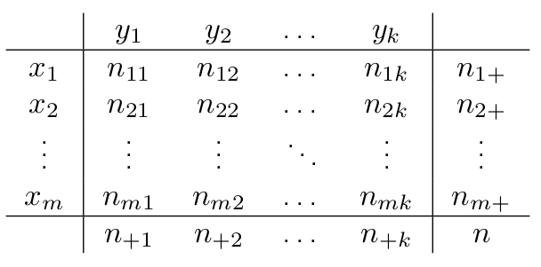

```{r include=FALSE}
library("dplyr")
```

# [STATISTICA MULTIVARIATA](./2_LEZ.pdf#introduzione)

> PRENDE IN CONSIDERAZIONE 2 O PIÙ VARIABILI CONTEMPORANEAMENTE

## DISTRIBUZIONI DI FREQUENZA

-   **CONGIUNTA**

    -   si prendono in considerazione entrambe le variabili durante una osservazione/misurazione

    -   $(x_{i},y_{k})$

        -   $i \in [1,|X|$

        -   $k \in [1,|Y|]$

-   **DISGIUNTA**

    -   viene presa in considerazione una variabile per volta

-   **CONDIZIONATA**

    -   in base a una condizione dettata da una delle due variabili si cercano le osservazioni congiunte rispetto all'altra variabile

    -   Date X e Y due variabili

        -   Y \| X = valore

        -   seleziona i valori di Y associati ai casi in cui X = valore indicato

```{r}
head(mtcars)
hp6Cyl = mtcars[mtcars$cyl==6,"hp"]
length(hp6Cyl)

```

## RAPPRESENTAZIONI GRAFICHE

> Sono le stesse spiegate nel [capitolo precedente](./2_LEZ.pdf#grafici), in quanto le funzioni grafiche sono in grado di accettare più variabili contemporanemente, ognuna con il suo significato visivo

# DIPENDENZA

> Date due variabili X e Y esse possono essere dipendenti tra loro.

**IPOTESI:**

-   **X variabile indipendente (**per convenzione matematica)

-   **Y variabile dipendente = f(X)**

    -   f è la funzione che regola la dipendenza

    -   può essere di qualsiasi tipo

## TIPOLOGIE

### [DIPENDENZA](#indipendenza)

> **2 QUALITATIVE**

### [DIPENDENZA MEDIA](#dipmed)

> **1 QUALITATIVA 1 QUANTITATIVA**

### [REGRESSIONE](#regr) o [CORRELAZIONE](#correl)

> **2 QUANTITATIVE**

# TABELLA CONTINGENZA

> Riporta le distribuzioni di frequenza associate alle due variabili, perciò gli assi contengono gli elementi del supporto delle variabili, cioè i possibili valori ammessi senza ripetizioni

{width="202"}

-   $X = [x_{1},...,x_{i},...,x_{m}], i \in [1,m], m = |Sx|$

-   $Y = [y_{1},...,y_{i},...,y_{k}], i \in [1,k], k = |Sy|$

$$
n = \sum_{i=1}^{m} n_{i+} =  \sum_{j=1}^{k} n_{+j}
$$

## FREQUENZA

-   **CONGIUNTA:**

    -   $n_{ij}=(x_{i},y_{j})$

-   **MARGINALE:**

    -   si tratta delle occorrenze dell'i-esimo valore di una delle variabili

        -   $n_{i+}=x_{i} = \sum_{j=1}^{k}n_{ij}$ --\> i=riga costante

        -   $n_{+j}=y_{j} = \sum_{i=1}^{m}n_{ij}$ --\> j=colonna costante

-   **CONDIZIONATA**

    -   $n_{i1}$ = vettore delle frequenze di X dato Y = y1

## ESEMPIO

```{r}
attitudine <- rbind(cbind(rep("S",1),rep("S",1)),cbind(rep("S",3),rep("B",3)),cbind(rep("B",1),rep("S",1)),cbind(rep("B",3),rep("B",3)),cbind(rep("B",2),rep("O",2)),cbind(rep("O",2),rep("S",2)),cbind(rep("O",1),rep("B",1)),cbind(rep("O",2),rep("O",2)))
                                                                                                                                                                                                           attitudine <- as.data.frame(attitudine) # matrice trasformata
# in data frame
colnames(attitudine) <- c("X","Y") # nomi delle colonne
attitudine$X <- ordered(attitudine$X, levels=c("S","B","O"))
attitudine$Y <- ordered(attitudine$Y, levels=c("S","B","O"))
str(attitudine)

tab <- table(attitudine$X,attitudine$Y) # tabella di contingenza
#(distribuzione di frequenza assoluta congiunta)
tab

# distribuzione marginale di Y
# (frequenza assoluta)
margin.table(tab,2)

# distribuzione condizionata di Y|X=S (frequenza assoluta)
tab[1,]

# distribuzione condizionata di Y|X=B (frequenza assoluta)
tab[2,]

tab[3,] # distribuzione condizionata di Y|X=O (frequenza assoluta)

tab[,1] # distribuzione condizionata di X|Y=S (frequenza assoluta)

tab/sum(tab) # distribuzione di frequenza relativa congiunta
# in alternativa, prop.table(tab)
# distribuzione marginale di X (frequenza relativa)
margin.table(tab,1)/sum(margin.table(tab,1))

# distribuzione marginale di Y (frequenza relativa)
margin.table(tab,2)/sum(margin.table(tab,2))

# distribuzione condizionata di Y|X=S (frequenza relativa)
tab[1,]/sum(tab[1,])

# distribuzione condizionata di Y|X=B (frequenza relativa)
tab[2,]/sum(tab[2,])
```

# INDIPENDENZA STATISTICA {#indipendenza}

> Viene misurata in maniera SIMMETRICA, perchè X e Y possono influenzarsi a vicenda, dipende dal punto di vista

$$
\frac{n_{rc}}{n_{+c}} =  \frac{n_{r+}}{n}
$$

> -   $r \in [1;m]$
>
> -   $c \in [1;k]$

$$
n_{rc} = \frac{n_{r+}*n_{+c}}{n}
$$

> questo valore corrisonde al valore ideale che la frequenza dovrebbe avere in caso di completa INDIPENDENZA tra le due variabili X e Y considerate

## INDICE DI CONNESSIONE

> Determina la forza della dipendenza che c'è tra le due variabili considerate

$$
\chi^2 = \sum_{r=1}^{m} \sum_{c=1}^{k} \frac{(n_{rs} - n^{*}_{rs})^2}{n^{*}_{rs}}
$$

$$
n^{*}_{rs} = \frac{n_{r+}*n_{+c}}{n}
$$

> $n^{*}_{rs}$ **= valore nel caso di completa indipendenza tra X e Y**

### INDIPENDENZA

$$
\chi^2 = 0 = (n_{rs} - n^{*}_{rs})^2 = (n_{rs} - n^{*}_{rs}), \forall r \in [1;m], \forall s \in [1;k] 
$$

> I valori attesi coincidono con quelli osservati, quindi vi è completa indipendenza

### DIPENDENZA

$$
\chi^2 \in ]0;min(m-1,k-1)]
$$

# DIPENDENZA MEDIA {#dipmed}

> Si misura in maniera ASIMMETRICA

-   X = QUALITATIVA INDIPENDENTE

-   Y = QUANTITATIVA DIPENDENTE = in funzione di X

> Non viene misurata la distribuzione di frequenza della variabile Y, ma solo la sua MEDIA

$$
E(Y | X = x_{i}) 
$$

> Media dei valori di Y associati al valore $x_{i}$

## INDIPENDENZA IN MEDIA

$$
E(Y) = E(Y | X = x_{i}) = E(Y | X = x_{k}), \forall i \neq k
$$

> Due variabili si dicono indipendenti in media quando la media di Y condizionata da tutti i possibili valori di X è costante.
>
> Se le medie condizionate sono diverse allora vi è una dipendenza tra le due variabili

# CORRELAZIONE {#correl}

## COVARIANZA

> Misura l'intensità del legame lineare due variabili quantitative, e la direzione della loro relazione, quindi quale delle due variabili è dipendente dall'altra...

$$
Cov(X,Y) = E [(X-E(X))*(Y-E(Y))] = \frac{1}{n}*\sum_{i=1}^{n}(x_i - E(X))* (y_i - E(Y))
$$

$$
\sigma_{XY}=Cov(X,Y) = E(XY) - E(X)E(Y) = \frac{1}{n}*\sum_{i=1}^{n}x_iy_i - E(X)E(Y)
$$

## COEFFICIENTE DI CORRELAZIONE LINEARE

> Disuguaglianza di Cauchy-Schwarz

$$
-\sigma_X\sigma_Y \le  \sigma_{XY} \le \sigma_X\sigma_Y
$$

> Coefficiente di correlazione lineare

$$
\rho_{XY} = \frac{\sigma_{XY}}{\sigma_X \sigma_Y}
$$

-   Dalla disuguaglianza iniziale si ottiene che

    -   $-1 \le \rho_{XY} \le 1$

-   $\rho_{XY} > 0$: relazione lineare crescente

    -   $\rho_{XY} = 1$

        -   tutti i punti $(x_i;y_i)$ sono allineati in una retta a pendenza positiva

-   $\rho_{XY} < 0$: relazione lineare decrescente

    -   $\rho_{XY} = -1$

        -   tutti i punti $(x_i;y_i)$ sono allineati in una retta a pendenza negativa

-   $|\rho_{XY}|$ indica la forza del legame tra X e Y

-   $\rho_{XY} = 0$: indica l'assenza di legame lineare

    -   Se non sono correlate linearmente non è detto che non siano indipendenti

> **Indipendenza --\> incorrelazione**
>
> **Incorrelazione non -\> indipendenza**

### RANGHI

> Date variabili qualitative ordinali è possbile individuare i ranghi dei valori, dopo aver ordinato in ordine crescente le modalità

**INDICE DI CORRELAZIONE TRA RANGHI**

$$
-1 \le \rho^{S}_{XY} \le 1
$$

-   $\rho^S_{XY} = 1$ perfetta concordanza tra i ranghi di X e Y

-   $\rho^S_{XY} = -1$. discordnaza tra i ranghi

-   $\rho^S_{XY} = 0$ non vi è alcuna associazione

# REGRESSIONE {#regr}

## LINEARE SEMPLICE

> Quando si analizzano due variabili quantitative. È una generalizzazione dell'analisi di dipendenza in media.
>
> Si ipotizza una relazione lineare tra le due variabili X e Y

-   Si studia la media condizionata di una variabile risposta Y in funzione di:

    -   una variabile: **regressione semplice**

    -   più variabili: **regressione multipla**

$$
y_i = b*x_i + a + e_i, i \in [1,n]
$$

-   b = coefficiente angolare della retta, che ne determina la pendenza

-   a = intercetta con l'asse Y

-   $e_i$ errore = **residui di regressione**: termine che evidenzia il fatto che la correlazione trovata non si adatta perfettamente ai dati osservati

## METODO DEI MINIMI QUADRATI

> I coefficienti a e b di regressione devono essere stimati e calcolati
>
> Date n coppie $(x_i;y_i)$ di osservazioni si hanno n valori anche di errore $e_i$

$$
Q(a,b) = \sum_{i=1}^{n} e^2_i = \sum_{i=1}^{n}(y_i - a - bx_i)^2
$$

> Da questo metodo si ottengono delle stime di valori a e b

$$
b = Cov(X,Y)/V(X) = \rho_{XY} \frac{\sigma_Y}{\sigma_X}
$$

$$
a = E(Y) - b*E(X)
$$

## RESIDUI STIMATI

$$
e_i = yi - a - bx_i  = y_i - y^s_i
$$

-   $y^s_i$ valore stimato dalla regressione

## COEFFICIENTE DI DETERMINAZIONE

$$
V(Y) = V(Y^s) + V(e^s)
$$

-   $V(Y^s)$ **= varianza spiegata**

-   $V(e^s)$ **= varianza residua**

> I due valori sono stati stimati dal modello

$$
R^2 = \frac{V(Y^s)}{V(Y)} = \frac{\sum_i (y^s_i - E(Y^s))^2 / n}{\sum_i (y_i - E(Y))^2 / n}
$$

$$
R^2 = \frac{V(e^s)}{V(Y)} = 1 - \frac{\sum_i (e^s_i - E(e^s))^2 / n}{\sum_i (y_i - E(Y))^2 / n}
$$

$$
0 \le R^2 \le 1
$$

$$
R^2 = \rho^2_{XY}
$$
